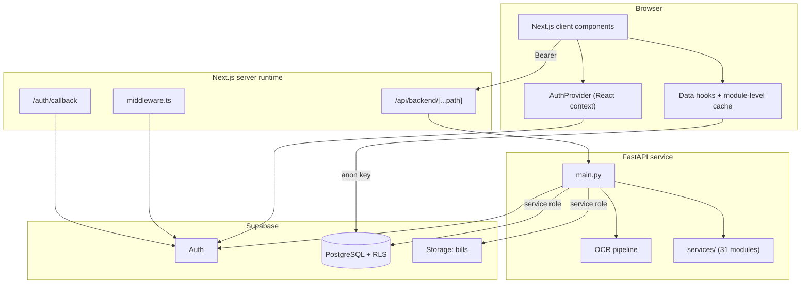
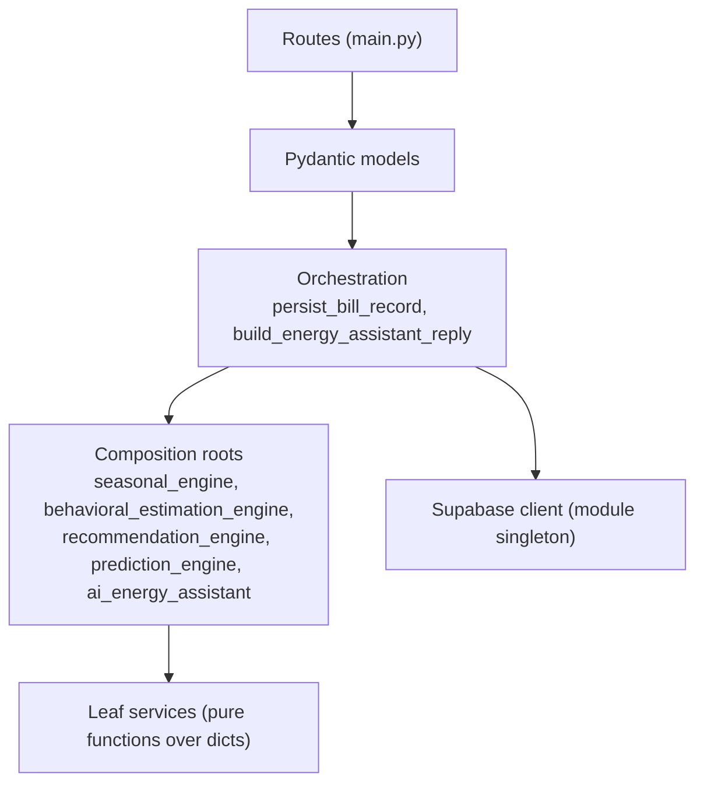
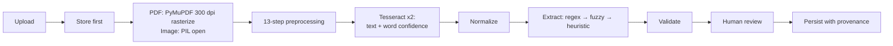
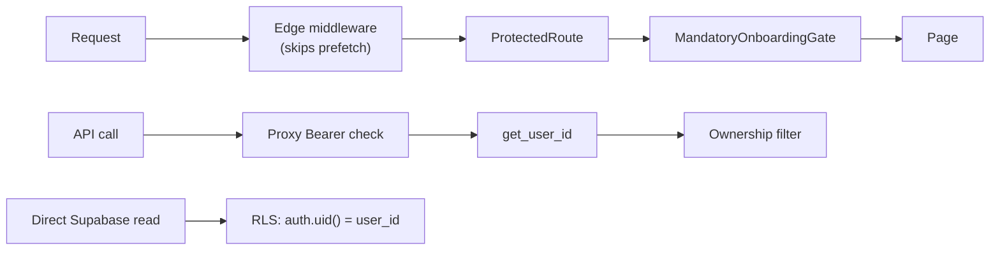
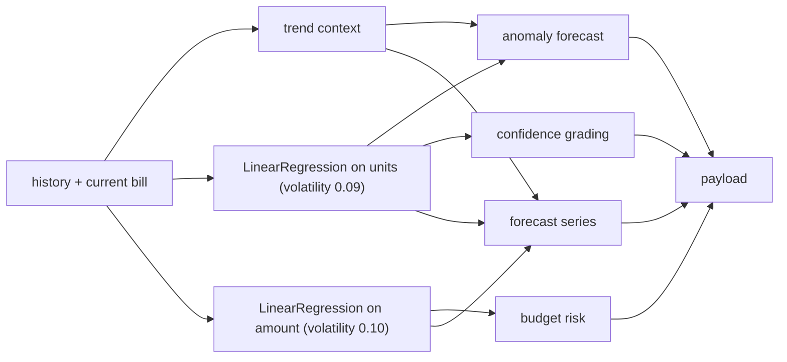
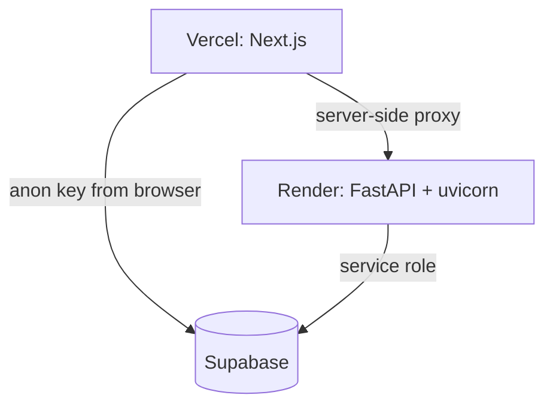

# WattWise Architecture Reference

> Companion reference for the [Building WattWise series](./index.md).
> **Estimated reading time:** 16 minutes
> Every statement here is derived from the repository. Inferences are marked as **Assumption**.

---

## Table of Contents

1. [System Overview](#system-overview)
2. [Frontend Architecture](#frontend-architecture)
3. [Backend Architecture](#backend-architecture)
4. [Database Design](#database-design)
5. [API Architecture](#api-architecture)
6. [OCR Architecture](#ocr-architecture)
7. [Authentication and Authorization](#authentication-and-authorization)
8. [Seasonal and Behavioral Intelligence](#seasonal-and-behavioral-intelligence)
9. [Prediction Engine](#prediction-engine)
10. [Recommendation Engine](#recommendation-engine)
11. [Assistant Architecture](#assistant-architecture)
12. [Deployment](#deployment)
13. [Scaling Strategy](#scaling-strategy)
14. [Known Gaps and Future Improvements](#known-gaps-and-future-improvements)

---

## System Overview



**Three deployable units:** the Next.js application, the FastAPI service, and the Supabase project. The first two are stateless; all state lives in the third.

**Two client-to-data paths.** Reads of `users`, `appliances` and `bills` go directly from the browser to Supabase, protected by row-level security. All bill mutations and all analysis go through the Next.js proxy to FastAPI, protected by explicit ownership filters.

---

## Frontend Architecture

### Route structure

```txt
app/
├── layout.tsx                    # RootLayout, wraps children in AuthProvider
├── page.tsx                      # public landing page
├── globals.css
├── (auth)/                       # route group — no dashboard chrome
│   ├── layout.tsx
│   ├── login/page.tsx
│   └── register/page.tsx
├── (dashboard)/                  # route group — sidebar, top nav, mobile nav
│   ├── layout.tsx                # ProtectedRoute + MandatoryOnboardingGate
│   ├── loading.tsx               # shared skeleton for the whole group
│   ├── dashboard/page.tsx        # 704 lines
│   ├── bills/page.tsx            # 1,875 lines — upload, parse, review, history
│   ├── bill-history/page.tsx     # 310 lines
│   ├── analytics/page.tsx        # 432 lines
│   ├── predictions/page.tsx      # 288 lines
│   ├── recommendations/page.tsx  # 343 lines
│   ├── assistant/page.tsx        # 254 lines
│   ├── onboarding/page.tsx       # 392 lines
│   └── settings/page.tsx         # 323 lines
├── api/backend/[...path]/route.ts  # authenticated reverse proxy
└── auth/callback/route.ts          # OAuth code exchange
```

Route groups carry real weight here. `(auth)` renders a bare layout; `(dashboard)` renders the full shell plus two guard components, and its `loading.tsx` provides a shared skeleton for every route in the group.

### Component organization

```txt
components/
├── ui/            # badge, button, card, input, label, separator, skeleton, textarea
├── layout/        # Logo, Sidebar, TopNav, MobileNav
├── auth/          # ProtectedRoute, MandatoryOnboardingGate (755 lines), LogoutButton
├── providers/     # AuthProvider
├── charts/        # EnergyAreaChart, EnergyBarChart, EnergyPieChart, PredictionForecastChart
├── dashboard/     # StatCard, SectionHeader, RecommendationCard, UploadBillCard
├── behavioral/    # ApplianceContributionList, ContributionCard, EstimatedAnalysisBadge
├── seasonal/      # SeasonalSeasonCard, SeasonalInsightCard, SeasonalApplianceList
├── household/     # HouseholdSummaryCard, QuantityStepper
├── prediction/    # PredictionConfidenceBadge
└── assistant/     # AssistantMessageBubble, AssistantSuggestionChips
```

The `ui/` layer is a small local primitive set built on `class-variance-authority`, `clsx` and `tailwind-merge`, with `@radix-ui/react-slot` for polymorphic components. Domain folders map one-to-one onto backend intelligence domains, which keeps the mental model consistent across the stack.

### State management

There is no Redux, Zustand or React Query. State lives in three places:

**1. Auth context.** `AuthProvider` holds the Supabase session and exposes `signInWithPassword`, `signUpWithPassword`, `signInWithGoogle` and `signOut`. It validates aggressively: on mount it calls `auth.getUser()` (a server round trip) before trusting `auth.getSession()`, and on every `onAuthStateChange` it re-validates and performs a local sign-out if validation fails.

**2. Module-level caches.** `useBills`, `useAppliances` and `useProfile` each maintain a module-scoped cache keyed by user id, a `Set` of subscriber callbacks, and a shared in-flight promise:

```typescript
let billsCache: BillsCache | null = null;
let billsFetchPromise: Promise<BillsCache> | null = null;
let billsFetchPromiseUserId: string | null = null;
const billsListeners = new Set<(cache: BillsCache | null) => void>();
```

Three components calling `useBills` on the same render produce one query. `refresh({ force: true })` bypasses the cache after a mutation.

**3. Local component state.** Everything else, notably the bills page's roughly 30 `useState` hooks covering the upload/parse/review workspace.

### Hook layer

| Hook | Responsibility |
|---|---|
| `useProfile` | Household profile CRUD with a schema-cache fallback path |
| `useAppliances` | Appliance list; save is delete-all-then-insert |
| `useBills` | Bill list, chronologically sorted client-side |
| `useSeasonalIntelligence` | Calls `/api/seasonal/analyze` |
| `useBehavioralEstimation` | Waits for seasonal, then calls `/api/behavioral/analyze` |
| `useRecommendations` | Waits for both, then calls `/api/recommendations/analyze` |
| `useIntelligenceBundle` | Runs seasonal → behavioral → (optional) recommendations in one effect |
| `useDashboardAnalytics` | Runs the full chain including predictions, plus derived analytics |
| `useEnergyAssistant` | Conversation history and ask |

The first three of the analysis hooks form a waterfall; the two bundle hooks were built to collapse it. **Both generations still exist and both are in use** — a partial migration.

### Analytics utilities

`lib/analytics/` holds client-side derivation:

- `analytics-utility.ts` — monthly trend series, seasonal comparison grouping, `calculateEnergyScore` (**duplicates the backend formula**), carbon estimate (`units × 0.82 kg`), spike summary, and `buildDashboardSummary` which composes them all.
- `insight-service.ts` — household insight cards and a recommendation preview fallback.
- `comparison-utility.ts` — a similar-household benchmark: `(105 + members × 26 + rooms × 19) × houseTypeFactor`.

### Performance decisions

| Decision | Implementation |
|---|---|
| Lazy chart bundles | `next/dynamic` with `ssr: false` + skeleton for all four charts |
| Prefetch-aware auth | Middleware `missing` header conditions skip prefetch requests |
| Route prefetching | `router.prefetch` on mount plus hover/focus/touch in `Sidebar` and `MobileNav` |
| Shared loading UI | `app/(dashboard)/loading.tsx` |
| Request deduplication | Module-level in-flight promise per hook |
| Collapsed waterfall | `useDashboardAnalytics` / `useIntelligenceBundle` |

**Assumption:** no measurement tooling exists in the repository (no Lighthouse config, no bundle analyzer, no Web Vitals reporting), so these are reasoned optimizations rather than verified ones.

### Build configuration

| File | Contents |
|---|---|
| `next.config.mjs` | `reactStrictMode: true` only |
| `tsconfig.json` | `strict: true`, `moduleResolution: "bundler"`, `@/*` path alias |
| `tailwind.config.ts` | Dark-first palette (below) |
| `.eslintrc.json` | `next/core-web-vitals` |
| `postcss.config.js` | tailwindcss + autoprefixer |

### Design tokens

Tailwind theme colors from `tailwind.config.ts`:

| Token | Hex | Use |
|---|---|---|
| background | `#0B0F19` | Page background |
| card | `#111827` | Surfaces |
| primary | `#10B981` | Accent |
| secondary | `#3B82F6` | Secondary accent |
| foreground | `#F9FAFB` | Text |
| muted | `#9CA3AF` | Secondary text |
| border | `#1F2937` | Dividers |

Contribution category colors, defined in `backend/services/appliance_category_service.py` and returned in every contribution payload:

| Category | Hex |
|---|---|
| Cooling | `#10B981` |
| Lighting | `#F59E0B` |
| Always Active | `#3B82F6` |
| Entertainment | `#8B5CF6` |
| Utility | `#F97316` |
| Fallback | `#94A3B8` |

The chart legend colors are therefore server-defined rather than chosen by the frontend, and Tailwind's `primary` is byte-identical to the backend's `Cooling` — the design system spans both languages.

**Icons** come entirely from `lucide-react` 0.468.0; there are no custom icon assets in the codebase. Navigation uses `Home`, `FileText`, `LineChart`, `Lightbulb`, `Bot` and `Settings` (`lib/navigation.ts`); `Loader2` backs every loading state.

---

## Backend Architecture

### Layering



**Invariant:** no leaf service imports the Supabase client, knows about HTTP, or holds state. Every one is a pure function taking plain dicts and returning plain dicts. That is what makes the eight test files mock-free.

### Module inventory

See the [full folder tree in Part 2](./part-2-fastapi-backend.md#folder-organization). Summary: `main.py` (1,119 lines) plus 31 service modules organized into six domains — parsing, seasonal, behavioral, recommendation, prediction, assistant — plus `bill_chronology.py` shared across several.

### Cross-cutting concerns

**Configuration** — 15 environment variables read at import with documented defaults; `RuntimeError` at boot if `SUPABASE_URL` or `SUPABASE_SERVICE_ROLE_KEY` is missing.

**CORS** — `CORSMiddleware` with origins from a comma-separated `CORS_ORIGINS`, defaulting to four localhost variants. Largely off the hot path because the browser talks through the Next.js proxy.

**Auth** — `get_user_id(authorization)` called manually in every handler. Local HS256 verification with `SUPABASE_JWT_SECRET`, falling back to `supabase.auth.get_user(token)`.

**Error handling** — `HTTPException` with human-readable `detail`; `APIError` translated to 500 with its message; OCR failures returned as HTTP 200 with `success: false`.

**Logging** — none beyond uvicorn's default access log.

---

## Database Design

Full detail in [database.md](./database.md). Summary:

Four tables — `users`, `appliances`, `bills`, `assistant_conversations` — all owned by a user id, all with RLS enabled, all cascading on user delete. `public.users` is populated by a `SECURITY DEFINER` trigger on `auth.users` insert.

`bills` is deliberately wide (~45 columns) in four groups: normalized core fields, Telangana-specific tariff columns, OCR provenance, and JSONB analysis snapshots with `*_generated_at` timestamps.

Four indexes: `(user_id, created_at desc)`, `(verification_status)`, `(user_id, is_deleted)` on bills, and `(user_id, created_at desc)` on conversations.

---

## API Architecture

Full detail in [api-reference.md](./api-reference.md). Fourteen routes: one health check, eight bill routes, four analysis routes, two assistant routes.

### The proxy layer

`app/api/backend/[...path]/route.ts` handles GET, POST, PUT, PATCH, DELETE and OPTIONS through one function, marked `force-dynamic`. It:

1. Rejects paths not starting with `api/` and any segment containing `..` or a backslash.
2. Requires `Authorization: Bearer` for every method except OPTIONS.
3. Strips `host` and `content-length` outbound; `content-encoding`, `content-length` and `transfer-encoding` inbound.
4. Iterates backend candidates with failover on network errors and 5xx responses.
5. Adds `x-wattwise-backend` identifying which candidate served the request.
6. Returns 502 with a diagnostic listing all candidates if none respond.

### Contract asymmetry

Mutation endpoints declare `response_model`; the four analysis endpoints return raw service dicts. The TypeScript types in `lib/hooks/*.ts` are therefore the de facto contract for those four. This is the clearest under-specification in the API surface.

---

## OCR Architecture

Full detail in [Part 3](./part-3-ocr-pipeline.md).



**Preprocessing:** EXIF transpose → RGB convert → upscale to 1,200 px (LANCZOS) → grayscale → contrast ×1.8 → sharpness ×1.4 → median filter → NumPy → `cv2.medianBlur` → adaptive Gaussian threshold (block 31, C 10) → deskew via `minAreaRect` + `warpAffine` → global threshold at 160.

**Tesseract:** `--oem 3 --psm 6 -c preserve_interword_spaces=1`, two passes (`image_to_string` + `image_to_data`).

**Extraction:** 19 fields, each with regex patterns and fuzzy aliases that include known OCR corruptions (`"blll amount"`, `"unlts consmed"`, `"nays"`). Fuzzy matching is gated by a required-token check. Scores range 0.72–1.00; anything below 0.75 is flagged for review; document confidence below 0.6 flags everything.

**Provenance:** `ocr_raw_text`, `parsed_data`, `corrected_data`, `parsed_field_meta`, `manual_override_fields`, `ocr_confidence`, `verification_status`, `parser_version` — all preserved, nothing overwritten.

---

## Authentication and Authorization

### Providers

Email/password and Google OAuth via Supabase Auth. Sign-up passes `emailRedirectTo: ${origin}/auth/callback` and stores `name` in user metadata, which the `handle_new_user` trigger copies into `public.users`.

### Guard layers



### Authorization models

| Path | Mechanism | Enforced by |
|---|---|---|
| Browser → Supabase | RLS policies | PostgreSQL |
| Browser → proxy → FastAPI | `.eq("user_id", user_id)` on every query | Application code |

The backend uses the service role key and therefore bypasses RLS. All ownership filters are currently correct; the structural fix (a repository scoped at construction) is the top security roadmap item.

### Open redirect protection

`safeRedirectPath` in three files rejects `null`, values not starting with `/`, values starting with `//`, and paths under `/auth`, `/login`, `/register` or `/onboarding`.

---

## Seasonal and Behavioral Intelligence

### Season detection

| Months | Season |
|---|---|
| 3, 4, 5, 6 | Summer |
| 7, 8, 9 | Rainy |
| 10, 11, 12, 1, 2 | Winter/Cooler |

Hard-coded and tuned for southern India. Parses a month name from `bill_month` first, then tries five numeric date formats.

### Seasonal appliance priorities

| Appliance | Summer | Rainy | Winter/Cooler |
|---|---|---|---|
| AC | 1.55 | 0.75 | 0.45 |
| Cooler | 1.35 | 0.65 | 0.30 |
| Fans | 1.25 | 1.00 | 0.70 |
| Lights | 1.05 | 1.25 | 1.20 |
| Geyser | 0.55 | — | 1.50 |
| Refrigerator | — | 1.05 | — |
| Laptop/Desktop | — | 1.05 | — |

Unlisted combinations default to 1.0.

### Behavioral contribution formula

```
raw_score = quantity
          × base_appliance_factor
          × seasonal_category_multiplier
          × occupancy_factor
          × room_spread_factor
          × house_type_factor
          × activity_factor
```

**Base factors:** AC 3.6, Cooler 2.8, Geyser 2.4, Refrigerator 1.5, Fans 1.35, Washing Machine 1.1, Laptop/Desktop 0.95, TV 0.85, Microwave 0.8, Lights 0.75, Water Purifier 0.65; unknown appliances default to 1.0.

**Category multipliers:**

| Category | Summer | Rainy | Winter/Cooler |
|---|---|---|---|
| Cooling | 1.45 | 0.92 | 0.72 |
| Lighting | 1.00 | 1.28 | 1.18 |
| Always Active | 1.00 | 1.02 | 1.00 |
| Entertainment | 1.05 | 1.08 | 1.00 |
| Utility | 0.88 | 0.98 | 1.32 |

**Household modifiers:** occupancy 1.18 (≥6) / 1.10 (≥4) / 1.00 / 0.92 (=1); room spread 1.16 (≥5) / 1.08 (≥3) / 1.00 / 0.94 (=1); house type 1.08 (independent) / 0.92 (studio) / 1.00.

**Activity factor:** starts at 1.0; +0.15 if the appliance is a seasonal priority, +0.12 if daily average ≥ 12 (−0.05 if ≤ 6), +0.1 for Lighting with ≥3 rooms, +0.08 for Always Active, +0.1 for a Geyser with daily average ≥ 10.

Scores are normalized to percentages and `units_consumed` is distributed proportionally. Categories carry fixed colors: Cooling `#10B981`, Lighting `#F59E0B`, Always Active `#3B82F6`, Entertainment `#8B5CF6`, Utility `#F97316`.

---

## Prediction Engine



**Model selection:** empty → `insufficient_history`; one point → `single_point_baseline`; otherwise `LinearRegression` on `index → value`, or `polyfit_fallback` if scikit-learn cannot be imported.

**Spread:** `max(|center| × volatility, std × 0.55, diff_std × 0.8, 2.0)`.

**Confidence:** High requires ≥5 bills, ≥2 same-season bills and range width ≤ 20% of center; Medium requires ≥2 bills; otherwise Low.

**Season sequence for forecasting:** Summer → Rainy → Winter/Cooler → Summer.

**Budget risk:** `high_risk` if the entire predicted range exceeds the goal; `watch` if the upper bound exceeds it or the center is within 5%; `safe` otherwise; `null` if no goal is set.

**Anomaly risk:** `high` if the predicted center ≥ 1.18 × the historical average; `medium` if the recent direction is rising; `low` otherwise. A Cooling lead category rewrites the reason text.

---

## Recommendation Engine

Six generators feed a dedupe → sort → cap pipeline:

| Generator | Fires on |
|---|---|
| `build_seasonal_recommendations` | Season, plus lead category for priority escalation |
| `build_appliance_optimization_recommendations` | Lead category, top appliance quantity ≥2, ≥8 active appliances |
| `build_tariff_recommendations` | Units 190–219, units ≥300, cost/unit ≥9, MoM ≥12 with units ≥180 |
| `_build_behavioral_suggestions` | Family ≥4, rooms ≥3, presence of behavior signals |
| `build_efficiency_recommendations` | Grade B/C/D, Cooling lead in Summer, daily average ≥12 |
| `build_usage_spike_recommendations` | Spike detected |

Dedupe key is `(lower(category), lower(title))`. Sort key is `(priority_rank, category, title)` — fully deterministic. Cap is 12.

**Energy score:** base 78, adjusted by units-per-person (≤55 +8, ≥90 −7), units-per-room (≤85 +5, ≥130 −5), daily average (≤7.5 +5, ≥13 −6), appliance count (≥8 −3), Cooling-lead-in-Summer (−4), Utility-lead-in-Winter (−2), MoM (≤−8 +4, ≥15 −5). Clamped to `[42, 96]`. Grades: A ≥90, B+ ≥82, B ≥74, C ≥66, D below.

**This formula is duplicated in `lib/analytics/analytics-utility.ts`.**

**Spike detection:** MoM ≥15 (high at ≥25); units ≥1.15 × seasonal average; cost per unit ≥9.

---

## Assistant Architecture

Not an LLM. A keyword-based intent classifier over ten intents, each routing to a dedicated explainer that reads a fully assembled context object.

**Context** (`build_assistant_context`): household summary, current bill, history, bill count, seasonal intelligence, behavioral estimation, recommendation analysis, prediction analysis, lead category, lead appliance, active appliances, energy score.

**Intents:** comparison, bill_fact, seasonal, specific_load, appliance, usage, prediction, recommendation, energy_score, general. Classification is a cascade of keyword membership tests; order matters and the first match wins.

**Answer format** (`_structured_answer`):

```
Short answer: <summary>

Why WattWise thinks that:
- <≤3 reasoning bullets>
Best next moves:
- <≤3 action bullets>
```

**Persistence:** every exchange is written to `assistant_conversations` with `generated_insights`, `related_recommendation_refs` and `grounding_metadata` (season, lead category, energy score grade, bill count).

**Cost note:** `GET /api/assistant/conversations` rebuilds the entire intelligence stack — seasonal, behavioral, recommendation and prediction — solely to produce the summary header.

---

## Deployment



**Frontend (Vercel):** framework preset Next.js, root `./`, `npm run build`. Requires `NEXT_PUBLIC_SUPABASE_URL`, `NEXT_PUBLIC_SUPABASE_ANON_KEY`, `NEXT_PUBLIC_API_BASE_URL`. The Vercel callback URL must be registered in Supabase Auth.

**Backend:** the repository contains Render-specific configuration — `packages.txt` (apt: `tesseract-ocr`, `tesseract-ocr-eng`, `libgl1`, `libglib2.0-0`), `runtime.txt` and `.python-version` (both `3.11.9`). Start command `uvicorn main:app --host 0.0.0.0 --port $PORT`. Requires `SUPABASE_URL`, `SUPABASE_SERVICE_ROLE_KEY`, `SUPABASE_JWT_SECRET`, `SUPABASE_STORAGE_BUCKET`, `CORS_ORIGINS`, plus optional OCR tuning variables.

`libgl1` and `libglib2.0-0` are required by `opencv-python` and are the classic cause of "ImportError: libGL.so.1" on slim Linux images.

**Assumption:** there is no `render.yaml`, `Dockerfile` or CI configuration in the repository. Deployment is configured through the host's dashboard.

**Supabase:** run `supabase/schema.sql` in the SQL editor, create a storage bucket named `bills`, enable the desired auth providers.

---

## Scaling Strategy

### Current characteristics

Both application tiers are stateless and horizontally scalable. All persistent state is in Supabase.

### Bottlenecks in order

| # | Bottleneck | Impact | Fix |
|---|---|---|---|
| 1 | Blocking OCR inside `async def` handlers | One upload stalls the event loop for all requests | Make handlers `def`; then a job queue |
| 2 | Full history load on every save | Grows linearly with bill count | 24-month window |
| 3 | Assistant summary recomputation | Full stack rebuilt per page load | Read stored snapshots |
| 4 | No rate limiting | CPU exhaustion via upload abuse | Per-user limits |
| 5 | Sequential reads in `get_user_household_context` | Three round trips | Concurrent fetch |
| 6 | No caching of identical analyses | Repeated CPU | Content-hash cache |

### What scales well

The four analysis endpoints are pure functions with no database access — trivially parallel, trivially cacheable, and extractable into a separate service unchanged. Read paths are cheap because analysis is precomputed at write time.

---

## Known Gaps and Future Improvements

**Correctness**
- No invalidation of stored analysis snapshots when the household profile changes.
- Energy score duplicated across Python and TypeScript.
- Bill chronology parsing duplicated across Python and TypeScript.
- `bill_month` stored as text rather than a date.
- Season mapping hard-coded for southern India.

**Operations**
- No CI; eight backend test files run only manually.
- No structured logging, request ids, metrics or tracing.
- `/health` is a liveness probe with no dependency checks.
- Schema managed by an idempotent script rather than versioned migrations.
- `__pycache__/*.pyc` artifacts tracked in git (no `.gitignore` entry).

**Security**
- Service role key bypasses RLS; ownership is application discipline.
- Public storage URLs for documents containing personal data.
- No rate limiting.
- Upload buffered fully into memory before the size check.
- No content-type sniffing.
- Storage objects orphaned on permanent bill delete.

**Architecture**
- `main.py` at 1,119 lines contains OCR and orchestration that belong in services.
- FastAPI `Depends` unused; no injectable Supabase client, hence no route-handler tests.
- Two generations of intelligence hooks coexist on the frontend.
- Four analysis endpoints have no response models.

---

**Related:** [Part 1](./part-1-building-wattwise.md) · [Part 2](./part-2-fastapi-backend.md) · [Part 3](./part-3-ocr-pipeline.md) · [Part 4](./part-4-engineering-lessons.md) · [Database](./database.md) · [API Reference](./api-reference.md)
