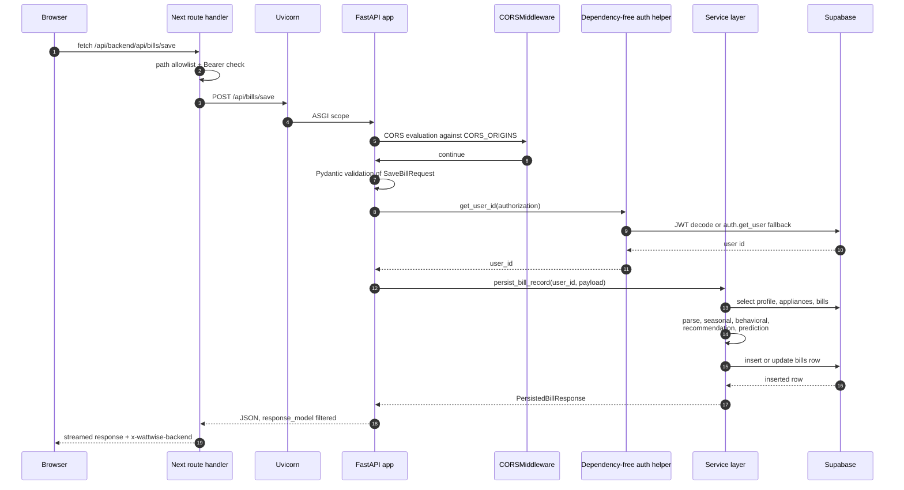
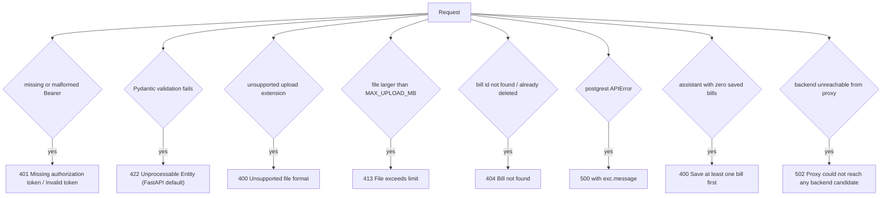
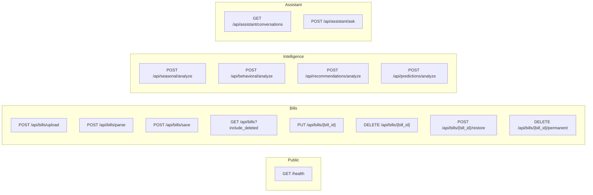

# API Request Flow

```mermaid
sequenceDiagram
  autonumber
  participant B as Browser
  participant N as Next route handler
  participant U as Uvicorn
  participant A as FastAPI app
  participant M as CORSMiddleware
  participant D as Dependency-free auth helper
  participant S as Service layer
  participant DB as Supabase

  B->>N: fetch /api/backend/api/bills/save
  N->>N: path allowlist + Bearer check
  N->>U: POST /api/bills/save
  U->>A: ASGI scope
  A->>M: CORS evaluation against CORS_ORIGINS
  M->>A: continue
  A->>A: Pydantic validation of SaveBillRequest
  A->>D: get_user_id(authorization)
  D->>DB: JWT decode or auth.get_user fallback
  DB-->>D: user id
  D-->>A: user_id
  A->>S: persist_bill_record(user_id, payload)
  S->>DB: select profile, appliances, bills
  S->>S: parse, seasonal, behavioral,<br/>recommendation, prediction
  S->>DB: insert or update bills row
  DB-->>S: inserted row
  S-->>A: PersistedBillResponse
  A-->>N: JSON, response_model filtered
  N-->>B: streamed response + x-wattwise-backend
```

## Error Surface

```mermaid
graph TD
  A["Request"] --> B{"missing or malformed Bearer"}
  B -- yes --> R401["401 Missing authorization token / Invalid token"]
  A --> C{"Pydantic validation fails"}
  C -- yes --> R422["422 Unprocessable Entity (FastAPI default)"]
  A --> D{"unsupported upload extension"}
  D -- yes --> R400["400 Unsupported file format"]
  A --> E{"file larger than MAX_UPLOAD_MB"}
  E -- yes --> R413["413 File exceeds limit"]
  A --> F{"bill id not found / already deleted"}
  F -- yes --> R404["404 Bill not found"]
  A --> G{"postgrest APIError"}
  G -- yes --> R500["500 with exc.message"]
  A --> H{"assistant with zero saved bills"}
  H -- yes --> R400b["400 Save at least one bill first"]
  A --> I{"backend unreachable from proxy"}
  I -- yes --> R502["502 Proxy could not reach any backend candidate"]
```

## Route Inventory

```mermaid
graph LR
  subgraph Public
    H1["GET /health"]
  end
  subgraph Bills
    B1["POST /api/bills/upload"]
    B2["POST /api/bills/parse"]
    B3["POST /api/bills/save"]
    B4["GET /api/bills?include_deleted"]
    B5["PUT /api/bills/{bill_id}"]
    B6["DELETE /api/bills/{bill_id}"]
    B7["POST /api/bills/{bill_id}/restore"]
    B8["DELETE /api/bills/{bill_id}/permanent"]
  end
  subgraph Intelligence
    I1["POST /api/seasonal/analyze"]
    I2["POST /api/behavioral/analyze"]
    I3["POST /api/recommendations/analyze"]
    I4["POST /api/predictions/analyze"]
  end
  subgraph Assistant
    A1["GET /api/assistant/conversations"]
    A2["POST /api/assistant/ask"]
  end
```
