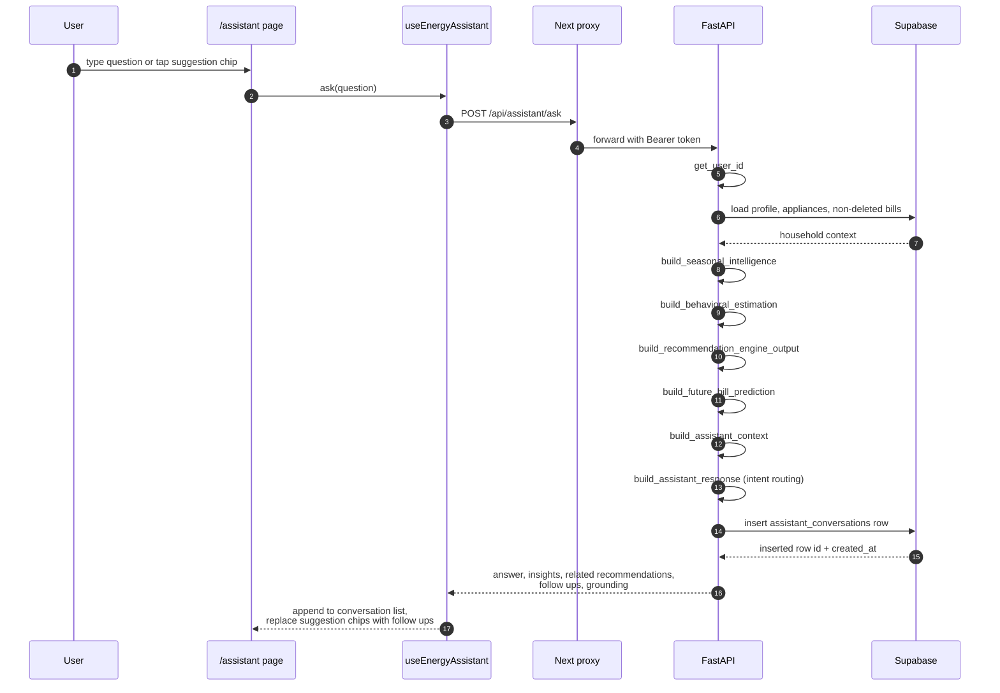
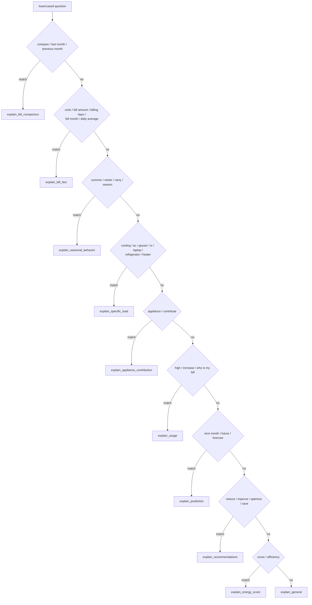
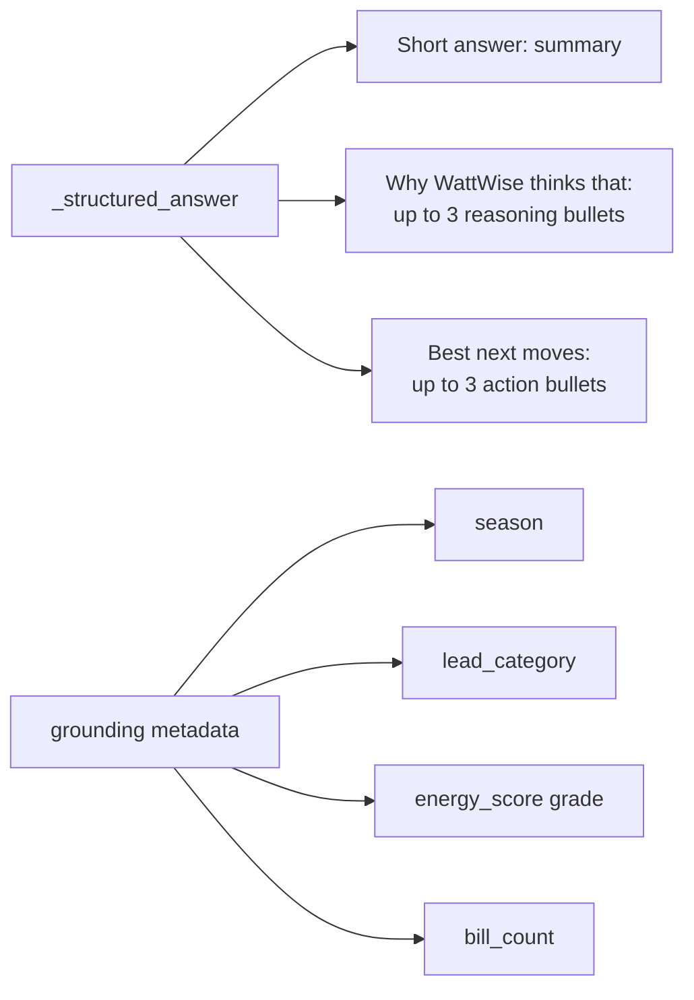

# Assistant Workflow

```mermaid
sequenceDiagram
  autonumber
  participant U as User
  participant P as /assistant page
  participant H as useEnergyAssistant
  participant X as Next proxy
  participant F as FastAPI
  participant S as Supabase

  U->>P: type question or tap suggestion chip
  P->>H: ask(question)
  H->>X: POST /api/assistant/ask
  X->>F: forward with Bearer token
  F->>F: get_user_id
  F->>S: load profile, appliances, non-deleted bills
  S-->>F: household context
  F->>F: build_seasonal_intelligence
  F->>F: build_behavioral_estimation
  F->>F: build_recommendation_engine_output
  F->>F: build_future_bill_prediction
  F->>F: build_assistant_context
  F->>F: build_assistant_response (intent routing)
  F->>S: insert assistant_conversations row
  S-->>F: inserted row id + created_at
  F-->>H: answer, insights, related recommendations,<br/>follow ups, grounding
  H-->>P: append to conversation list,<br/>replace suggestion chips with follow ups
```

## Intent Routing

```mermaid
graph TD
  Q["lowercased question"] --> C1{"compare / last month / previous month"}
  C1 -- match --> R1["explain_bill_comparison"]
  C1 -- no --> C2{"units / bill amount / billing days /<br/>bill month / daily average"}
  C2 -- match --> R2["explain_bill_fact"]
  C2 -- no --> C3{"summer / winter / rainy / season"}
  C3 -- match --> R3["explain_seasonal_behavior"]
  C3 -- no --> C4{"cooling / ac / geyser / tv / laptop /<br/>refrigerator / heater"}
  C4 -- match --> R4["explain_specific_load"]
  C4 -- no --> C5{"appliance / contribute"}
  C5 -- match --> R5["explain_appliance_contribution"]
  C5 -- no --> C6{"high / increase / why is my bill"}
  C6 -- match --> R6["explain_usage"]
  C6 -- no --> C7{"next month / future / forecast"}
  C7 -- match --> R7["explain_prediction"]
  C7 -- no --> C8{"reduce / improve / optimize / save"}
  C8 -- match --> R8["explain_recommendations"]
  C8 -- no --> C9{"score / efficiency"}
  C9 -- match --> R9["explain_energy_score"]
  C9 -- no --> R10["explain_general"]
```

## Answer Shape

```mermaid
graph LR
  A["_structured_answer"] --> B["Short answer: summary"]
  A --> C["Why WattWise thinks that:<br/>up to 3 reasoning bullets"]
  A --> D["Best next moves:<br/>up to 3 action bullets"]
  E["grounding metadata"] --> F["season"]
  E --> G["lead_category"]
  E --> H["energy_score grade"]
  E --> I["bill_count"]
```
