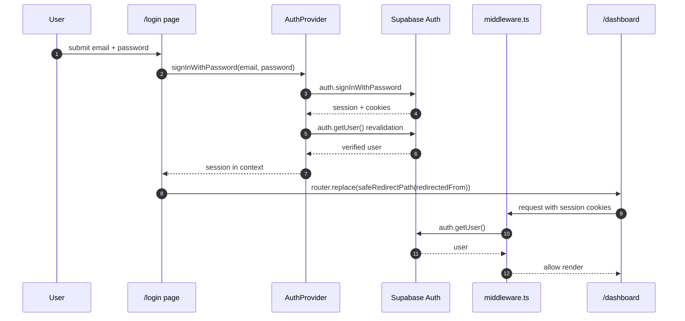
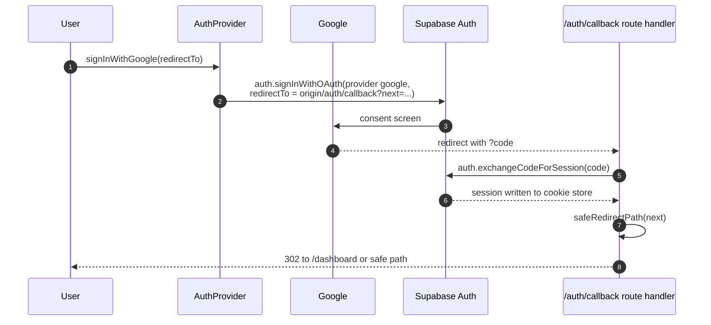
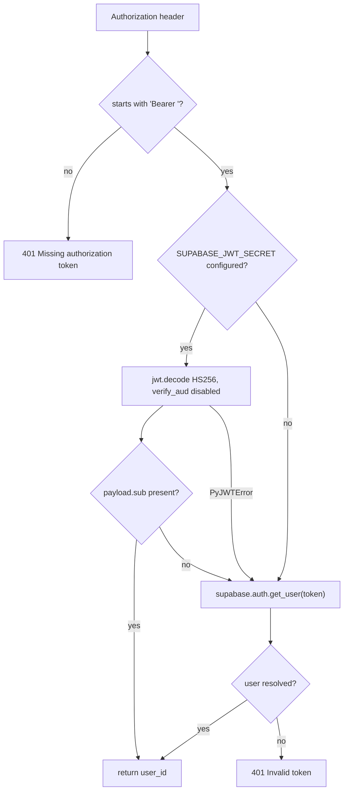
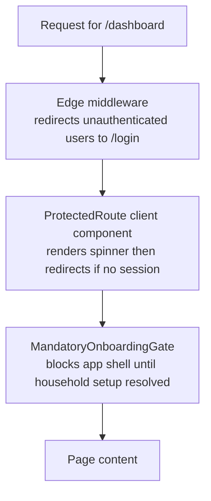

# Authentication Flow

## Email and Password

```mermaid
sequenceDiagram
  autonumber
  participant U as User
  participant L as /login page
  participant A as AuthProvider
  participant SB as Supabase Auth
  participant MW as middleware.ts
  participant D as /dashboard

  U->>L: submit email + password
  L->>A: signInWithPassword(email, password)
  A->>SB: auth.signInWithPassword
  SB-->>A: session + cookies
  A->>SB: auth.getUser() revalidation
  SB-->>A: verified user
  A-->>L: session in context
  L->>D: router.replace(safeRedirectPath(redirectedFrom))
  D->>MW: request with session cookies
  MW->>SB: auth.getUser()
  SB-->>MW: user
  MW-->>D: allow render
```

## Google OAuth

```mermaid
sequenceDiagram
  autonumber
  participant U as User
  participant A as AuthProvider
  participant G as Google
  participant SB as Supabase Auth
  participant CB as /auth/callback route handler

  U->>A: signInWithGoogle(redirectTo)
  A->>SB: auth.signInWithOAuth(provider google,<br/>redirectTo = origin/auth/callback?next=...)
  SB->>G: consent screen
  G-->>CB: redirect with ?code
  CB->>SB: auth.exchangeCodeForSession(code)
  SB-->>CB: session written to cookie store
  CB->>CB: safeRedirectPath(next)
  CB-->>U: 302 to /dashboard or safe path
```

## Backend Token Verification

```mermaid
flowchart TD
  A["Authorization header"] --> B{"starts with 'Bearer '?"}
  B -- no --> E1["401 Missing authorization token"]
  B -- yes --> C{"SUPABASE_JWT_SECRET configured?"}
  C -- yes --> D["jwt.decode HS256, verify_aud disabled"]
  D --> F{"payload.sub present?"}
  F -- yes --> OK["return user_id"]
  F -- no --> G
  C -- no --> G["supabase.auth.get_user(token)"]
  D -->|"PyJWTError"| G
  G --> H{"user resolved?"}
  H -- yes --> OK
  H -- no --> E2["401 Invalid token"]
```

## Layered Guards

```mermaid
graph TD
  R["Request for /dashboard"] --> M["Edge middleware<br/>redirects unauthenticated users to /login"]
  M --> P["ProtectedRoute client component<br/>renders spinner then redirects if no session"]
  P --> O["MandatoryOnboardingGate<br/>blocks app shell until household setup resolved"]
  O --> C["Page content"]
```
