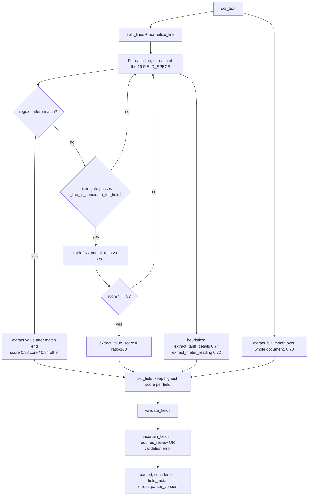
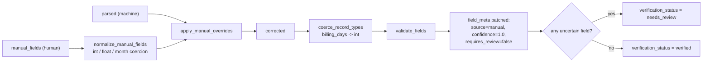
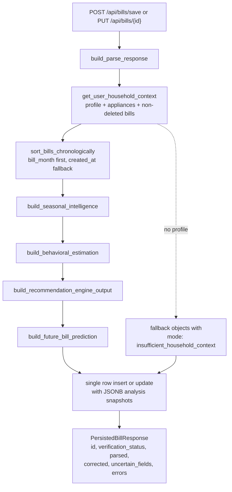

# Bill Processing

## Parse Stage

```mermaid
graph TD
  A["ocr_text"] --> B["split_lines + normalize_line"]
  B --> C["For each line, for each of the 19 FIELD_SPECS"]
  C --> D{"regex pattern match?"}
  D -- yes --> E["extract value after match end<br/>score 0.88 core / 0.84 other"]
  D -- no --> F{"token gate passes<br/>_line_is_candidate_for_field?"}
  F -- no --> C
  F -- yes --> G["rapidfuzz partial_ratio vs aliases"]
  G --> H{"score >= 78?"}
  H -- no --> C
  H -- yes --> I["extract value, score = ratio/100"]
  E --> J["set_field: keep highest score per field"]
  I --> J
  C --> K["heuristics: extract_tariff_details 0.74<br/>extract_meter_reading 0.72"]
  K --> J
  A --> L["extract_bill_month over whole document, 0.78"]
  L --> J
  J --> M["validate_fields"]
  M --> N["uncertain_fields = requires_review OR validation error"]
  N --> O["parsed, confidence, field_meta,<br/>errors, parser_version"]
```

## Manual Override Merge

```mermaid
graph LR
  A["parsed (machine)"] --> C["apply_manual_overrides"]
  B["manual_fields (human)"] --> N["normalize_manual_fields<br/>int / float / month coercion"]
  N --> C
  C --> D["corrected"]
  D --> E["coerce_record_types<br/>billing_days -> int"]
  E --> F["validate_fields"]
  F --> G["field_meta patched:<br/>source=manual, confidence=1.0,<br/>requires_review=false"]
  G --> H{"any uncertain field?"}
  H -- yes --> I["verification_status = needs_review"]
  H -- no --> J["verification_status = verified"]
```

## Save Stage Composition

```mermaid
graph TD
  A["POST /api/bills/save or PUT /api/bills/{id}"] --> B["build_parse_response"]
  B --> C["get_user_household_context<br/>profile + appliances + non-deleted bills"]
  C --> D["sort_bills_chronologically<br/>bill_month first, created_at fallback"]
  D --> E["build_seasonal_intelligence"]
  E --> F["build_behavioral_estimation"]
  F --> G["build_recommendation_engine_output"]
  G --> H["build_future_bill_prediction"]
  H --> I["single row insert or update<br/>with JSONB analysis snapshots"]
  I --> J["PersistedBillResponse<br/>id, verification_status, parsed,<br/>corrected, uncertain_fields, errors"]

  C -.->|"no profile"| K["fallback objects with<br/>mode: insufficient_household_context"]
  K --> I
```
