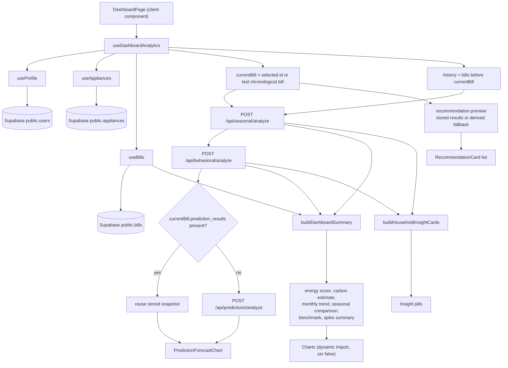
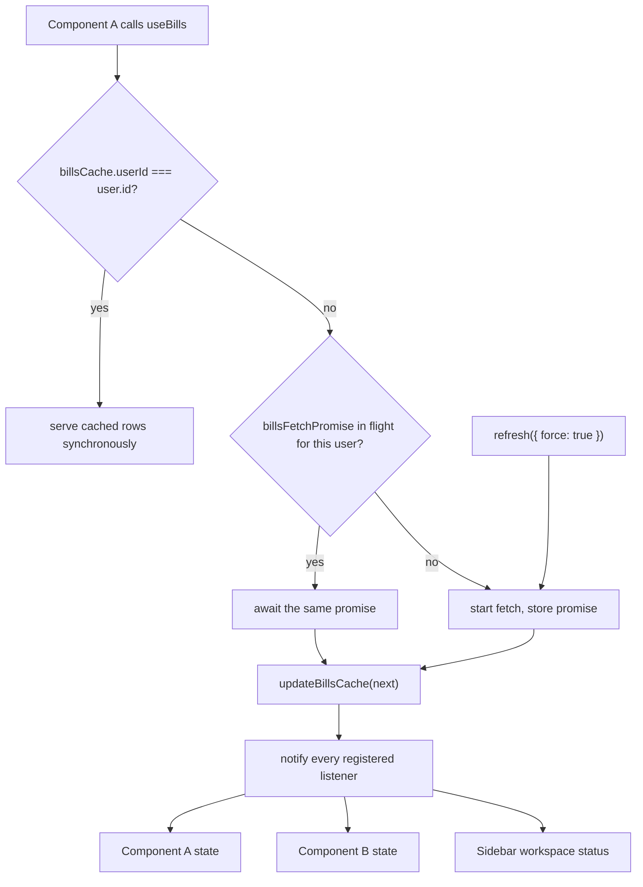
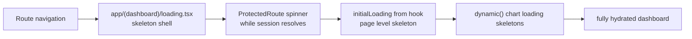

# Dashboard Data Flow

```mermaid
graph TD
  A["DashboardPage (client component)"] --> B["useDashboardAnalytics"]
  B --> C["useProfile"]
  B --> D["useAppliances"]
  B --> E["useBills"]
  C --> F[("Supabase public.users")]
  D --> G[("Supabase public.appliances")]
  E --> H[("Supabase public.bills")]

  B --> I["currentBill = selected id or last chronological bill"]
  B --> J["history = bills before currentBill"]

  I --> K["POST /api/seasonal/analyze"]
  J --> K
  K --> L["POST /api/behavioral/analyze"]
  L --> M{"currentBill.prediction_results present?"}
  M -- yes --> N["reuse stored snapshot"]
  M -- no --> O["POST /api/predictions/analyze"]

  K --> P["buildDashboardSummary"]
  L --> P
  E --> P
  P --> Q["energy score, carbon estimate,<br/>monthly trend, seasonal comparison,<br/>benchmark, spike summary"]

  L --> R["buildHouseholdInsightCards"]
  K --> R
  I --> S["recommendation preview<br/>stored results or derived fallback"]

  Q --> T["Charts (dynamic import, ssr false)"]
  R --> U["Insight pills"]
  S --> V["RecommendationCard list"]
  N --> W["PredictionForecastChart"]
  O --> W
```

## Module-Level Client Cache

```mermaid
graph TD
  A["Component A calls useBills"] --> B{"billsCache.userId === user.id?"}
  B -- yes --> C["serve cached rows synchronously"]
  B -- no --> D{"billsFetchPromise in flight for this user?"}
  D -- yes --> E["await the same promise"]
  D -- no --> F["start fetch, store promise"]
  F --> G["updateBillsCache(next)"]
  E --> G
  G --> H["notify every registered listener"]
  H --> I["Component A state"]
  H --> J["Component B state"]
  H --> K["Sidebar workspace status"]
  L["refresh({ force: true })"] --> F
```

## Loading States

```mermaid
graph LR
  A["Route navigation"] --> B["app/(dashboard)/loading.tsx<br/>skeleton shell"]
  B --> C["ProtectedRoute spinner<br/>while session resolves"]
  C --> D["initialLoading from hook<br/>page level skeleton"]
  D --> E["dynamic() chart loading skeletons"]
  E --> F["fully hydrated dashboard"]
```
