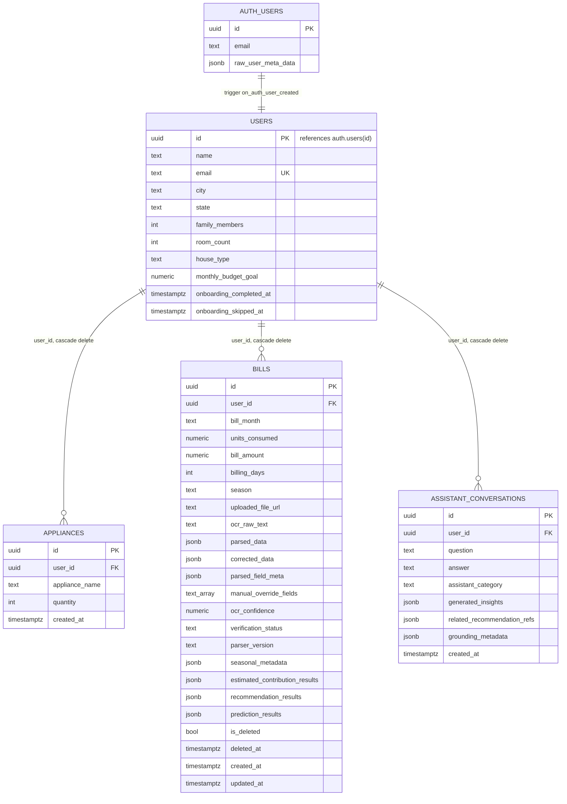
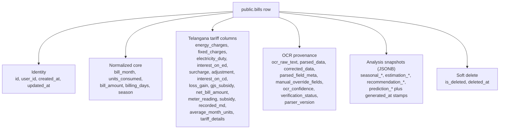
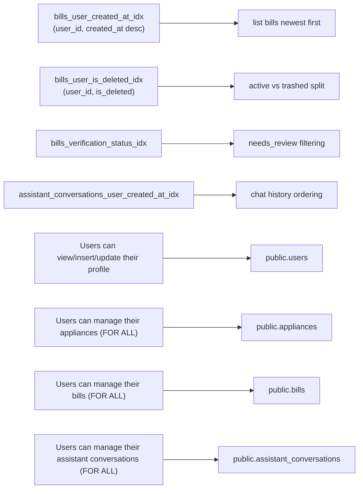

# Database Relationships

```mermaid
erDiagram
  AUTH_USERS ||--|| USERS : "trigger on_auth_user_created"
  USERS ||--o{ APPLIANCES : "user_id, cascade delete"
  USERS ||--o{ BILLS : "user_id, cascade delete"
  USERS ||--o{ ASSISTANT_CONVERSATIONS : "user_id, cascade delete"

  AUTH_USERS {
    uuid id PK
    text email
    jsonb raw_user_meta_data
  }

  USERS {
    uuid id PK "references auth.users(id)"
    text name
    text email UK
    text city
    text state
    int family_members
    int room_count
    text house_type
    numeric monthly_budget_goal
    timestamptz onboarding_completed_at
    timestamptz onboarding_skipped_at
  }

  APPLIANCES {
    uuid id PK
    uuid user_id FK
    text appliance_name
    int quantity
    timestamptz created_at
  }

  BILLS {
    uuid id PK
    uuid user_id FK
    text bill_month
    numeric units_consumed
    numeric bill_amount
    int billing_days
    text season
    text uploaded_file_url
    text ocr_raw_text
    jsonb parsed_data
    jsonb corrected_data
    jsonb parsed_field_meta
    text_array manual_override_fields
    numeric ocr_confidence
    text verification_status
    text parser_version
    jsonb seasonal_metadata
    jsonb estimated_contribution_results
    jsonb recommendation_results
    jsonb prediction_results
    bool is_deleted
    timestamptz deleted_at
    timestamptz created_at
    timestamptz updated_at
  }

  ASSISTANT_CONVERSATIONS {
    uuid id PK
    uuid user_id FK
    text question
    text answer
    text assistant_category
    jsonb generated_insights
    jsonb related_recommendation_refs
    jsonb grounding_metadata
    timestamptz created_at
  }
```

## Column Groups Inside `bills`

```mermaid
graph TD
  B["public.bills row"] --> B1["Identity<br/>id, user_id, created_at, updated_at"]
  B --> B2["Normalized core<br/>bill_month, units_consumed,<br/>bill_amount, billing_days, season"]
  B --> B3["Telangana tariff columns<br/>energy_charges, fixed_charges,<br/>electricity_duty, interest_on_ed,<br/>surcharge, adjustment, interest_on_cd,<br/>loss_gain, gjs_subsidy, net_bill_amount,<br/>meter_reading, subsidy, recorded_md,<br/>average_month_units, tariff_details"]
  B --> B4["OCR provenance<br/>ocr_raw_text, parsed_data, corrected_data,<br/>parsed_field_meta, manual_override_fields,<br/>ocr_confidence, verification_status,<br/>parser_version"]
  B --> B5["Analysis snapshots (JSONB)<br/>seasonal_*, estimation_*, recommendation_*,<br/>prediction_* plus generated_at stamps"]
  B --> B6["Soft delete<br/>is_deleted, deleted_at"]
```

## Index and Policy Coverage

```mermaid
graph LR
  I1["bills_user_created_at_idx<br/>(user_id, created_at desc)"] --> Q1["list bills newest first"]
  I2["bills_user_is_deleted_idx<br/>(user_id, is_deleted)"] --> Q2["active vs trashed split"]
  I3["bills_verification_status_idx"] --> Q3["needs_review filtering"]
  I4["assistant_conversations_user_created_at_idx"] --> Q4["chat history ordering"]

  P1["Users can view/insert/update their profile"] --> T1["public.users"]
  P2["Users can manage their appliances (FOR ALL)"] --> T2["public.appliances"]
  P3["Users can manage their bills (FOR ALL)"] --> T3["public.bills"]
  P4["Users can manage their assistant conversations (FOR ALL)"] --> T4["public.assistant_conversations"]
```
