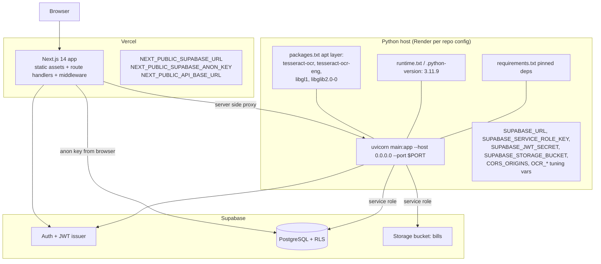
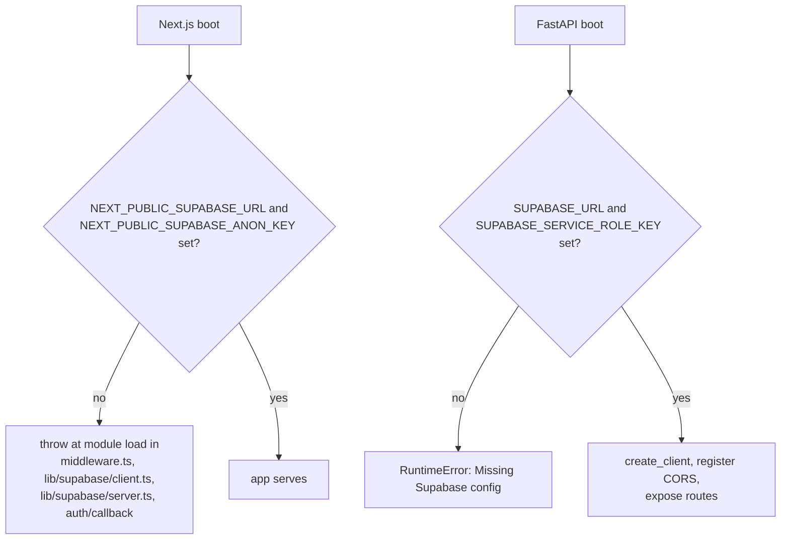
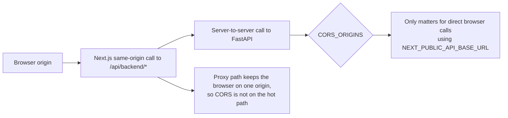

# Deployment Architecture

```mermaid
graph TB
  subgraph Edge["Vercel"]
    NEXT["Next.js 14 app<br/>static assets + route handlers + middleware"]
    ENV1["NEXT_PUBLIC_SUPABASE_URL<br/>NEXT_PUBLIC_SUPABASE_ANON_KEY<br/>NEXT_PUBLIC_API_BASE_URL"]
  end

  subgraph Python["Python host (Render per repo config)"]
    UV["uvicorn main:app --host 0.0.0.0 --port $PORT"]
    SYS["packages.txt apt layer:<br/>tesseract-ocr, tesseract-ocr-eng,<br/>libgl1, libglib2.0-0"]
    PY["runtime.txt / .python-version: 3.11.9"]
    REQ["requirements.txt pinned deps"]
    ENV2["SUPABASE_URL, SUPABASE_SERVICE_ROLE_KEY,<br/>SUPABASE_JWT_SECRET, SUPABASE_STORAGE_BUCKET,<br/>CORS_ORIGINS, OCR_* tuning vars"]
  end

  subgraph SB["Supabase"]
    AUTH["Auth + JWT issuer"]
    PG[("PostgreSQL + RLS")]
    ST["Storage bucket: bills"]
  end

  User["Browser"] --> NEXT
  NEXT -->|"server side proxy"| UV
  NEXT -->|"anon key from browser"| PG
  NEXT --> AUTH
  UV -->|"service role"| PG
  UV -->|"service role"| ST
  UV --> AUTH
  SYS --- UV
  PY --- UV
  REQ --- UV
```

## Boot-Time Configuration Contracts

```mermaid
flowchart TD
  A["Next.js boot"] --> B{"NEXT_PUBLIC_SUPABASE_URL and<br/>NEXT_PUBLIC_SUPABASE_ANON_KEY set?"}
  B -- no --> B1["throw at module load in<br/>middleware.ts, lib/supabase/client.ts,<br/>lib/supabase/server.ts, auth/callback"]
  B -- yes --> C["app serves"]

  D["FastAPI boot"] --> E{"SUPABASE_URL and<br/>SUPABASE_SERVICE_ROLE_KEY set?"}
  E -- no --> E1["RuntimeError: Missing Supabase config"]
  E -- yes --> F["create_client, register CORS,<br/>expose routes"]
```

## Request Origin Trust

```mermaid
graph LR
  A["Browser origin"] --> B["Next.js same-origin call to /api/backend/*"]
  B --> C["Server-to-server call to FastAPI"]
  C --> D{"CORS_ORIGINS"}
  D --> E["Only matters for direct browser calls<br/>using NEXT_PUBLIC_API_BASE_URL"]
  B --> F["Proxy path keeps the browser on one origin,<br/>so CORS is not on the hot path"]
```
