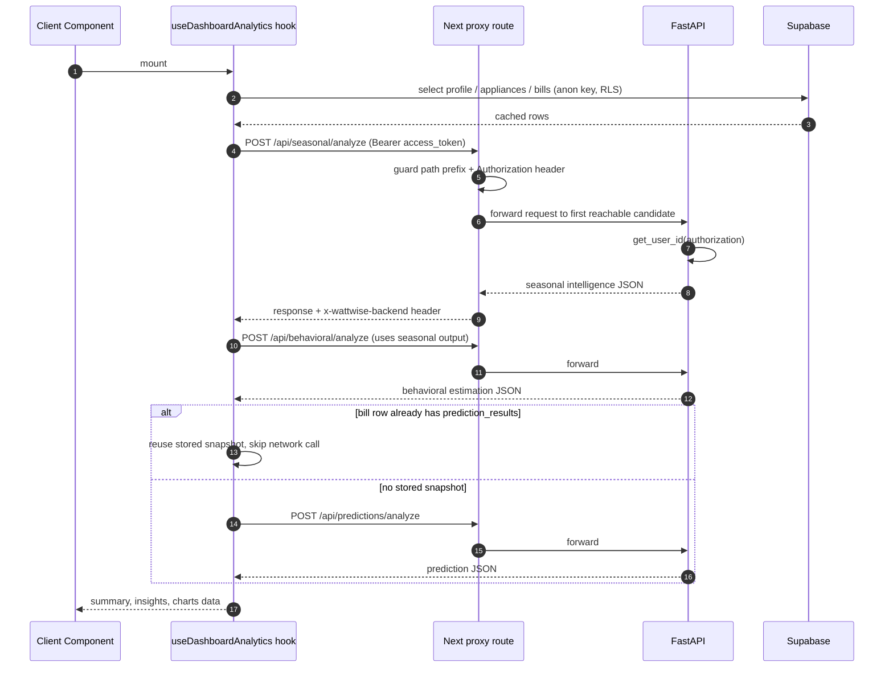
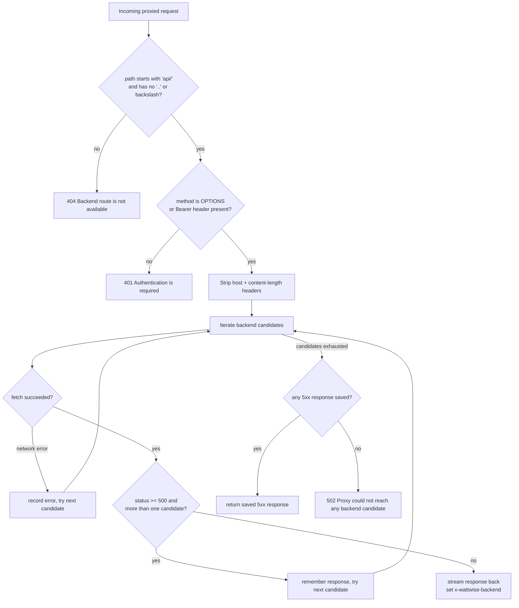

# Frontend to Backend Flow

```mermaid
sequenceDiagram
  autonumber
  participant C as Client Component
  participant H as useDashboardAnalytics hook
  participant P as Next proxy route
  participant F as FastAPI
  participant S as Supabase

  C->>H: mount
  H->>S: select profile / appliances / bills (anon key, RLS)
  S-->>H: cached rows
  H->>P: POST /api/seasonal/analyze (Bearer access_token)
  P->>P: guard path prefix + Authorization header
  P->>F: forward request to first reachable candidate
  F->>F: get_user_id(authorization)
  F-->>P: seasonal intelligence JSON
  P-->>H: response + x-wattwise-backend header
  H->>P: POST /api/behavioral/analyze (uses seasonal output)
  P->>F: forward
  F-->>H: behavioral estimation JSON
  alt bill row already has prediction_results
    H->>H: reuse stored snapshot, skip network call
  else no stored snapshot
    H->>P: POST /api/predictions/analyze
    P->>F: forward
    F-->>H: prediction JSON
  end
  H-->>C: summary, insights, charts data
```

## Proxy Failover

```mermaid
flowchart TD
  A["Incoming proxied request"] --> B{"path starts with 'api/'<br/>and has no '..' or backslash?"}
  B -- no --> B1["404 Backend route is not available"]
  B -- yes --> C{"method is OPTIONS<br/>or Bearer header present?"}
  C -- no --> C1["401 Authentication is required"]
  C -- yes --> D["Strip host + content-length headers"]
  D --> E["Iterate backend candidates"]
  E --> F{"fetch succeeded?"}
  F -- network error --> G["record error, try next candidate"]
  G --> E
  F -- yes --> H{"status >= 500 and<br/>more than one candidate?"}
  H -- yes --> I["remember response, try next candidate"]
  I --> E
  H -- no --> J["stream response back<br/>set x-wattwise-backend"]
  E -->|"candidates exhausted"| K{"any 5xx response saved?"}
  K -- yes --> L["return saved 5xx response"]
  K -- no --> M["502 Proxy could not reach any backend candidate"]
```
