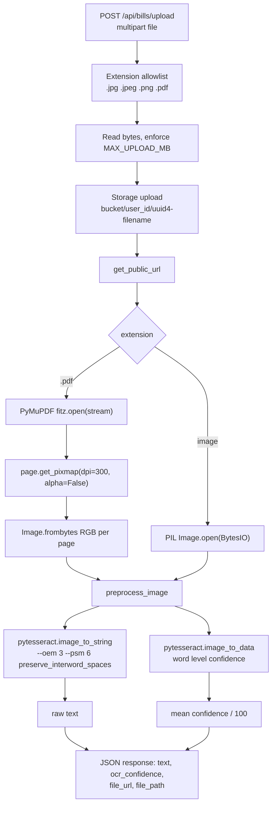
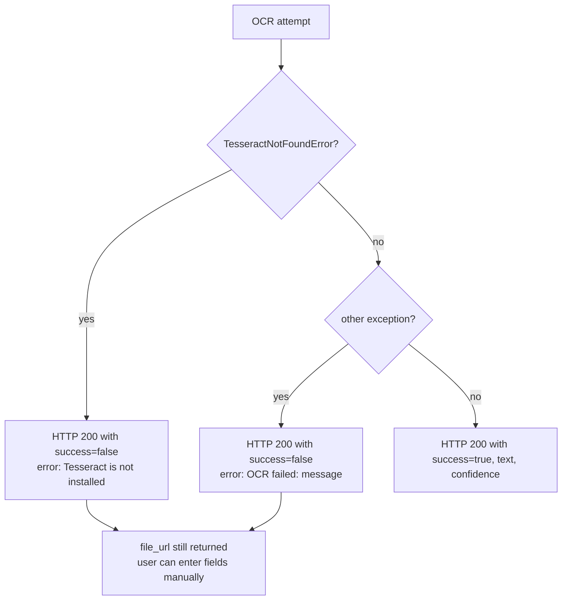

# OCR Pipeline

```mermaid
graph TD
  A["POST /api/bills/upload<br/>multipart file"] --> B["Extension allowlist<br/>.jpg .jpeg .png .pdf"]
  B --> C["Read bytes, enforce MAX_UPLOAD_MB"]
  C --> D["Storage upload<br/>bucket/user_id/uuid4-filename"]
  D --> E["get_public_url"]
  E --> F{"extension"}
  F -->|".pdf"| G["PyMuPDF fitz.open(stream)"]
  F -->|"image"| H["PIL Image.open(BytesIO)"]
  G --> G1["page.get_pixmap(dpi=300, alpha=False)"]
  G1 --> G2["Image.frombytes RGB per page"]
  G2 --> P
  H --> P["preprocess_image"]
  P --> Q["pytesseract.image_to_string<br/>--oem 3 --psm 6 preserve_interword_spaces"]
  P --> R["pytesseract.image_to_data<br/>word level confidence"]
  Q --> S["raw text"]
  R --> T["mean confidence / 100"]
  S --> U["JSON response: text, ocr_confidence,<br/>file_url, file_path"]
  T --> U
```

## Preprocessing Chain

```mermaid
graph LR
  A["Source image"] --> B["ImageOps.exif_transpose"]
  B --> C["convert to RGB if needed"]
  C --> D{"width < OCR_MIN_WIDTH (1200)?"}
  D -- yes --> E["LANCZOS upscale"]
  D -- no --> F
  E --> F["convert to grayscale"]
  F --> G["ImageEnhance.Contrast x1.8"]
  G --> H["ImageEnhance.Sharpness x1.4"]
  H --> I["MedianFilter size 3"]
  I --> J["numpy array"]
  J --> K["cv2.medianBlur 3"]
  K --> L["cv2.adaptiveThreshold<br/>GAUSSIAN_C, block 31, C 10"]
  L --> M["cv2.minAreaRect on dark pixels<br/>-> skew angle"]
  M --> N["cv2.warpAffine INTER_CUBIC<br/>BORDER_REPLICATE"]
  N --> O["cv2.threshold at OCR_THRESHOLD (160)"]
  O --> P["PIL image handed to Tesseract"]
```

## Degradation Path

```mermaid
flowchart TD
  A["OCR attempt"] --> B{"TesseractNotFoundError?"}
  B -- yes --> C["HTTP 200 with success=false<br/>error: Tesseract is not installed"]
  B -- no --> D{"other exception?"}
  D -- yes --> E["HTTP 200 with success=false<br/>error: OCR failed: message"]
  D -- no --> F["HTTP 200 with success=true, text, confidence"]
  C --> G["file_url still returned<br/>user can enter fields manually"]
  E --> G
```
