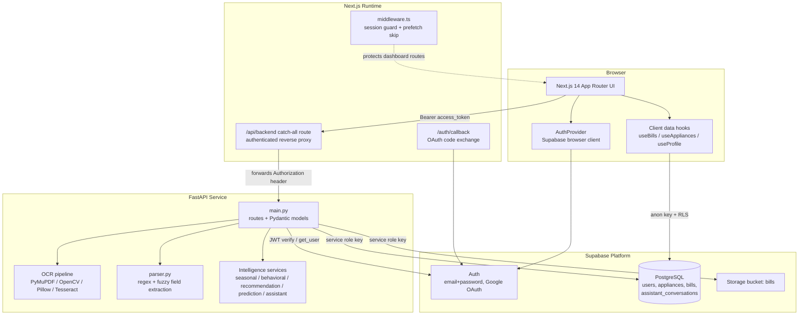
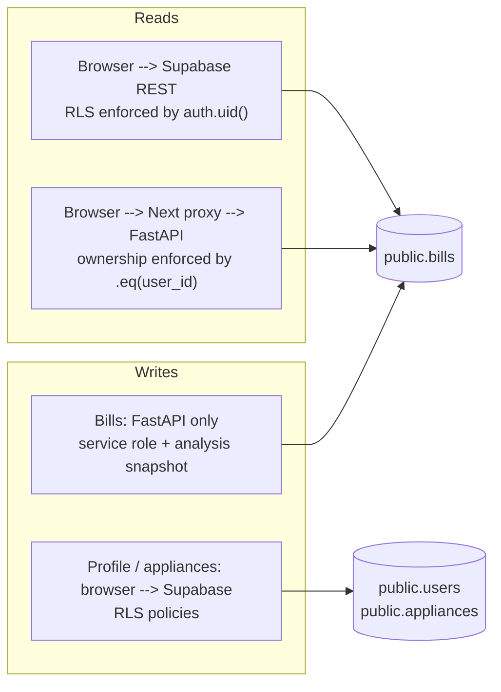

# Overall System Architecture

```mermaid
graph TB
  subgraph Client["Browser"]
    UI["Next.js 14 App Router UI"]
    Hooks["Client data hooks<br/>useBills / useAppliances / useProfile"]
    Auth["AuthProvider<br/>Supabase browser client"]
  end

  subgraph Vercel["Next.js Runtime"]
    MW["middleware.ts<br/>session guard + prefetch skip"]
    CB["/auth/callback<br/>OAuth code exchange"]
    PROXY["/api/backend catch-all route<br/>authenticated reverse proxy"]
  end

  subgraph Backend["FastAPI Service"]
    API["main.py<br/>routes + Pydantic models"]
    OCR["OCR pipeline<br/>PyMuPDF / OpenCV / Pillow / Tesseract"]
    PARSE["parser.py<br/>regex + fuzzy field extraction"]
    INTEL["Intelligence services<br/>seasonal / behavioral / recommendation / prediction / assistant"]
  end

  subgraph Supabase["Supabase Platform"]
    AUTH["Auth<br/>email+password, Google OAuth"]
    DB[("PostgreSQL<br/>users, appliances, bills,<br/>assistant_conversations")]
    STORE["Storage bucket: bills"]
  end

  UI --> Hooks
  UI --> Auth
  Auth --> AUTH
  Hooks -->|"anon key + RLS"| DB
  UI -->|"Bearer access_token"| PROXY
  MW -.->|"protects dashboard routes"| UI
  CB --> AUTH
  PROXY -->|"forwards Authorization header"| API
  API --> OCR
  API --> PARSE
  API --> INTEL
  API -->|"service role key"| DB
  API -->|"service role key"| STORE
  API -->|"JWT verify / get_user"| AUTH
```

## Two Read Paths, One Write Path

```mermaid
graph LR
  subgraph Reads
    R1["Browser --> Supabase REST<br/>RLS enforced by auth.uid()"]
    R2["Browser --> Next proxy --> FastAPI<br/>ownership enforced by .eq(user_id)"]
  end

  subgraph Writes
    W1["Bills: FastAPI only<br/>service role + analysis snapshot"]
    W2["Profile / appliances: browser --> Supabase<br/>RLS policies"]
  end

  R1 --> DB[("public.bills")]
  R2 --> DB
  W1 --> DB
  W2 --> DB2[("public.users<br/>public.appliances")]
```
