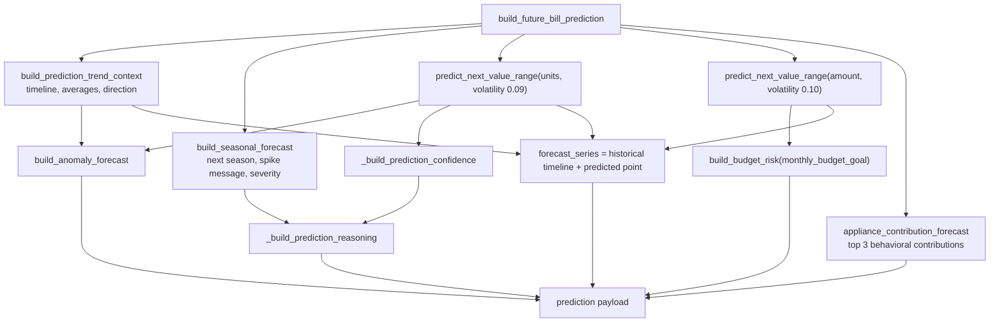
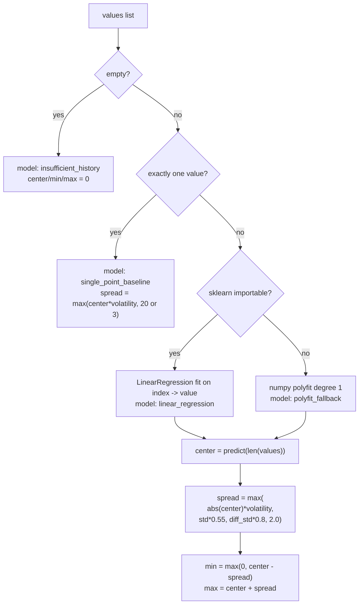
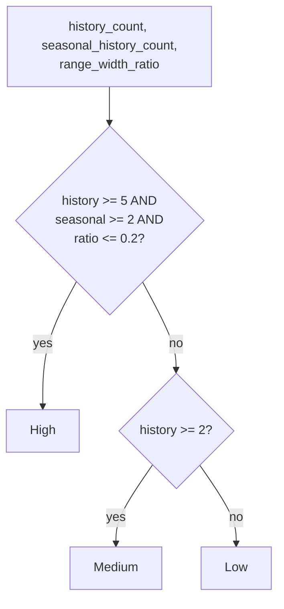
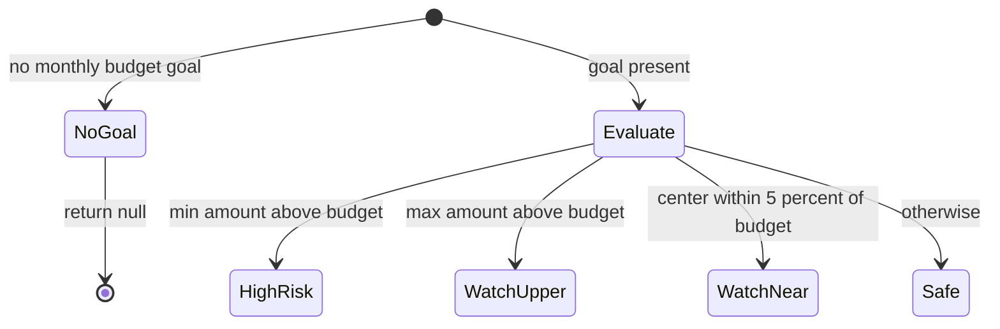

# Prediction Engine

```mermaid
graph TD
  A["build_future_bill_prediction"] --> B["build_prediction_trend_context<br/>timeline, averages, direction"]
  A --> C["build_seasonal_forecast<br/>next season, spike message, severity"]
  A --> D["predict_next_value_range(units, volatility 0.09)"]
  A --> E["predict_next_value_range(amount, volatility 0.10)"]
  D --> F["build_anomaly_forecast"]
  B --> F
  E --> G["build_budget_risk(monthly_budget_goal)"]
  D --> H["_build_prediction_confidence"]
  B --> I["forecast_series = historical timeline + predicted point"]
  D --> I
  E --> I
  C --> J["_build_prediction_reasoning"]
  H --> J
  F --> K["prediction payload"]
  G --> K
  I --> K
  J --> K
  A --> L["appliance_contribution_forecast<br/>top 3 behavioral contributions"]
  L --> K
```

## Value Range Model Selection

```mermaid
flowchart TD
  A["values list"] --> B{"empty?"}
  B -- yes --> B1["model: insufficient_history<br/>center/min/max = 0"]
  B -- no --> C{"exactly one value?"}
  C -- yes --> C1["model: single_point_baseline<br/>spread = max(center*volatility, 20 or 3)"]
  C -- no --> D{"sklearn importable?"}
  D -- yes --> E["LinearRegression fit on index -> value<br/>model: linear_regression"]
  D -- no --> F["numpy polyfit degree 1<br/>model: polyfit_fallback"]
  E --> G["center = predict(len(values))"]
  F --> G
  G --> H["spread = max(<br/>abs(center)*volatility,<br/>std*0.55, diff_std*0.8, 2.0)"]
  H --> I["min = max(0, center - spread)<br/>max = center + spread"]
```

## Confidence Grading

```mermaid
flowchart TD
  A["history_count, seasonal_history_count,<br/>range_width_ratio"] --> B{"history >= 5 AND<br/>seasonal >= 2 AND<br/>ratio <= 0.2?"}
  B -- yes --> H["High"]
  B -- no --> C{"history >= 2?"}
  C -- yes --> M["Medium"]
  C -- no --> L["Low"]
```

## Budget Risk States

```mermaid
stateDiagram-v2
  [*] --> NoGoal: no monthly budget goal
  NoGoal --> [*]: return null
  [*] --> Evaluate: goal present
  Evaluate --> HighRisk: min amount above budget
  Evaluate --> WatchUpper: max amount above budget
  Evaluate --> WatchNear: center within 5 percent of budget
  Evaluate --> Safe: otherwise
```
