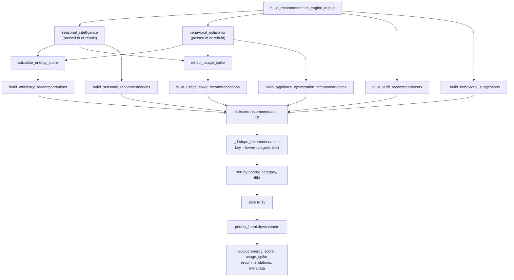
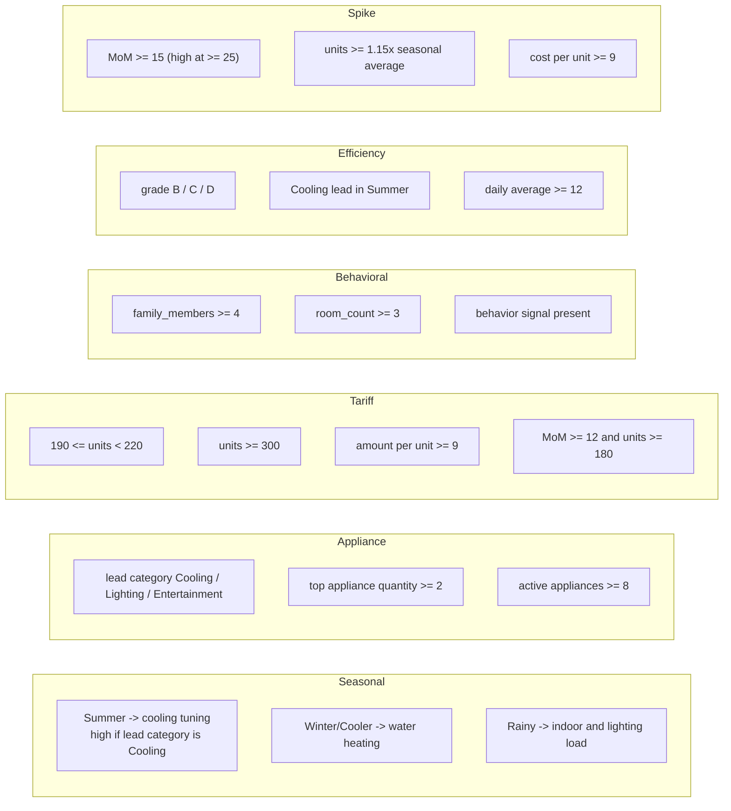
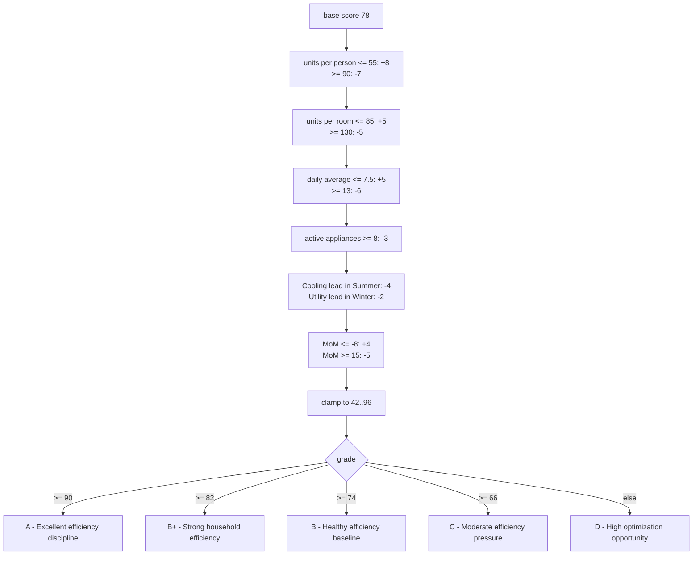

# Recommendation Engine

```mermaid
graph TD
  A["build_recommendation_engine_output"] --> B["seasonal_intelligence<br/>(passed in or rebuilt)"]
  A --> C["behavioral_estimation<br/>(passed in or rebuilt)"]
  B --> D["calculate_energy_score"]
  C --> D
  B --> E["detect_usage_spike"]
  C --> E

  D --> G1["build_efficiency_recommendations"]
  B --> G2["build_seasonal_recommendations"]
  C --> G3["build_appliance_optimization_recommendations"]
  A --> G4["build_tariff_recommendations"]
  A --> G5["_build_behavioral_suggestions"]
  E --> G6["build_usage_spike_recommendations"]

  G1 --> H["collected recommendation list"]
  G2 --> H
  G3 --> H
  G4 --> H
  G5 --> H
  G6 --> H

  H --> I["_dedupe_recommendations<br/>key = lower(category, title)"]
  I --> J["sort by priority, category, title"]
  J --> K["slice to 12"]
  K --> L["priority_breakdown counts"]
  L --> M["output: energy_score, usage_spike,<br/>recommendations, metadata"]
```

## Generator Trigger Conditions

```mermaid
graph LR
  subgraph Seasonal
    S1["Summer -> cooling tuning<br/>high if lead category is Cooling"]
    S2["Winter/Cooler -> water heating"]
    S3["Rainy -> indoor and lighting load"]
  end
  subgraph Appliance
    A1["lead category Cooling / Lighting / Entertainment"]
    A2["top appliance quantity >= 2"]
    A3["active appliances >= 8"]
  end
  subgraph Tariff
    T1["190 <= units < 220"]
    T2["units >= 300"]
    T3["amount per unit >= 9"]
    T4["MoM >= 12 and units >= 180"]
  end
  subgraph Behavioral
    B1["family_members >= 4"]
    B2["room_count >= 3"]
    B3["behavior signal present"]
  end
  subgraph Efficiency
    E1["grade B / C / D"]
    E2["Cooling lead in Summer"]
    E3["daily average >= 12"]
  end
  subgraph Spike
    P1["MoM >= 15 (high at >= 25)"]
    P2["units >= 1.15x seasonal average"]
    P3["cost per unit >= 9"]
  end
```

## Energy Score Composition

```mermaid
graph TD
  A["base score 78"] --> B["units per person <= 55: +8<br/>>= 90: -7"]
  B --> C["units per room <= 85: +5<br/>>= 130: -5"]
  C --> D["daily average <= 7.5: +5<br/>>= 13: -6"]
  D --> E["active appliances >= 8: -3"]
  E --> F["Cooling lead in Summer: -4<br/>Utility lead in Winter: -2"]
  F --> G["MoM <= -8: +4<br/>MoM >= 15: -5"]
  G --> H["clamp to 42..96"]
  H --> I{"grade"}
  I -->|">= 90"| A1["A - Excellent efficiency discipline"]
  I -->|">= 82"| A2["B+ - Strong household efficiency"]
  I -->|">= 74"| A3["B - Healthy efficiency baseline"]
  I -->|">= 66"| A4["C - Moderate efficiency pressure"]
  I -->|"else"| A5["D - High optimization opportunity"]
```
