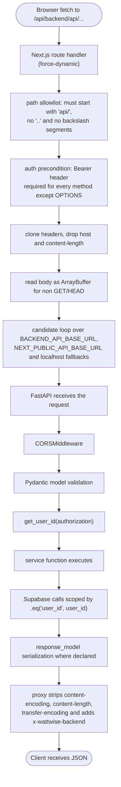
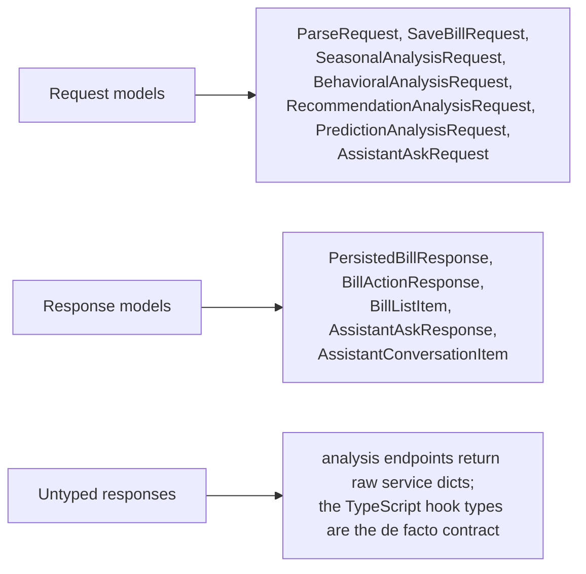
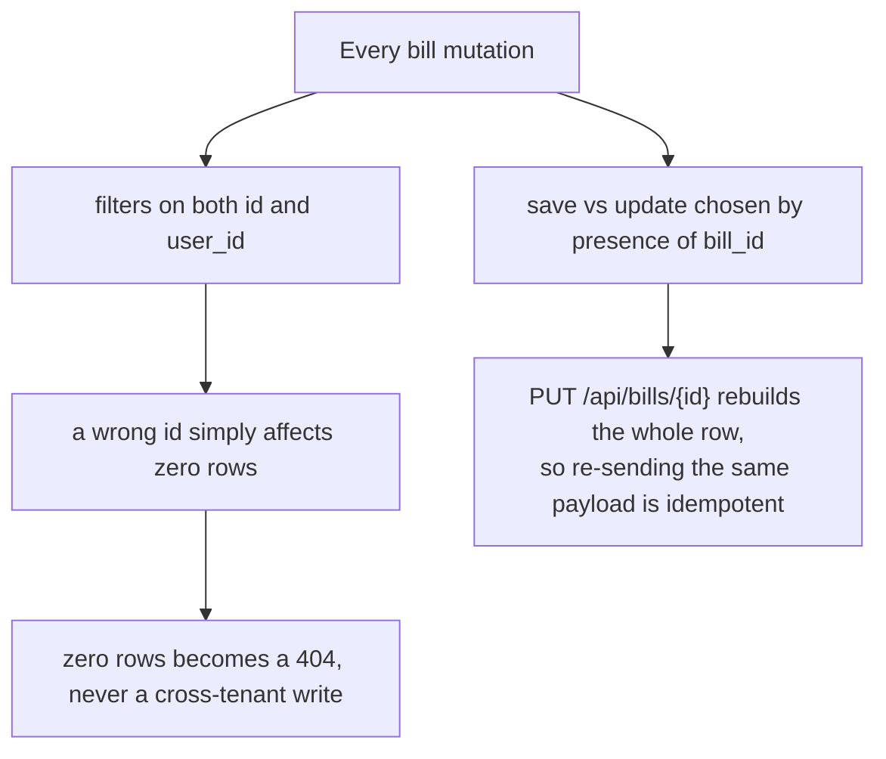
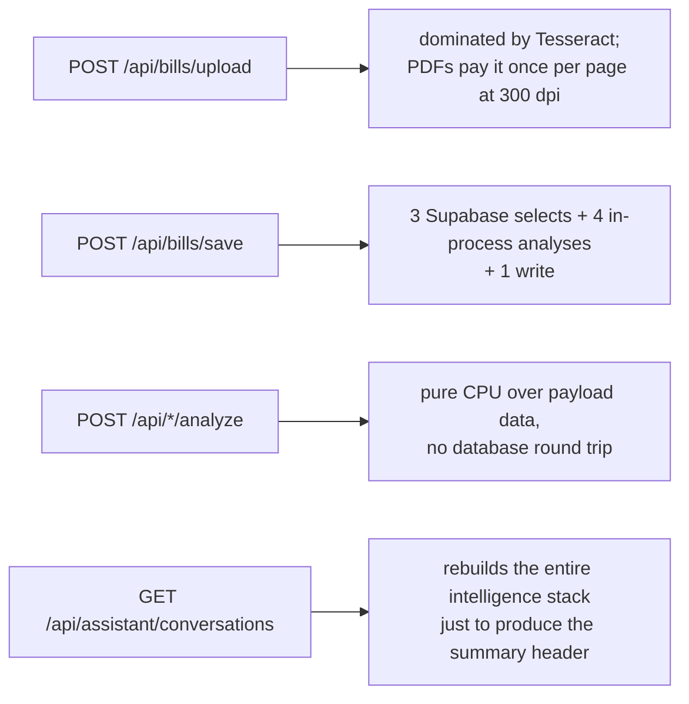

# API Lifecycle Flowchart

```mermaid
flowchart TD
  Start(["Browser fetch to /api/backend/api/..."]) --> A["Next.js route handler<br/>(force-dynamic)"]
  A --> B["path allowlist: must start with 'api/',<br/>no '..' and no backslash segments"]
  B --> C["auth precondition: Bearer header<br/>required for every method except OPTIONS"]
  C --> D["clone headers, drop host and content-length"]
  D --> E["read body as ArrayBuffer for non GET/HEAD"]
  E --> F["candidate loop over BACKEND_API_BASE_URL,<br/>NEXT_PUBLIC_API_BASE_URL and localhost fallbacks"]
  F --> G["FastAPI receives the request"]
  G --> H["CORSMiddleware"]
  H --> I["Pydantic model validation"]
  I --> J["get_user_id(authorization)"]
  J --> K["service function executes"]
  K --> L["Supabase calls scoped by .eq('user_id', user_id)"]
  L --> M["response_model serialization where declared"]
  M --> N["proxy strips content-encoding, content-length,<br/>transfer-encoding and adds x-wattwise-backend"]
  N --> Done(["Client receives JSON"])
```

## Contract Layers

```mermaid
flowchart LR
  A["Request models"] --> A1["ParseRequest, SaveBillRequest,<br/>SeasonalAnalysisRequest, BehavioralAnalysisRequest,<br/>RecommendationAnalysisRequest, PredictionAnalysisRequest,<br/>AssistantAskRequest"]
  B["Response models"] --> B1["PersistedBillResponse, BillActionResponse,<br/>BillListItem, AssistantAskResponse,<br/>AssistantConversationItem"]
  C["Untyped responses"] --> C1["analysis endpoints return raw service dicts;<br/>the TypeScript hook types are the de facto contract"]
```

## Idempotency and Ownership

```mermaid
flowchart TD
  A["Every bill mutation"] --> B["filters on both id and user_id"]
  B --> C["a wrong id simply affects zero rows"]
  C --> D["zero rows becomes a 404, never a cross-tenant write"]
  A --> E["save vs update chosen by presence of bill_id"]
  E --> F["PUT /api/bills/{id} rebuilds the whole row,<br/>so re-sending the same payload is idempotent"]
```

## Where Time Is Spent

```mermaid
flowchart LR
  A["POST /api/bills/upload"] --> A1["dominated by Tesseract;<br/>PDFs pay it once per page at 300 dpi"]
  B["POST /api/bills/save"] --> B1["3 Supabase selects + 4 in-process analyses<br/>+ 1 write"]
  C["POST /api/*/analyze"] --> C1["pure CPU over payload data,<br/>no database round trip"]
  D["GET /api/assistant/conversations"] --> D1["rebuilds the entire intelligence stack<br/>just to produce the summary header"]
```
