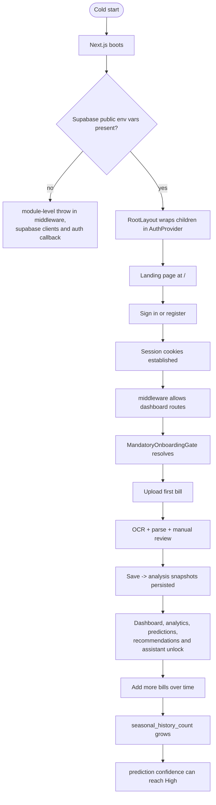
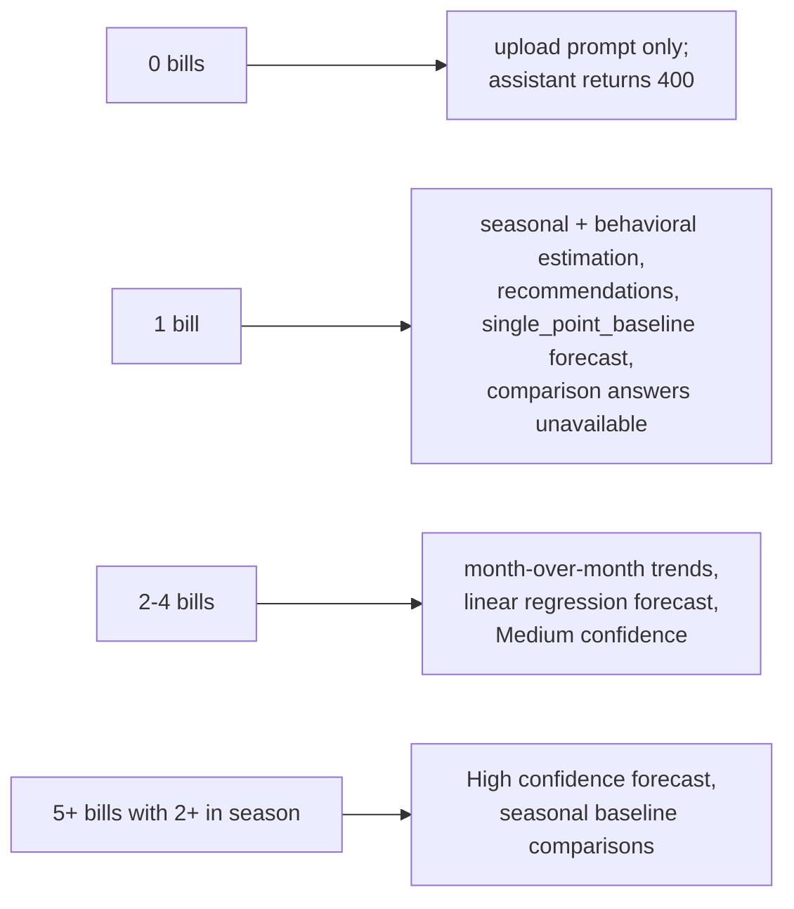
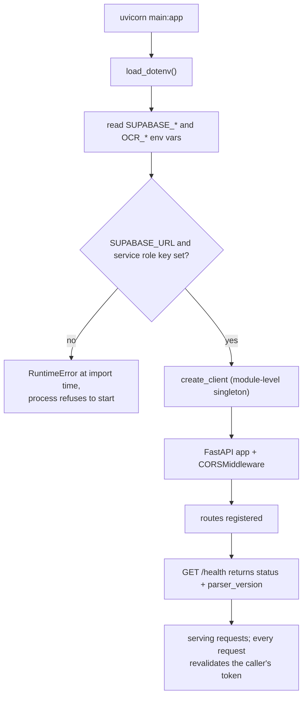

# Application Lifecycle Flowchart

```mermaid
flowchart TD
  Start(["Cold start"]) --> A["Next.js boots"]
  A --> B{"Supabase public env vars present?"}
  B -- no --> B1["module-level throw in middleware,<br/>supabase clients and auth callback"]
  B -- yes --> C["RootLayout wraps children in AuthProvider"]
  C --> D["Landing page at /"]
  D --> E["Sign in or register"]
  E --> F["Session cookies established"]
  F --> G["middleware allows dashboard routes"]
  G --> H["MandatoryOnboardingGate resolves"]
  H --> I["Upload first bill"]
  I --> J["OCR + parse + manual review"]
  J --> K["Save -> analysis snapshots persisted"]
  K --> L["Dashboard, analytics, predictions,<br/>recommendations and assistant unlock"]
  L --> M["Add more bills over time"]
  M --> N["seasonal_history_count grows"]
  N --> O["prediction confidence can reach High"]
```

## Feature Availability by Data Volume

```mermaid
flowchart LR
  A["0 bills"] --> A1["upload prompt only;<br/>assistant returns 400"]
  B["1 bill"] --> B1["seasonal + behavioral estimation,<br/>recommendations, single_point_baseline forecast,<br/>comparison answers unavailable"]
  C["2-4 bills"] --> C1["month-over-month trends,<br/>linear regression forecast,<br/>Medium confidence"]
  D["5+ bills with 2+ in season"] --> D1["High confidence forecast,<br/>seasonal baseline comparisons"]
```

## Backend Process Lifecycle

```mermaid
flowchart TD
  A["uvicorn main:app"] --> B["load_dotenv()"]
  B --> C["read SUPABASE_* and OCR_* env vars"]
  C --> D{"SUPABASE_URL and service role key set?"}
  D -- no --> D1["RuntimeError at import time,<br/>process refuses to start"]
  D -- yes --> E["create_client (module-level singleton)"]
  E --> F["FastAPI app + CORSMiddleware"]
  F --> G["routes registered"]
  G --> H["GET /health returns status + parser_version"]
  H --> I["serving requests; every request<br/>revalidates the caller's token"]
```
