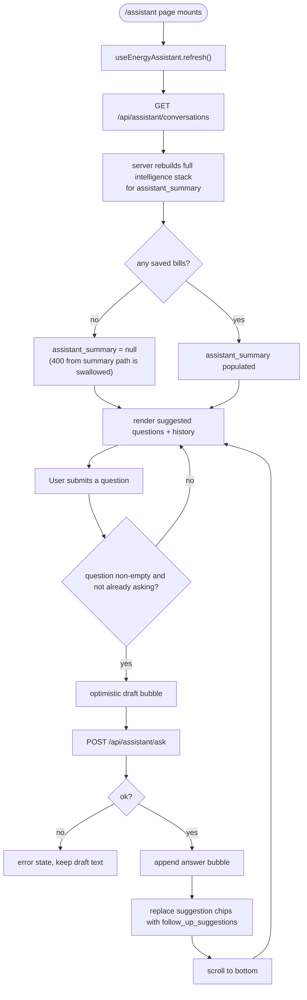
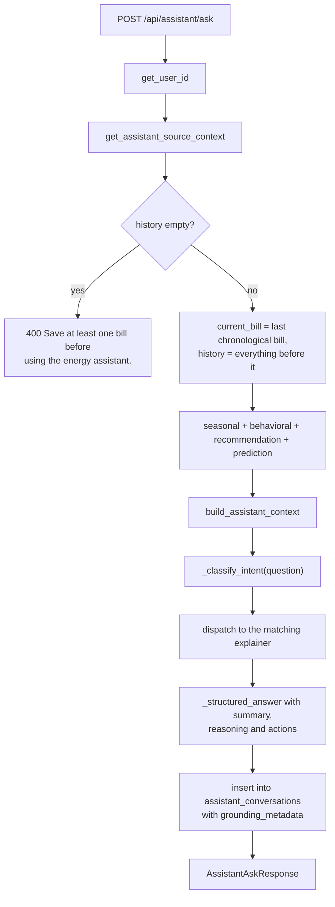
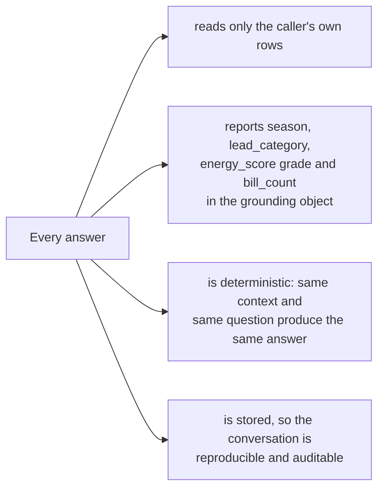

# Assistant Conversation Flowchart

```mermaid
flowchart TD
  Start(["/assistant page mounts"]) --> A["useEnergyAssistant.refresh()"]
  A --> B["GET /api/assistant/conversations"]
  B --> C["server rebuilds full intelligence stack<br/>for assistant_summary"]
  C --> D{"any saved bills?"}
  D -- no --> E["assistant_summary = null<br/>(400 from summary path is swallowed)"]
  D -- yes --> F["assistant_summary populated"]
  E --> G["render suggested questions + history"]
  F --> G
  G --> H["User submits a question"]
  H --> I{"question non-empty and not already asking?"}
  I -- no --> G
  I -- yes --> J["optimistic draft bubble"]
  J --> K["POST /api/assistant/ask"]
  K --> L{"ok?"}
  L -- no --> M["error state, keep draft text"]
  L -- yes --> N["append answer bubble"]
  N --> O["replace suggestion chips with follow_up_suggestions"]
  O --> P["scroll to bottom"]
  P --> G
```

## Server-Side Answer Construction

```mermaid
flowchart TD
  A["POST /api/assistant/ask"] --> B["get_user_id"]
  B --> C["get_assistant_source_context"]
  C --> D{"history empty?"}
  D -- yes --> D1["400 Save at least one bill before<br/>using the energy assistant."]
  D -- no --> E["current_bill = last chronological bill,<br/>history = everything before it"]
  E --> F["seasonal + behavioral + recommendation + prediction"]
  F --> G["build_assistant_context"]
  G --> H["_classify_intent(question)"]
  H --> I["dispatch to the matching explainer"]
  I --> J["_structured_answer with summary,<br/>reasoning and actions"]
  J --> K["insert into assistant_conversations<br/>with grounding_metadata"]
  K --> L["AssistantAskResponse"]
```

## Grounding Guarantee

```mermaid
flowchart LR
  A["Every answer"] --> B["reads only the caller's own rows"]
  A --> C["reports season, lead_category,<br/>energy_score grade and bill_count<br/>in the grounding object"]
  A --> D["is deterministic: same context and<br/>same question produce the same answer"]
  A --> E["is stored, so the conversation is<br/>reproducible and auditable"]
```
