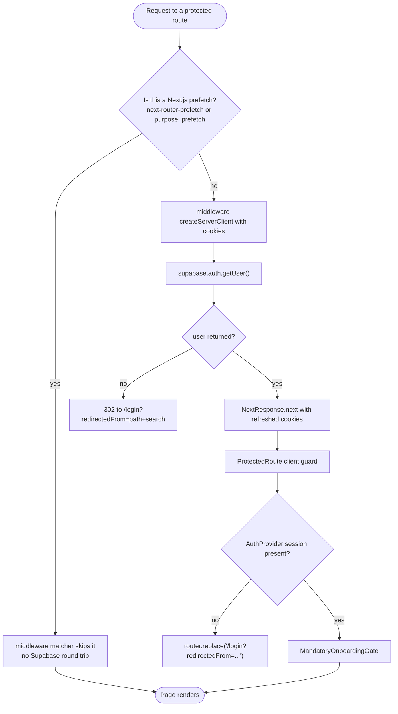
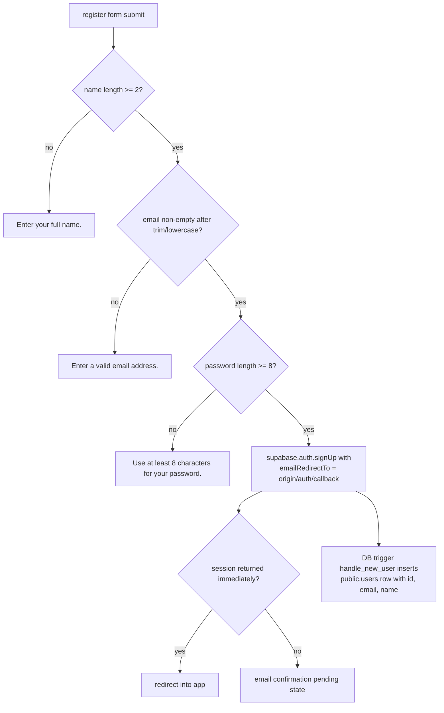
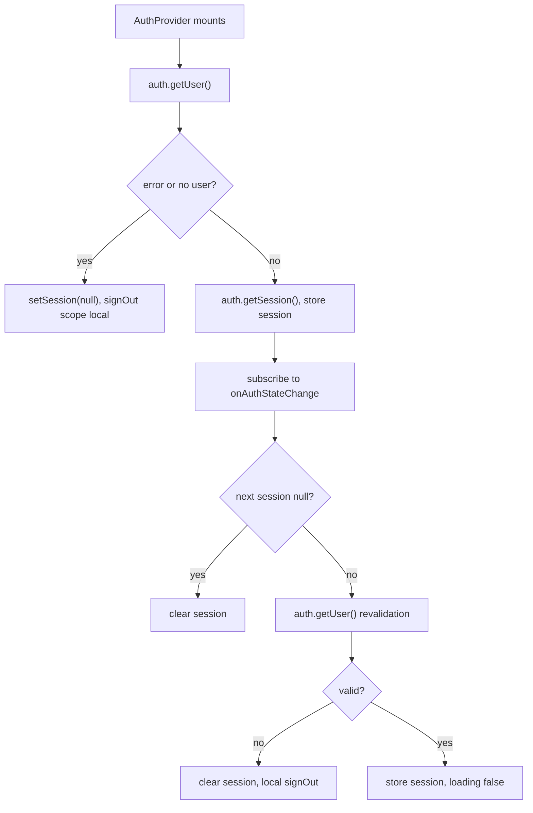
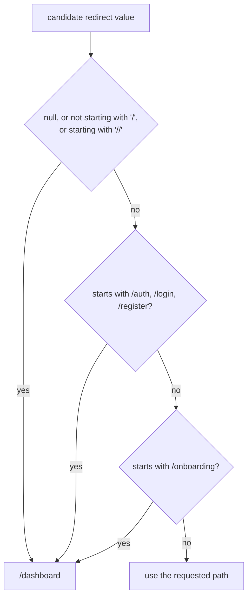

# Authentication Flowchart

```mermaid
flowchart TD
  Start(["Request to a protected route"]) --> A{"Is this a Next.js prefetch?<br/>next-router-prefetch or purpose: prefetch"}
  A -- yes --> A1["middleware matcher skips it<br/>no Supabase round trip"] --> Render
  A -- no --> B["middleware createServerClient with cookies"]
  B --> C["supabase.auth.getUser()"]
  C --> D{"user returned?"}
  D -- no --> E["302 to /login?redirectedFrom=path+search"]
  D -- yes --> F["NextResponse.next with refreshed cookies"]
  F --> G["ProtectedRoute client guard"]
  G --> H{"AuthProvider session present?"}
  H -- no --> I["router.replace('/login?redirectedFrom=...')"]
  H -- yes --> J["MandatoryOnboardingGate"]
  J --> Render(["Page renders"])
```

## Sign-Up Validation

```mermaid
flowchart TD
  A["register form submit"] --> B{"name length >= 2?"}
  B -- no --> B1["Enter your full name."]
  B -- yes --> C{"email non-empty after trim/lowercase?"}
  C -- no --> C1["Enter a valid email address."]
  C -- yes --> D{"password length >= 8?"}
  D -- no --> D1["Use at least 8 characters for your password."]
  D -- yes --> E["supabase.auth.signUp with<br/>emailRedirectTo = origin/auth/callback"]
  E --> F{"session returned immediately?"}
  F -- yes --> G["redirect into app"]
  F -- no --> H["email confirmation pending state"]
  E --> I["DB trigger handle_new_user inserts<br/>public.users row with id, email, name"]
```

## Session Revalidation Loop

```mermaid
flowchart TD
  A["AuthProvider mounts"] --> B["auth.getUser()"]
  B --> C{"error or no user?"}
  C -- yes --> D["setSession(null), signOut scope local"]
  C -- no --> E["auth.getSession(), store session"]
  E --> F["subscribe to onAuthStateChange"]
  F --> G{"next session null?"}
  G -- yes --> H["clear session"]
  G -- no --> I["auth.getUser() revalidation"]
  I --> J{"valid?"}
  J -- no --> K["clear session, local signOut"]
  J -- yes --> L["store session, loading false"]
```

## Open Redirect Guard

```mermaid
flowchart TD
  A["candidate redirect value"] --> B{"null, or not starting with '/',<br/>or starting with '//'"}
  B -- yes --> D["/dashboard"]
  B -- no --> C{"starts with /auth, /login, /register?"}
  C -- yes --> D
  C -- no --> E{"starts with /onboarding?"}
  E -- yes --> D
  E -- no --> F["use the requested path"]
```
