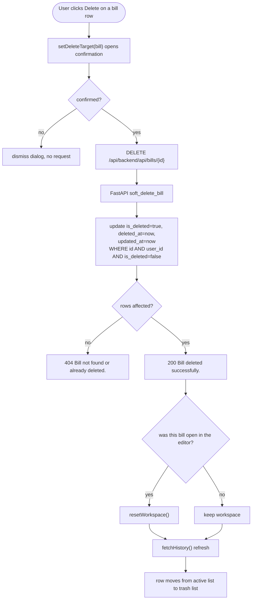
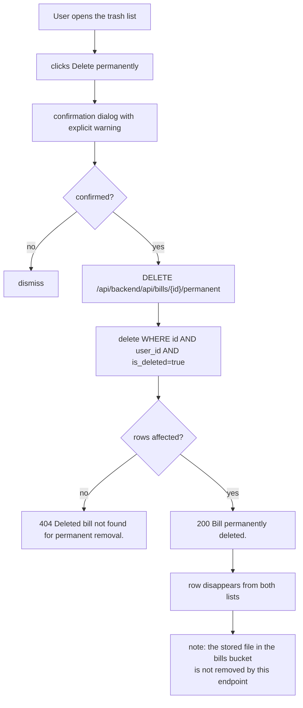
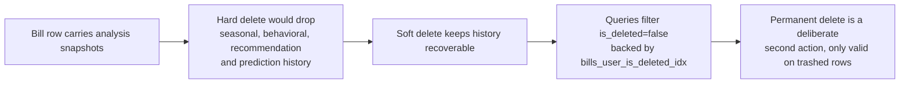

# Bill Deletion Flowchart

```mermaid
flowchart TD
  Start(["User clicks Delete on a bill row"]) --> A["setDeleteTarget(bill) opens confirmation"]
  A --> B{"confirmed?"}
  B -- no --> B1["dismiss dialog, no request"]
  B -- yes --> C["DELETE /api/backend/api/bills/{id}"]
  C --> D["FastAPI soft_delete_bill"]
  D --> E["update is_deleted=true, deleted_at=now,<br/>updated_at=now<br/>WHERE id AND user_id AND is_deleted=false"]
  E --> F{"rows affected?"}
  F -- no --> G["404 Bill not found or already deleted."]
  F -- yes --> H["200 Bill deleted successfully."]
  H --> I{"was this bill open in the editor?"}
  I -- yes --> J["resetWorkspace()"]
  I -- no --> K["keep workspace"]
  J --> L["fetchHistory() refresh"]
  K --> L
  L --> M["row moves from active list to trash list"]
```

## Permanent Delete

```mermaid
flowchart TD
  A["User opens the trash list"] --> B["clicks Delete permanently"]
  B --> C["confirmation dialog with explicit warning"]
  C --> D{"confirmed?"}
  D -- no --> D1["dismiss"]
  D -- yes --> E["DELETE /api/backend/api/bills/{id}/permanent"]
  E --> F["delete WHERE id AND user_id AND is_deleted=true"]
  F --> G{"rows affected?"}
  G -- no --> H["404 Deleted bill not found for permanent removal."]
  G -- yes --> I["200 Bill permanently deleted."]
  I --> J["row disappears from both lists"]
  J --> K["note: the stored file in the bills bucket<br/>is not removed by this endpoint"]
```

## Why Soft Delete First

```mermaid
flowchart LR
  A["Bill row carries analysis snapshots"] --> B["Hard delete would drop<br/>seasonal, behavioral, recommendation<br/>and prediction history"]
  B --> C["Soft delete keeps history recoverable"]
  C --> D["Queries filter is_deleted=false<br/>backed by bills_user_is_deleted_idx"]
  D --> E["Permanent delete is a deliberate<br/>second action, only valid on trashed rows"]
```
