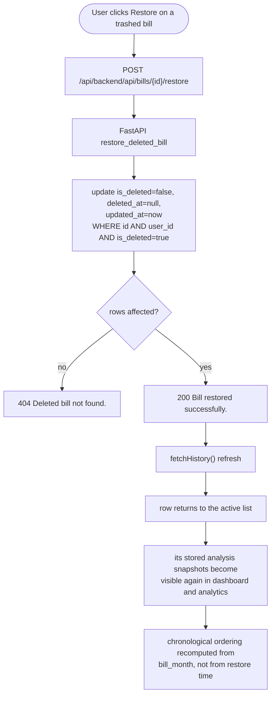
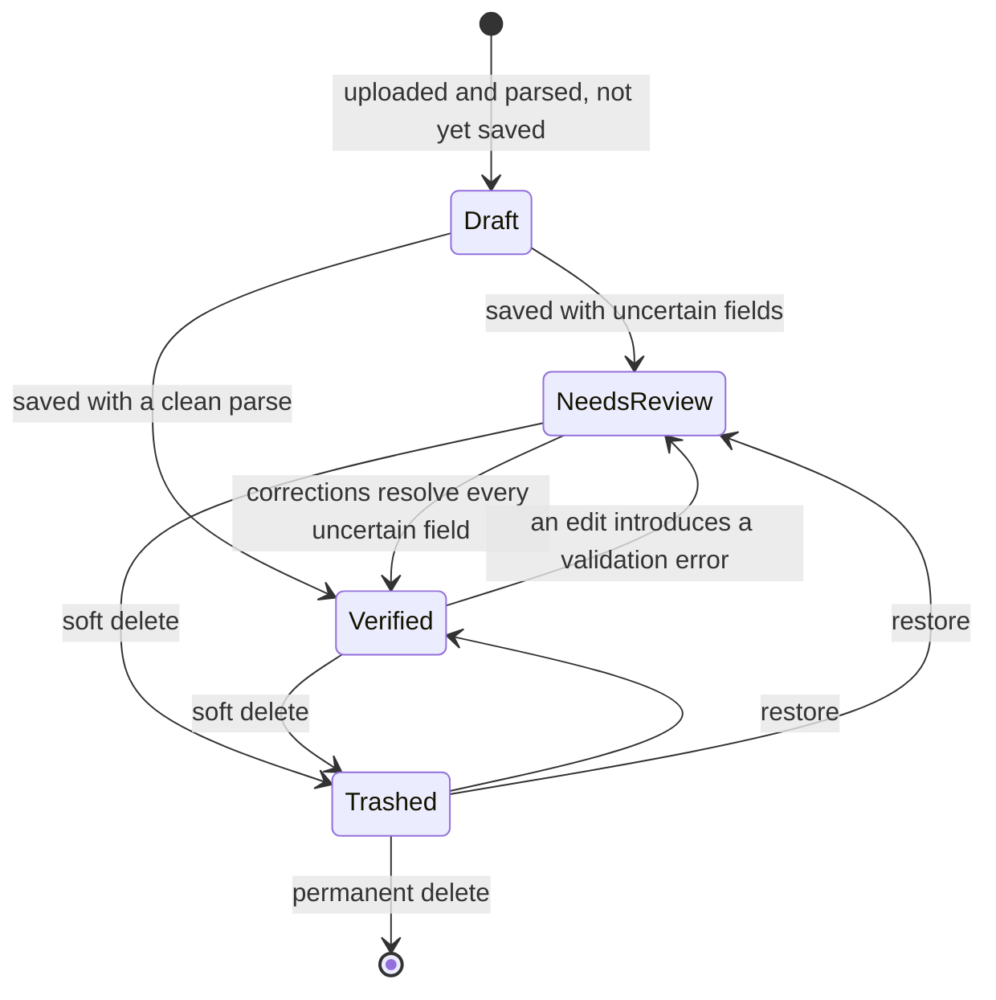
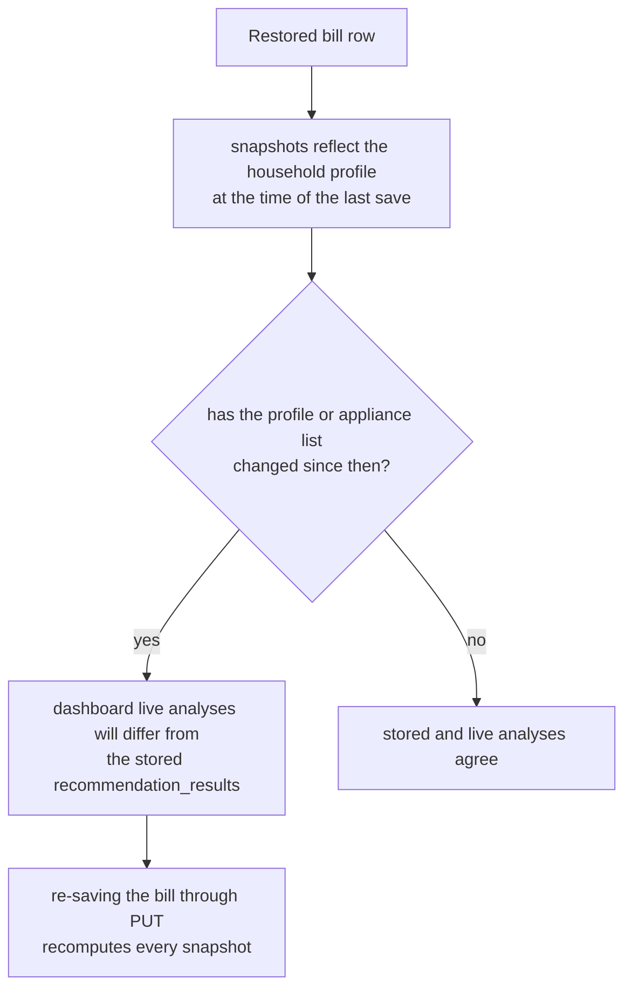

# Bill Restoration Flowchart

```mermaid
flowchart TD
  Start(["User clicks Restore on a trashed bill"]) --> A["POST /api/backend/api/bills/{id}/restore"]
  A --> B["FastAPI restore_deleted_bill"]
  B --> C["update is_deleted=false, deleted_at=null,<br/>updated_at=now<br/>WHERE id AND user_id AND is_deleted=true"]
  C --> D{"rows affected?"}
  D -- no --> E["404 Deleted bill not found."]
  D -- yes --> F["200 Bill restored successfully."]
  F --> G["fetchHistory() refresh"]
  G --> H["row returns to the active list"]
  H --> I["its stored analysis snapshots become<br/>visible again in dashboard and analytics"]
  I --> J["chronological ordering recomputed from<br/>bill_month, not from restore time"]
```

## Bill Lifecycle States

```mermaid
stateDiagram-v2
  [*] --> Draft: uploaded and parsed, not yet saved
  Draft --> NeedsReview: saved with uncertain fields
  Draft --> Verified: saved with a clean parse
  NeedsReview --> Verified: corrections resolve every uncertain field
  Verified --> NeedsReview: an edit introduces a validation error
  NeedsReview --> Trashed: soft delete
  Verified --> Trashed: soft delete
  Trashed --> Verified: restore
  Trashed --> NeedsReview: restore
  Trashed --> [*]: permanent delete
```

## Analysis Freshness After Restore

```mermaid
flowchart TD
  A["Restored bill row"] --> B["snapshots reflect the household profile<br/>at the time of the last save"]
  B --> C{"has the profile or appliance list<br/>changed since then?"}
  C -- yes --> D["dashboard live analyses will differ from<br/>the stored recommendation_results"]
  C -- no --> E["stored and live analyses agree"]
  D --> F["re-saving the bill through PUT<br/>recomputes every snapshot"]
```
