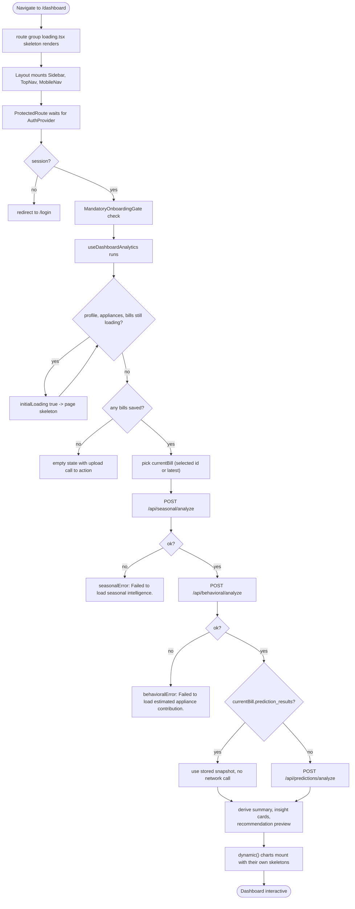
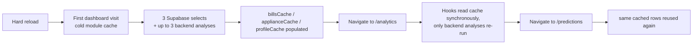

# Dashboard Loading Flowchart

```mermaid
flowchart TD
  Start(["Navigate to /dashboard"]) --> A["route group loading.tsx skeleton renders"]
  A --> B["Layout mounts Sidebar, TopNav, MobileNav"]
  B --> C["ProtectedRoute waits for AuthProvider"]
  C --> D{"session?"}
  D -- no --> D1["redirect to /login"]
  D -- yes --> E["MandatoryOnboardingGate check"]
  E --> F["useDashboardAnalytics runs"]
  F --> G{"profile, appliances, bills still loading?"}
  G -- yes --> G1["initialLoading true -> page skeleton"] --> G
  G -- no --> H{"any bills saved?"}
  H -- no --> H1["empty state with upload call to action"]
  H -- yes --> I["pick currentBill (selected id or latest)"]
  I --> J["POST /api/seasonal/analyze"]
  J --> K{"ok?"}
  K -- no --> K1["seasonalError: Failed to load seasonal intelligence."]
  K -- yes --> L["POST /api/behavioral/analyze"]
  L --> M{"ok?"}
  M -- no --> M1["behavioralError: Failed to load estimated appliance contribution."]
  M -- yes --> N{"currentBill.prediction_results?"}
  N -- yes --> O["use stored snapshot, no network call"]
  N -- no --> P["POST /api/predictions/analyze"]
  O --> Q["derive summary, insight cards,<br/>recommendation preview"]
  P --> Q
  Q --> R["dynamic() charts mount with their own skeletons"]
  R --> Done(["Dashboard interactive"])
```

## Cache Warmth Across Routes

```mermaid
flowchart LR
  A["First dashboard visit<br/>cold module cache"] --> B["3 Supabase selects<br/>+ up to 3 backend analyses"]
  B --> C["billsCache / applianceCache / profileCache populated"]
  C --> D["Navigate to /analytics"]
  D --> E["Hooks read cache synchronously,<br/>only backend analyses re-run"]
  E --> F["Navigate to /predictions"]
  F --> G["same cached rows reused again"]
  H["Hard reload"] --> A
```
