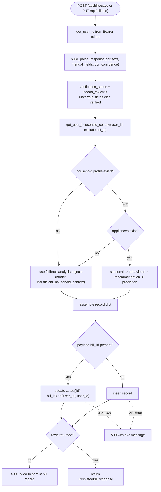
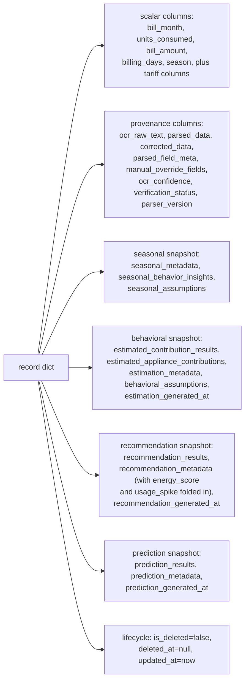
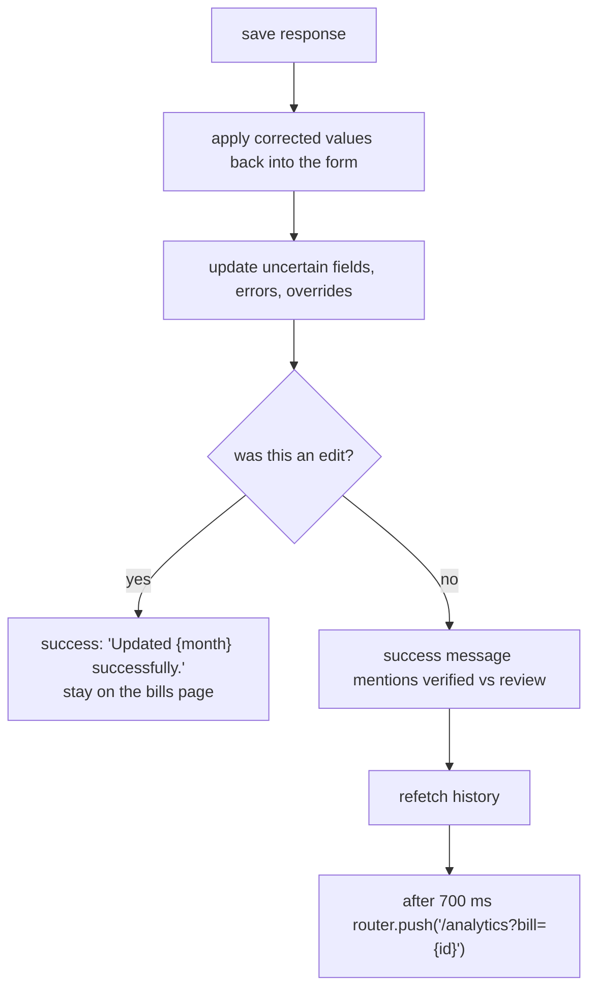

# Database Save Flowchart

```mermaid
flowchart TD
  Start(["POST /api/bills/save or PUT /api/bills/{id}"]) --> A["get_user_id from Bearer token"]
  A --> B["build_parse_response(ocr_text, manual_fields, ocr_confidence)"]
  B --> C["verification_status = needs_review if<br/>uncertain_fields else verified"]
  C --> D["get_user_household_context(user_id, exclude bill_id)"]
  D --> E{"household profile exists?"}
  E -- no --> F["use fallback analysis objects<br/>(mode: insufficient_household_context)"]
  E -- yes --> G{"appliances exist?"}
  G -- no --> F
  G -- yes --> H["seasonal -> behavioral -> recommendation -> prediction"]
  F --> I["assemble record dict"]
  H --> I
  I --> J{"payload.bill_id present?"}
  J -- yes --> K["update ... .eq('id', bill_id).eq('user_id', user_id)"]
  J -- no --> L["insert record"]
  K --> M{"rows returned?"}
  L --> M
  M -- no --> N["500 Failed to persist bill record"]
  M -- yes --> O["return PersistedBillResponse"]
  K -.->|"APIError"| P["500 with exc.message"]
  L -.->|"APIError"| P
```

## What Gets Written

```mermaid
flowchart LR
  A["record dict"] --> B["scalar columns:<br/>bill_month, units_consumed, bill_amount,<br/>billing_days, season, plus tariff columns"]
  A --> C["provenance columns:<br/>ocr_raw_text, parsed_data, corrected_data,<br/>parsed_field_meta, manual_override_fields,<br/>ocr_confidence, verification_status, parser_version"]
  A --> D["seasonal snapshot:<br/>seasonal_metadata, seasonal_behavior_insights,<br/>seasonal_assumptions"]
  A --> E["behavioral snapshot:<br/>estimated_contribution_results,<br/>estimated_appliance_contributions,<br/>estimation_metadata, behavioral_assumptions,<br/>estimation_generated_at"]
  A --> F["recommendation snapshot:<br/>recommendation_results,<br/>recommendation_metadata (with energy_score<br/>and usage_spike folded in),<br/>recommendation_generated_at"]
  A --> G["prediction snapshot:<br/>prediction_results, prediction_metadata,<br/>prediction_generated_at"]
  A --> H["lifecycle: is_deleted=false,<br/>deleted_at=null, updated_at=now"]
```

## Post-Save Client Behavior

```mermaid
flowchart TD
  A["save response"] --> B["apply corrected values back into the form"]
  B --> C["update uncertain fields, errors, overrides"]
  C --> D{"was this an edit?"}
  D -- yes --> E["success: 'Updated {month} successfully.'<br/>stay on the bills page"]
  D -- no --> F["success message mentions verified vs review"]
  F --> G["refetch history"]
  G --> H["after 700 ms router.push('/analytics?bill={id}')"]
```
