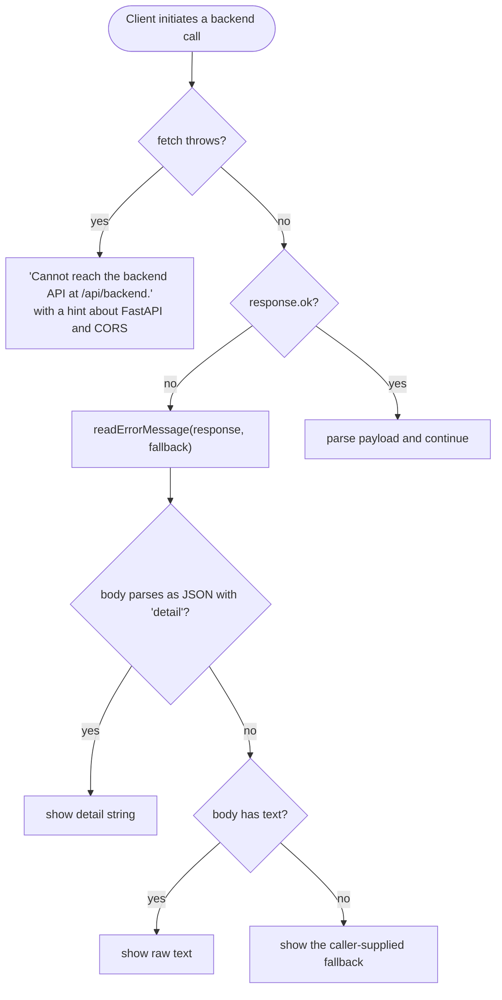
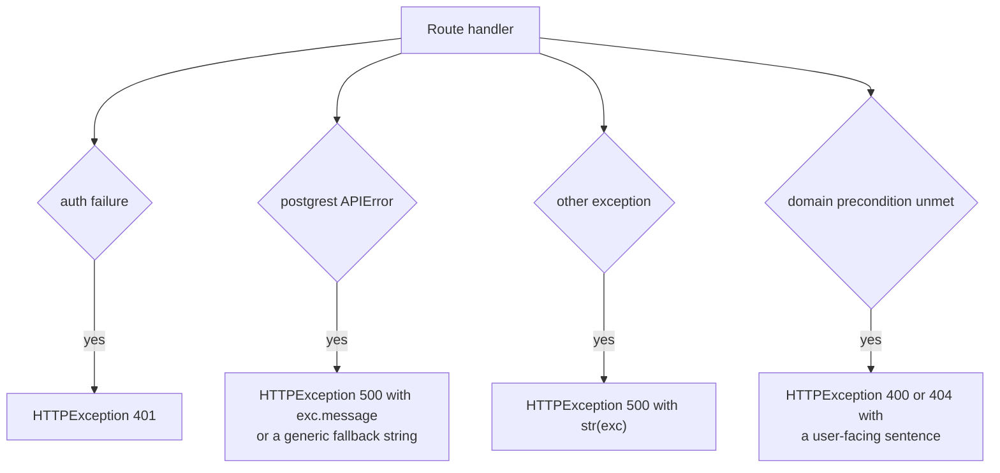
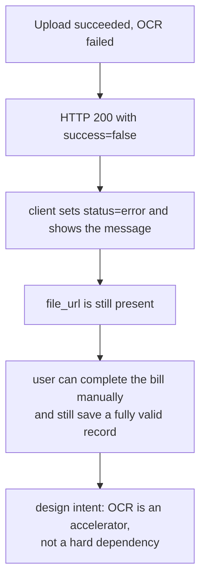
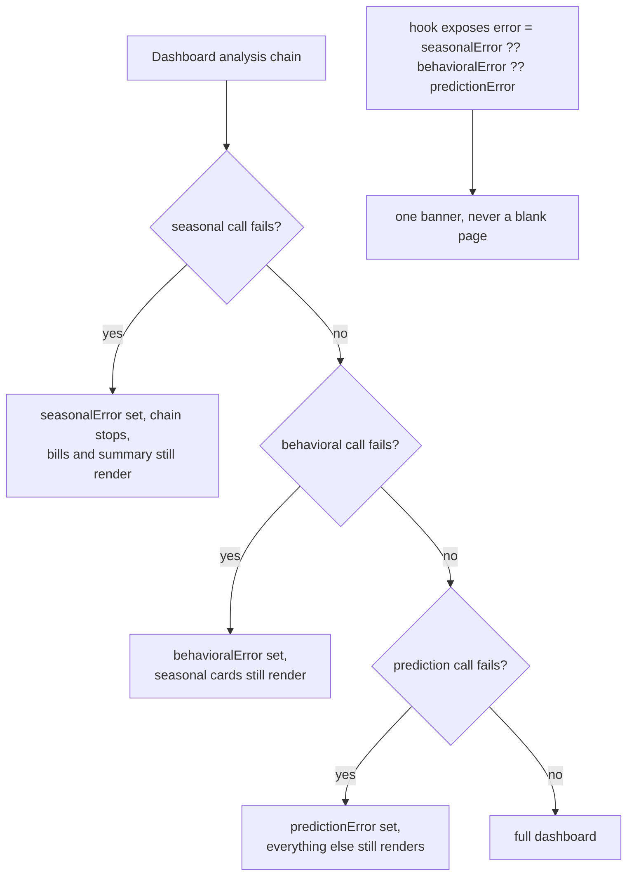

# Error Handling Flowchart

```mermaid
flowchart TD
  Start(["Client initiates a backend call"]) --> A{"fetch throws?"}
  A -- yes --> A1["'Cannot reach the backend API at /api/backend.'<br/>with a hint about FastAPI and CORS"]
  A -- no --> B{"response.ok?"}
  B -- no --> C["readErrorMessage(response, fallback)"]
  C --> D{"body parses as JSON with 'detail'?"}
  D -- yes --> E["show detail string"]
  D -- no --> F{"body has text?"}
  F -- yes --> G["show raw text"]
  F -- no --> H["show the caller-supplied fallback"]
  B -- yes --> I["parse payload and continue"]
```

## Backend Error Translation

```mermaid
flowchart TD
  A["Route handler"] --> B{"auth failure"}
  B -- yes --> B1["HTTPException 401"]
  A --> C{"postgrest APIError"}
  C -- yes --> C1["HTTPException 500 with exc.message<br/>or a generic fallback string"]
  A --> D{"other exception"}
  D -- yes --> D1["HTTPException 500 with str(exc)"]
  A --> E{"domain precondition unmet"}
  E -- yes --> E1["HTTPException 400 or 404 with<br/>a user-facing sentence"]
```

## OCR Failures Are Not Request Failures

```mermaid
flowchart TD
  A["Upload succeeded, OCR failed"] --> B["HTTP 200 with success=false"]
  B --> C["client sets status=error and shows the message"]
  C --> D["file_url is still present"]
  D --> E["user can complete the bill manually<br/>and still save a fully valid record"]
  E --> F["design intent: OCR is an accelerator,<br/>not a hard dependency"]
```

## Partial Intelligence Degradation

```mermaid
flowchart TD
  A["Dashboard analysis chain"] --> B{"seasonal call fails?"}
  B -- yes --> B1["seasonalError set, chain stops,<br/>bills and summary still render"]
  B -- no --> C{"behavioral call fails?"}
  C -- yes --> C1["behavioralError set,<br/>seasonal cards still render"]
  C -- no --> D{"prediction call fails?"}
  D -- yes --> D1["predictionError set,<br/>everything else still renders"]
  D -- no --> E["full dashboard"]
  F["hook exposes error = seasonalError ?? behavioralError ?? predictionError"] --> G["one banner, never a blank page"]
```
