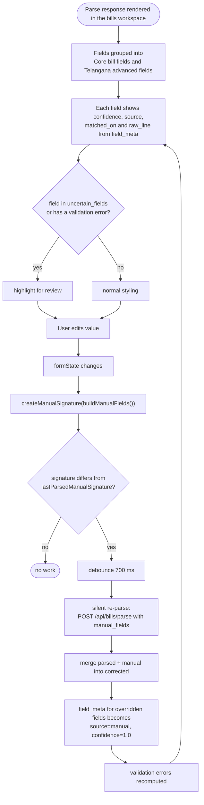
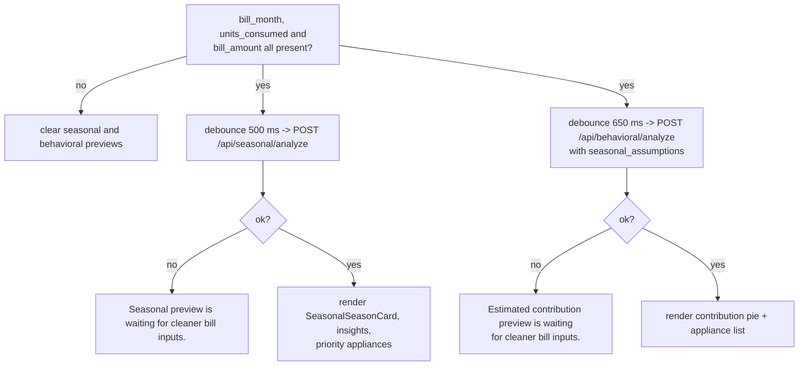
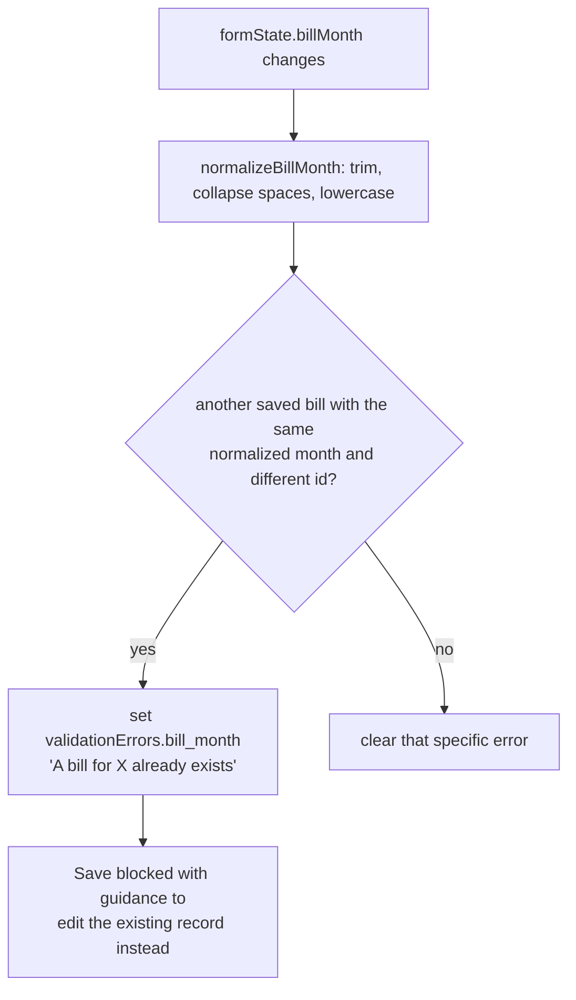

# Manual Review Flowchart

```mermaid
flowchart TD
  Start(["Parse response rendered in the bills workspace"]) --> A["Fields grouped into<br/>Core bill fields and Telangana advanced fields"]
  A --> B["Each field shows confidence, source,<br/>matched_on and raw_line from field_meta"]
  B --> C{"field in uncertain_fields<br/>or has a validation error?"}
  C -- yes --> D["highlight for review"]
  C -- no --> E["normal styling"]
  D --> F["User edits value"]
  E --> F
  F --> G["formState changes"]
  G --> H["createManualSignature(buildManualFields())"]
  H --> I{"signature differs from<br/>lastParsedManualSignature?"}
  I -- no --> Idle(["no work"])
  I -- yes --> J["debounce 700 ms"]
  J --> K["silent re-parse:<br/>POST /api/bills/parse with manual_fields"]
  K --> L["merge parsed + manual into corrected"]
  L --> M["field_meta for overridden fields becomes<br/>source=manual, confidence=1.0"]
  M --> N["validation errors recomputed"]
  N --> B
```

## Live Preview Side-Effects

```mermaid
flowchart TD
  A["bill_month, units_consumed and<br/>bill_amount all present?"] -- no --> A1["clear seasonal and behavioral previews"]
  A -- yes --> B["debounce 500 ms -> POST /api/seasonal/analyze"]
  B --> C{"ok?"}
  C -- no --> C1["Seasonal preview is waiting for cleaner bill inputs."]
  C -- yes --> D["render SeasonalSeasonCard, insights,<br/>priority appliances"]
  A -- yes --> E["debounce 650 ms -> POST /api/behavioral/analyze<br/>with seasonal_assumptions"]
  E --> F{"ok?"}
  F -- no --> F1["Estimated contribution preview is waiting<br/>for cleaner bill inputs."]
  F -- yes --> G["render contribution pie + appliance list"]
```

## Duplicate Month Guard

```mermaid
flowchart TD
  A["formState.billMonth changes"] --> B["normalizeBillMonth: trim, collapse spaces, lowercase"]
  B --> C{"another saved bill with the same<br/>normalized month and different id?"}
  C -- yes --> D["set validationErrors.bill_month<br/>'A bill for X already exists'"]
  C -- no --> E["clear that specific error"]
  D --> F["Save blocked with guidance to<br/>edit the existing record instead"]
```
