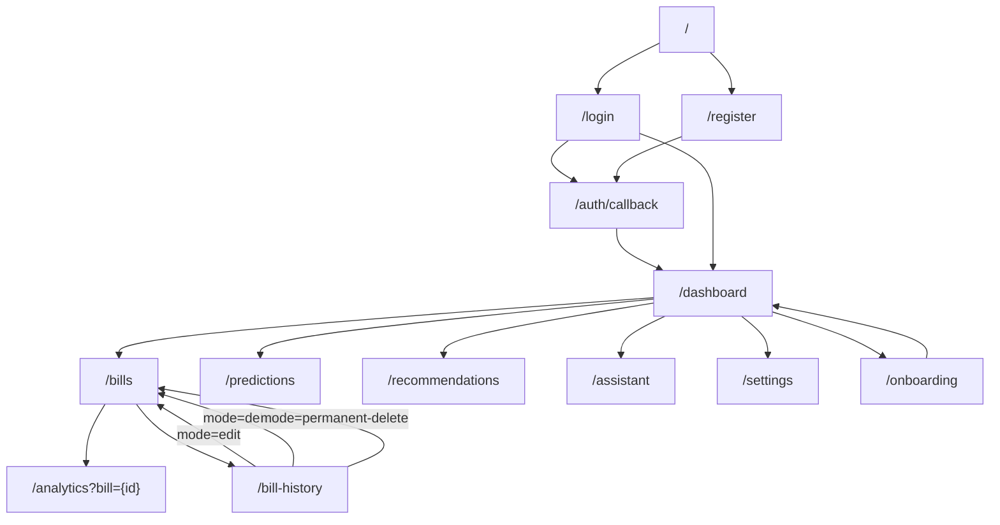
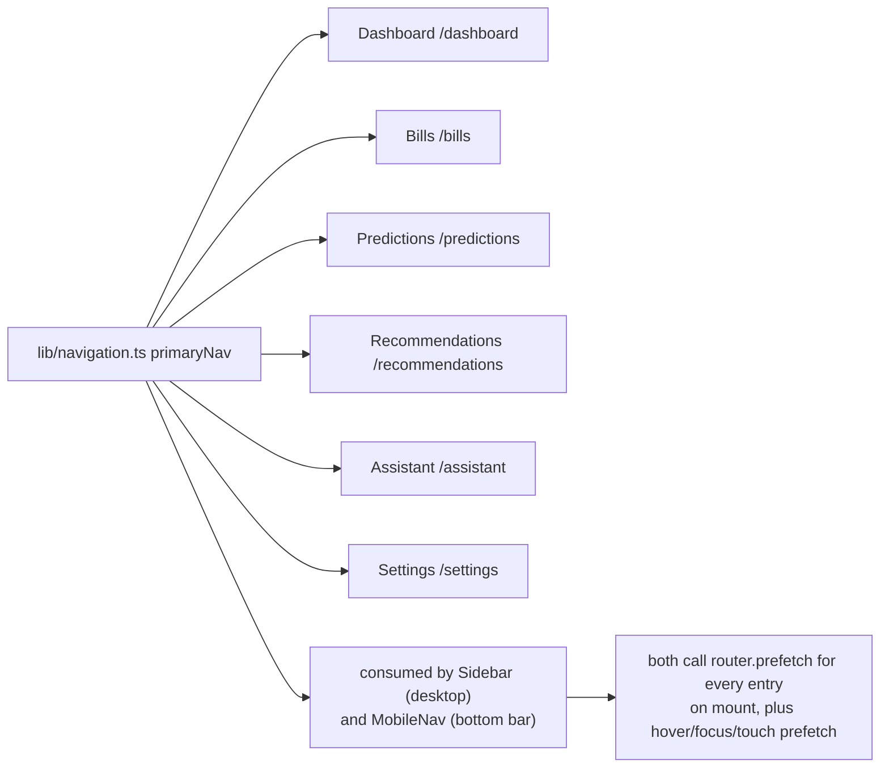
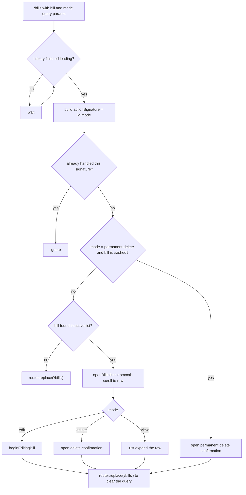

# Navigation Flowchart

```mermaid
flowchart TD
  Root["/"] --> Login["/login"]
  Root --> Register["/register"]
  Login --> Callback["/auth/callback"]
  Register --> Callback
  Callback --> Dashboard["/dashboard"]
  Login --> Dashboard
  Dashboard --> Bills["/bills"]
  Dashboard --> Predictions["/predictions"]
  Dashboard --> Recommendations["/recommendations"]
  Dashboard --> Assistant["/assistant"]
  Dashboard --> Settings["/settings"]
  Bills --> Analytics["/analytics?bill={id}"]
  Bills --> History["/bill-history"]
  History -->|"mode=edit"| Bills
  History -->|"mode=delete"| Bills
  History -->|"mode=permanent-delete"| Bills
  Dashboard --> Onboarding["/onboarding"]
  Onboarding --> Dashboard
```

## Primary Navigation Set

```mermaid
flowchart LR
  A["lib/navigation.ts primaryNav"] --> B["Dashboard /dashboard"]
  A --> C["Bills /bills"]
  A --> D["Predictions /predictions"]
  A --> E["Recommendations /recommendations"]
  A --> F["Assistant /assistant"]
  A --> G["Settings /settings"]
  A --> H["consumed by Sidebar (desktop)<br/>and MobileNav (bottom bar)"]
  H --> I["both call router.prefetch for every entry<br/>on mount, plus hover/focus/touch prefetch"]
```

## Deep Link Handling on the Bills Page

```mermaid
flowchart TD
  A["/bills with bill and mode query params"] --> B{"history finished loading?"}
  B -- no --> B1["wait"] --> B
  B -- yes --> C["build actionSignature = id:mode"]
  C --> D{"already handled this signature?"}
  D -- yes --> Z["ignore"]
  D -- no --> E{"mode = permanent-delete and bill is trashed?"}
  E -- yes --> F["open permanent delete confirmation"]
  E -- no --> G{"bill found in active list?"}
  G -- no --> H["router.replace('/bills')"]
  G -- yes --> I["openBillInline + smooth scroll to row"]
  I --> J{"mode"}
  J -->|"edit"| K["beginEditingBill"]
  J -->|"delete"| L["open delete confirmation"]
  J -->|"view"| M["just expand the row"]
  K --> N["router.replace('/bills') to clear the query"]
  L --> N
  M --> N
  F --> N
```
