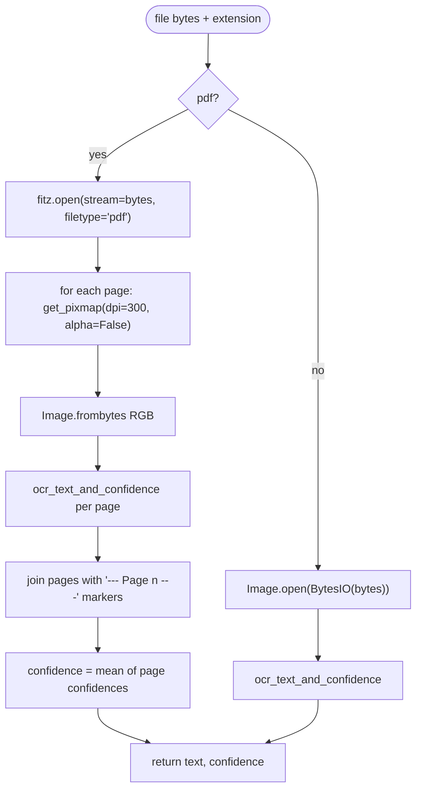
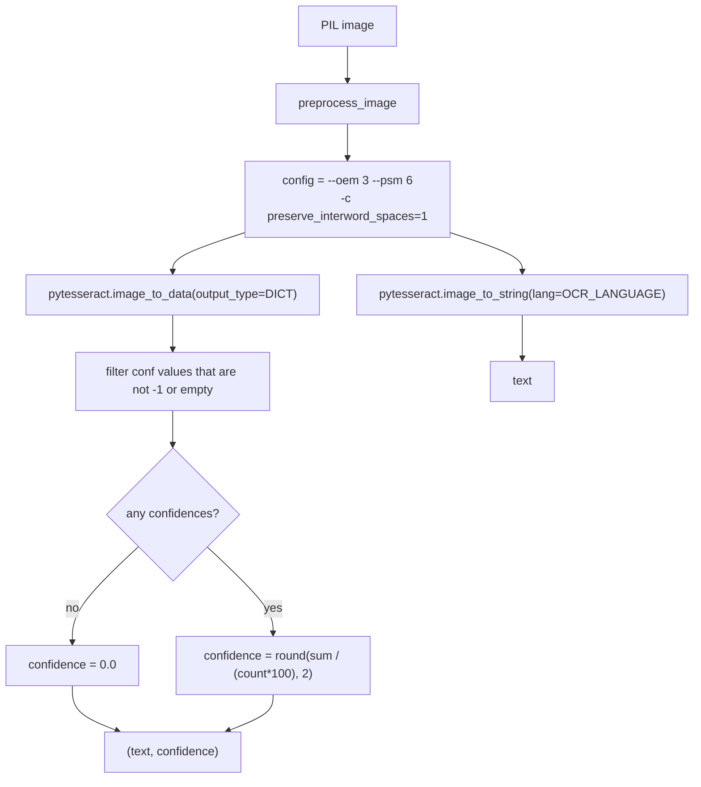
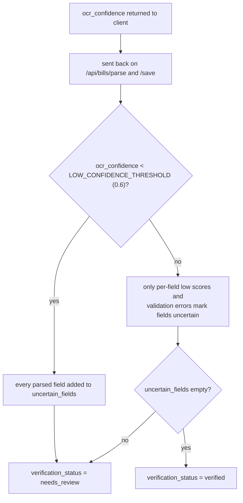

# OCR Extraction Flowchart

```mermaid
flowchart TD
  Start(["file bytes + extension"]) --> A{"pdf?"}
  A -- yes --> B["fitz.open(stream=bytes, filetype='pdf')"]
  B --> C["for each page: get_pixmap(dpi=300, alpha=False)"]
  C --> D["Image.frombytes RGB"]
  D --> E["ocr_text_and_confidence per page"]
  E --> F["join pages with '--- Page n ---' markers"]
  F --> G["confidence = mean of page confidences"]
  A -- no --> H["Image.open(BytesIO(bytes))"]
  H --> I["ocr_text_and_confidence"]
  G --> J["return text, confidence"]
  I --> J
```

## Per-Image Extraction

```mermaid
flowchart TD
  A["PIL image"] --> B["preprocess_image"]
  B --> C["config = --oem 3 --psm 6<br/>-c preserve_interword_spaces=1"]
  C --> D["pytesseract.image_to_string(lang=OCR_LANGUAGE)"]
  C --> E["pytesseract.image_to_data(output_type=DICT)"]
  E --> F["filter conf values that are not -1 or empty"]
  F --> G{"any confidences?"}
  G -- no --> H["confidence = 0.0"]
  G -- yes --> I["confidence = round(sum / (count*100), 2)"]
  D --> J["text"]
  H --> K["(text, confidence)"]
  I --> K
```

## Confidence Consequences

```mermaid
flowchart TD
  A["ocr_confidence returned to client"] --> B["sent back on /api/bills/parse and /save"]
  B --> C{"ocr_confidence < LOW_CONFIDENCE_THRESHOLD (0.6)?"}
  C -- yes --> D["every parsed field added to uncertain_fields"]
  C -- no --> E["only per-field low scores and<br/>validation errors mark fields uncertain"]
  D --> F["verification_status = needs_review"]
  E --> G{"uncertain_fields empty?"}
  G -- yes --> H["verification_status = verified"]
  G -- no --> F
```
