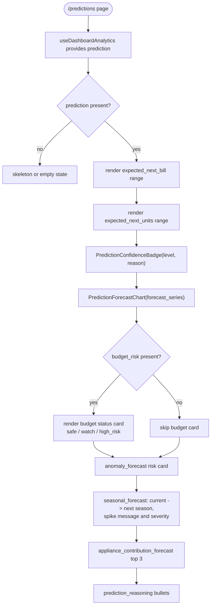
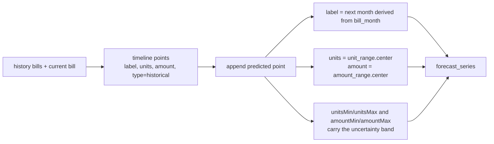
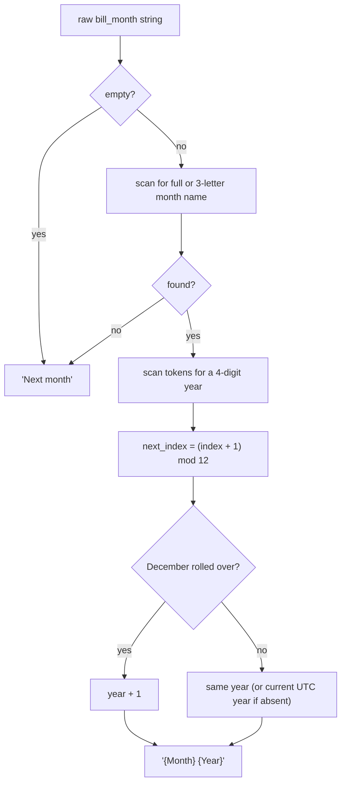

# Predictions Flowchart

```mermaid
flowchart TD
  Start(["/predictions page"]) --> A["useDashboardAnalytics provides prediction"]
  A --> B{"prediction present?"}
  B -- no --> B1["skeleton or empty state"]
  B -- yes --> C["render expected_next_bill range"]
  C --> D["render expected_next_units range"]
  D --> E["PredictionConfidenceBadge(level, reason)"]
  E --> F["PredictionForecastChart(forecast_series)"]
  F --> G{"budget_risk present?"}
  G -- yes --> H["render budget status card<br/>safe / watch / high_risk"]
  G -- no --> I["skip budget card"]
  H --> J["anomaly_forecast risk card"]
  I --> J
  J --> K["seasonal_forecast: current -> next season,<br/>spike message and severity"]
  K --> L["appliance_contribution_forecast top 3"]
  L --> M["prediction_reasoning bullets"]
```

## Series Assembly

```mermaid
flowchart LR
  A["history bills + current bill"] --> B["timeline points<br/>label, units, amount, type=historical"]
  B --> C["append predicted point"]
  C --> D["label = next month derived from bill_month"]
  C --> E["units = unit_range.center<br/>amount = amount_range.center"]
  C --> F["unitsMin/unitsMax and amountMin/amountMax<br/>carry the uncertainty band"]
  D --> G["forecast_series"]
  E --> G
  F --> G
```

## Next Month Label Derivation

```mermaid
flowchart TD
  A["raw bill_month string"] --> B{"empty?"}
  B -- yes --> B1["'Next month'"]
  B -- no --> C["scan for full or 3-letter month name"]
  C --> D{"found?"}
  D -- no --> B1
  D -- yes --> E["scan tokens for a 4-digit year"]
  E --> F["next_index = (index + 1) mod 12"]
  F --> G{"December rolled over?"}
  G -- yes --> H["year + 1"]
  G -- no --> I["same year (or current UTC year if absent)"]
  H --> J["'{Month} {Year}'"]
  I --> J
```
