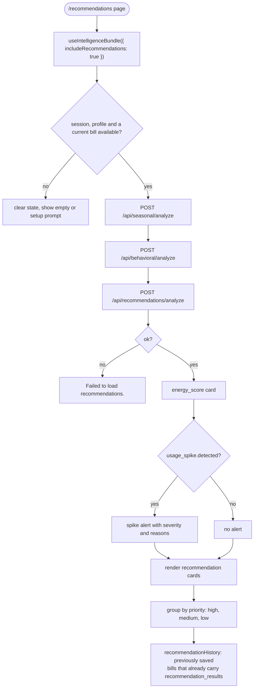
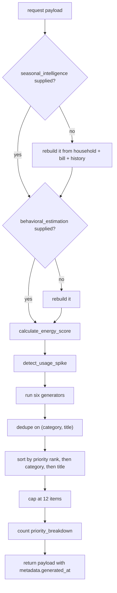
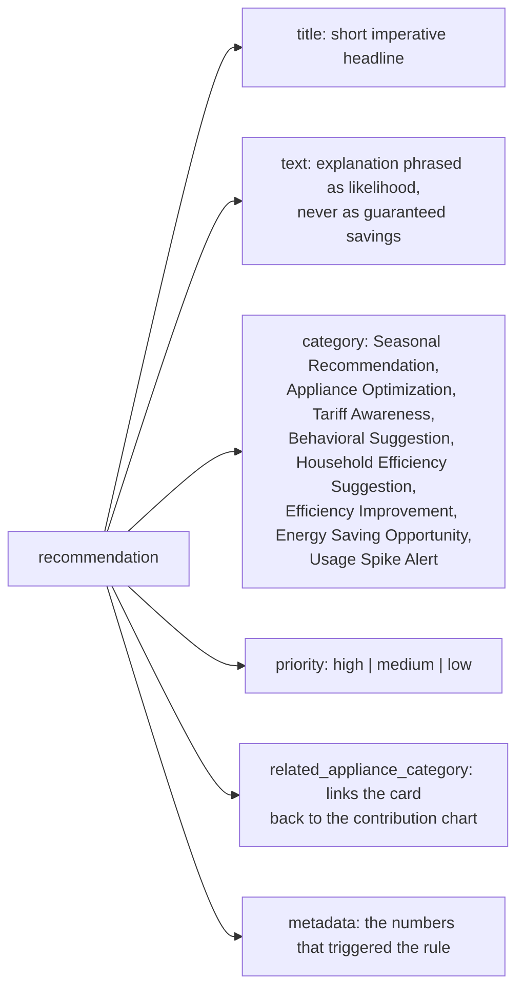

# Recommendations Flowchart

```mermaid
flowchart TD
  Start(["/recommendations page"]) --> A["useIntelligenceBundle({ includeRecommendations: true })"]
  A --> B{"session, profile and a current bill available?"}
  B -- no --> B1["clear state, show empty or setup prompt"]
  B -- yes --> C["POST /api/seasonal/analyze"]
  C --> D["POST /api/behavioral/analyze"]
  D --> E["POST /api/recommendations/analyze"]
  E --> F{"ok?"}
  F -- no --> F1["Failed to load recommendations."]
  F -- yes --> G["energy_score card"]
  G --> H{"usage_spike.detected?"}
  H -- yes --> I["spike alert with severity and reasons"]
  H -- no --> J["no alert"]
  I --> K["render recommendation cards"]
  J --> K
  K --> L["group by priority: high, medium, low"]
  L --> M["recommendationHistory: previously saved<br/>bills that already carry recommendation_results"]
```

## Server-Side Assembly

```mermaid
flowchart TD
  A["request payload"] --> B{"seasonal_intelligence supplied?"}
  B -- no --> B1["rebuild it from household + bill + history"]
  B -- yes --> C
  B1 --> C{"behavioral_estimation supplied?"}
  C -- no --> C1["rebuild it"]
  C -- yes --> D
  C1 --> D["calculate_energy_score"]
  D --> E["detect_usage_spike"]
  E --> F["run six generators"]
  F --> G["dedupe on (category, title)"]
  G --> H["sort by priority rank, then category, then title"]
  H --> I["cap at 12 items"]
  I --> J["count priority_breakdown"]
  J --> K["return payload with metadata.generated_at"]
```

## Recommendation Item Contract

```mermaid
flowchart LR
  A["recommendation"] --> B["title: short imperative headline"]
  A --> C["text: explanation phrased as likelihood,<br/>never as guaranteed savings"]
  A --> D["category: Seasonal Recommendation,<br/>Appliance Optimization, Tariff Awareness,<br/>Behavioral Suggestion, Household Efficiency Suggestion,<br/>Efficiency Improvement, Energy Saving Opportunity,<br/>Usage Spike Alert"]
  A --> E["priority: high | medium | low"]
  A --> F["related_appliance_category: links the card<br/>back to the contribution chart"]
  A --> G["metadata: the numbers that triggered the rule"]
```
