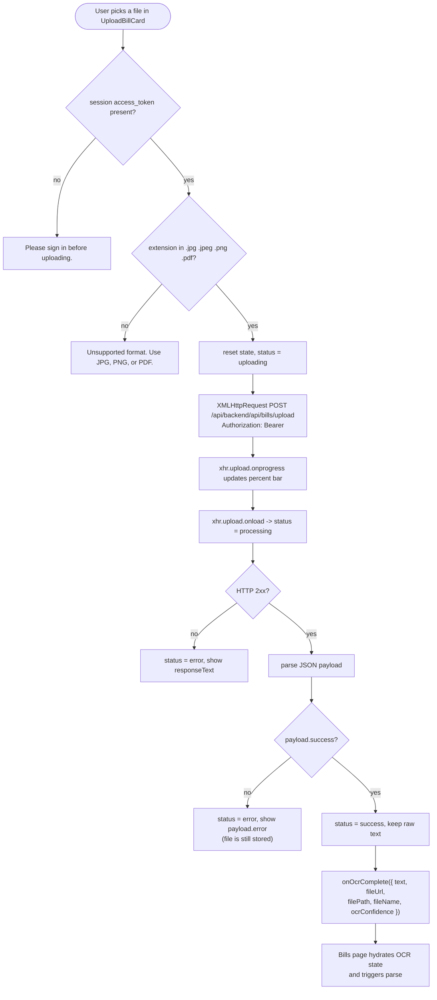
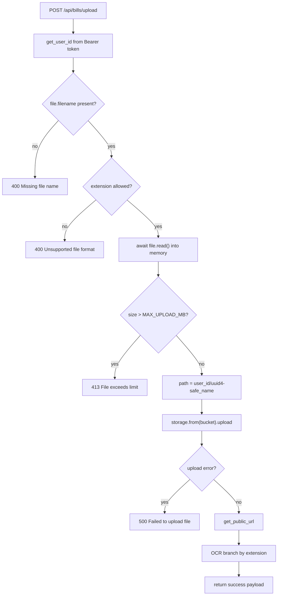

# Upload Bill Flowchart

```mermaid
flowchart TD
  Start(["User picks a file in UploadBillCard"]) --> A{"session access_token present?"}
  A -- no --> A1["Please sign in before uploading."]
  A -- yes --> B{"extension in .jpg .jpeg .png .pdf?"}
  B -- no --> B1["Unsupported format. Use JPG, PNG, or PDF."]
  B -- yes --> C["reset state, status = uploading"]
  C --> D["XMLHttpRequest POST /api/backend/api/bills/upload<br/>Authorization: Bearer"]
  D --> E["xhr.upload.onprogress updates percent bar"]
  E --> F["xhr.upload.onload -> status = processing"]
  F --> G{"HTTP 2xx?"}
  G -- no --> G1["status = error, show responseText"]
  G -- yes --> H["parse JSON payload"]
  H --> I{"payload.success?"}
  I -- no --> I1["status = error, show payload.error<br/>(file is still stored)"]
  I -- yes --> J["status = success, keep raw text"]
  J --> K["onOcrComplete({ text, fileUrl,<br/>filePath, fileName, ocrConfidence })"]
  K --> L["Bills page hydrates OCR state<br/>and triggers parse"]
```

## Server-Side Upload Handling

```mermaid
flowchart TD
  A["POST /api/bills/upload"] --> B["get_user_id from Bearer token"]
  B --> C{"file.filename present?"}
  C -- no --> C1["400 Missing file name"]
  C -- yes --> D{"extension allowed?"}
  D -- no --> D1["400 Unsupported file format"]
  D -- yes --> E["await file.read() into memory"]
  E --> F{"size > MAX_UPLOAD_MB?"}
  F -- yes --> F1["413 File exceeds limit"]
  F -- no --> G["path = user_id/uuid4-safe_name"]
  G --> H["storage.from(bucket).upload"]
  H --> I{"upload error?"}
  I -- yes --> I1["500 Failed to upload file"]
  I -- no --> J["get_public_url"]
  J --> K["OCR branch by extension"]
  K --> L["return success payload"]
```
