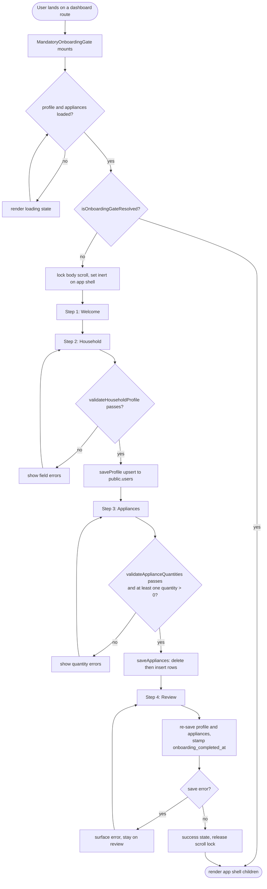
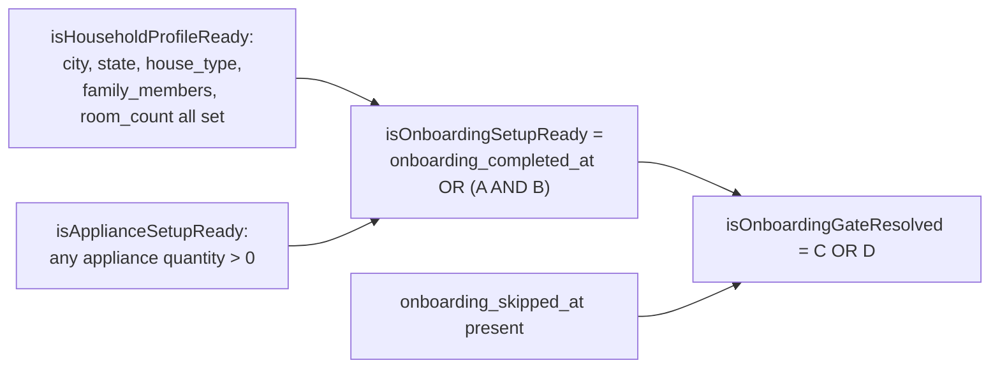

# User Onboarding Flowchart

```mermaid
flowchart TD
  Start(["User lands on a dashboard route"]) --> A["MandatoryOnboardingGate mounts"]
  A --> B{"profile and appliances loaded?"}
  B -- no --> B1["render loading state"] --> B
  B -- yes --> C{"isOnboardingGateResolved?"}
  C -- yes --> Z(["render app shell children"])
  C -- no --> D["lock body scroll, set inert on app shell"]
  D --> E["Step 1: Welcome"]
  E --> F["Step 2: Household"]
  F --> G{"validateHouseholdProfile passes?"}
  G -- no --> F1["show field errors"] --> F
  G -- yes --> H["saveProfile upsert to public.users"]
  H --> I["Step 3: Appliances"]
  I --> J{"validateApplianceQuantities passes<br/>and at least one quantity > 0?"}
  J -- no --> I1["show quantity errors"] --> I
  J -- yes --> K["saveAppliances: delete then insert rows"]
  K --> L["Step 4: Review"]
  L --> M["re-save profile and appliances,<br/>stamp onboarding_completed_at"]
  M --> N{"save error?"}
  N -- yes --> N1["surface error, stay on review"] --> L
  N -- no --> O["success state, release scroll lock"]
  O --> Z
```

## Gate Resolution Predicate

```mermaid
flowchart LR
  A["isHouseholdProfileReady:<br/>city, state, house_type,<br/>family_members, room_count all set"] --> C
  B["isApplianceSetupReady:<br/>any appliance quantity > 0"] --> C
  C["isOnboardingSetupReady =<br/>onboarding_completed_at OR (A AND B)"] --> E
  D["onboarding_skipped_at present"] --> E
  E["isOnboardingGateResolved = C OR D"]
```
