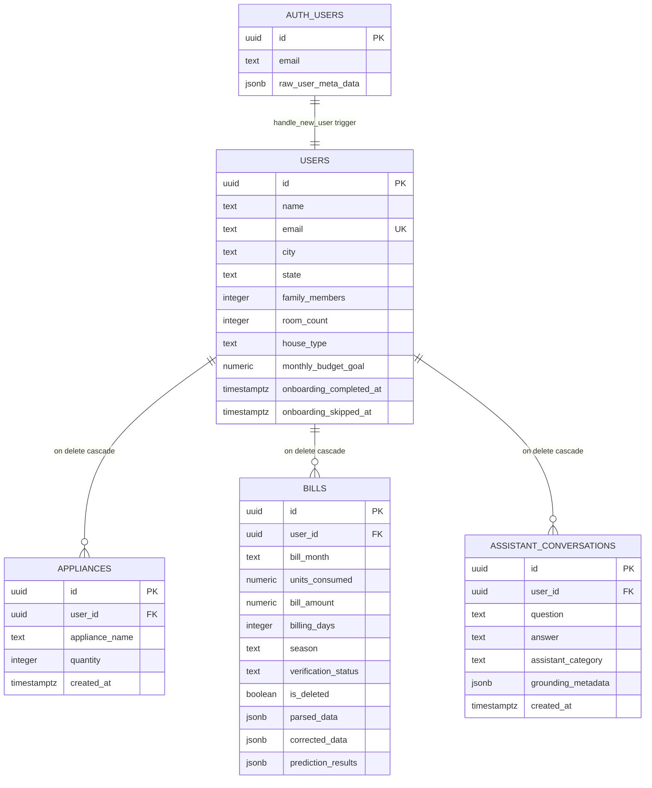

# WattWise Database Reference

> Companion reference for the [Building WattWise series](./index.md).
> **Estimated reading time:** 12 minutes
> Source of truth: [`supabase/schema.sql`](../supabase/schema.sql).

---

## Table of Contents

1. [Entity Relationship Diagram](#entity-relationship-diagram)
2. [Design Principles](#design-principles)
3. [Table: `public.users`](#table-publicusers)
4. [Table: `public.appliances`](#table-publicappliances)
5. [Table: `public.bills`](#table-publicbills)
6. [Table: `public.assistant_conversations`](#table-publicassistant_conversations)
7. [Indexes](#indexes)
8. [Constraints](#constraints)
9. [Row-Level Security](#row-level-security)
10. [Triggers and Functions](#triggers-and-functions)
11. [Storage](#storage)
12. [Query Patterns](#query-patterns)
13. [Migration Strategy and Its Problems](#migration-strategy-and-its-problems)
14. [Known Issues](#known-issues)

---

## Entity Relationship Diagram



Every table is owned by exactly one user. There are no shared, join or lookup tables — appliance categories, seasonal multipliers and base factors all live in Python constants rather than the database. That is a deliberate choice: they are model parameters, not user data, and versioning them with the code is more useful than versioning them with the schema.

---

## Design Principles

**1. Single-tenant rows.** Every table carries `user_id` (or is `users` itself). Every policy is `auth.uid() = user_id`. Every backend query filters on it. There is no concept of sharing.

**2. Cascade on user delete.** All three child tables use `on delete cascade` against `public.users`, which itself cascades from `auth.users`. Deleting an auth user removes every trace in one statement — an accidental but genuine GDPR-erasure primitive.

**3. Soft delete for bills only.** Bills carry `is_deleted` and `deleted_at`. Appliances and conversations are hard-deleted. The asymmetry is intentional: a bill row carries expensive computed analysis, so accidental loss is costly.

**4. Analysis is denormalized into the bill row.** Twelve JSONB columns plus three timestamps store precomputed seasonal, behavioral, recommendation and prediction output. Reads are cheap; freshness is the cost.

**5. Provenance is never overwritten.** `parsed_data` (machine) and `corrected_data` (human) coexist permanently, alongside `parsed_field_meta`, `manual_override_fields`, `ocr_raw_text`, `ocr_confidence` and `parser_version`.

---

## Table: `public.users`

```sql
create table if not exists public.users (
  id uuid primary key references auth.users (id) on delete cascade,
  name text,
  email text unique not null,
  city text,
  state text,
  family_members integer,
  room_count integer,
  house_type text,
  monthly_budget_goal numeric,
  onboarding_completed_at timestamptz,
  onboarding_skipped_at timestamptz
);
```

| Column | Type | Null | Purpose |
|---|---|---|---|
| `id` | uuid | no | PK, FK to `auth.users(id)`, cascade delete |
| `name` | text | yes | Display name, seeded from OAuth/signup metadata |
| `email` | text | no | Unique; mirrors the auth email |
| `city` | text | yes | Used in seasonal insight prose |
| `state` | text | yes | From a fixed option list in `lib/household.ts` |
| `family_members` | integer | yes | Drives `occupancy_factor` and units-per-person scoring |
| `room_count` | integer | yes | Drives `room_spread_factor` and units-per-room scoring |
| `house_type` | text | yes | 1BHK / 2BHK / 3BHK / Independent House / Studio Apartment |
| `monthly_budget_goal` | numeric | yes | Enables budget risk analysis; null disables it |
| `onboarding_completed_at` | timestamptz | yes | Set on wizard completion |
| `onboarding_skipped_at` | timestamptz | yes | Set when the user bypasses the gate |

**Why the profile fields are nullable.** The row is created by a trigger the moment an auth user exists, before onboarding runs. Making `city` or `family_members` `not null` would break user creation. The application enforces completeness through `isHouseholdProfileReady` and the onboarding gate.

**The `onboarding_*` columns have a fallback path.** `useProfile` detects PostgREST "schema cache" errors mentioning either column, retries with a narrower `select`, and stores the skip flag in `localStorage` instead. That code exists because a deployed database can be behind the application — a symptom of the missing migration story.

**Design note:** `house_type` and `state` are free-text columns constrained only by the frontend's option lists. A `check` constraint or an enum would move that guarantee into the database, where `house_type_factor` lookups depend on it.

---

## Table: `public.appliances`

```sql
create table if not exists public.appliances (
  id uuid primary key default gen_random_uuid(),
  user_id uuid not null references public.users (id) on delete cascade,
  appliance_name text not null,
  quantity integer not null default 1,
  created_at timestamptz not null default now()
);
```

| Column | Type | Null | Purpose |
|---|---|---|---|
| `id` | uuid | no | PK, `gen_random_uuid()` |
| `user_id` | uuid | no | Owner, cascade delete |
| `appliance_name` | text | no | Matches names in `applianceCatalog` |
| `quantity` | integer | no | Default 1; frontend caps per appliance |
| `created_at` | timestamptz | no | Also the ordering key |

**One row per appliance type**, not per physical device. Eleven catalog entries exist (Fans, Lights, AC, Cooler, Refrigerator, TV, Washing Machine, Geyser, Microwave, Laptop/Desktop, Water Purifier), each with a recommended maximum enforced client-side.

**Saves are delete-all-then-insert:**

```typescript
if (existingRows.length > 0) {
  await supabase.from("appliances").delete().eq("user_id", user.id);
}
// … then insert every appliance with quantity > 0
```

Simple and idempotent, with two real costs: `created_at` is reset on every save (so ordering reflects the last edit, not the original entry), and there is a window between delete and insert where the user has no appliances. The window is small and the failure mode is recoverable — the user re-saves — but a transactional upsert would be strictly better.

**No unique constraint on `(user_id, appliance_name)`**, so duplicate rows for the same appliance are possible if the delete-then-insert is interrupted. The backend's `infer_seasonal_behavior` happens to tolerate this by summing quantities per normalized name, but relying on that is accidental robustness rather than design.

---

## Table: `public.bills`

The core table, roughly 45 columns in four groups.

### Group 1 — Identity and normalized core

| Column | Type | Notes |
|---|---|---|
| `id` | uuid | PK |
| `user_id` | uuid | Owner, cascade delete |
| `bill_month` | text, not null | Canonical `"%b %Y"` format, e.g. `"Mar 2026"` |
| `units_consumed` | numeric | Primary consumption metric |
| `bill_amount` | numeric | Primary cost metric |
| `billing_days` | integer | 1–60 enforced in application validation |
| `season` | text | Derived at save: Summer / Rainy / Winter/Cooler |
| `uploaded_file_url` | text | Public storage URL |
| `created_at` / `updated_at` | timestamptz | Both default `now()` |

**`bill_month` as text is the schema's biggest weakness.** Sorting, seasonal grouping, duplicate detection and month-over-month comparison all parse this string. Two implementations of that parsing exist — `backend/services/bill_chronology.py` and `lib/bill-chronology.ts` — with identical regexes and fallback chains. A `date` column would delete both and let `ORDER BY` do the work.

### Group 2 — Telangana tariff columns

`meter_reading`, `subsidy`, `tariff_details` (text), `average_month_units`, `recorded_md`, `energy_charges`, `fixed_charges`, `electricity_duty`, `interest_on_ed`, `surcharge`, `adjustment`, `interest_on_cd`, `loss_gain`, `gjs_subsidy`, `net_bill_amount` — all `numeric` except `tariff_details`.

These are first-class columns rather than JSONB because they are extracted, validated and edited individually, and because a future analytics feature will want to aggregate across them. `adjustment`, `interest_on_cd` and `loss_gain` are legitimately negative on real bills, which is why they sit in `OPTIONALLY_NEGATIVE_FIELDS` in the validator.

The naming is regionally specific — `gjs_subsidy` is a Telangana scheme. Supporting another state means either adding columns or generalizing to a JSONB map. **Assumption:** the column-per-field approach was chosen because these fields are individually editable in the review UI, which is materially harder against a JSONB blob.

### Group 3 — OCR provenance

| Column | Type | Contents |
|---|---|---|
| `ocr_raw_text` | text | Complete unmodified Tesseract output |
| `ocr_confidence` | numeric | Document-level confidence, 0–1 |
| `parsed_data` | jsonb | Machine-extracted values, never overwritten |
| `corrected_data` | jsonb | Human-confirmed values |
| `parsed_field_meta` | jsonb | Per field: value, confidence, source, matched_on, raw_line, requires_review |
| `manual_override_fields` | text[] | Which fields the human edited |
| `verification_status` | text, not null, default `'needs_review'` | `needs_review` or `verified` |
| `parser_version` | text | e.g. `phase4.v2` |

This group is what makes the parser improvable. `manual_override_fields` aggregated across all rows is a live dataset of exactly which fields the parser gets wrong most often — a prioritized backlog written by users. `parser_version` allows selective re-processing when the parser changes.

`manual_override_fields` is a Postgres array rather than JSONB because it is a flat list of strings that a future query will want to `unnest` and aggregate.

### Group 4 — Analysis snapshots

| Column | Type | Written by |
|---|---|---|
| `seasonal_metadata` | jsonb | `build_seasonal_intelligence` |
| `seasonal_behavior_insights` | jsonb | " |
| `seasonal_assumptions` | jsonb | " |
| `estimated_contribution_results` | jsonb | `build_behavioral_estimation` (category level) |
| `estimated_appliance_contributions` | jsonb | " (appliance level) |
| `estimation_metadata` | jsonb | " |
| `behavioral_assumptions` | jsonb | " |
| `estimation_generated_at` | timestamptz | " |
| `recommendation_results` | jsonb | `build_recommendation_engine_output` |
| `recommendation_metadata` | jsonb | " (includes `energy_score` and `usage_spike`) |
| `recommendation_generated_at` | timestamptz | " |
| `prediction_results` | jsonb | `build_future_bill_prediction` |
| `prediction_metadata` | jsonb | " |
| `prediction_generated_at` | timestamptz | " |

**Why JSONB rather than normalized tables.** These payloads are deeply nested, variable in shape (a bill may produce three recommendations or twelve), read as a whole rather than queried by field, and versioned by the code that produced them. Normalizing them would create four or five tables that are only ever `select *`-ed together.

**The `*_generated_at` columns exist and are not yet used for invalidation.** The design anticipated staleness — snapshots reflect the household profile at save time, and changing that profile does not recompute them — but stopped one step short of acting on it. Adding a profile version to compare against would turn a silent correctness gap into a visible state.

### Group 5 — Soft delete

| Column | Type | Default |
|---|---|---|
| `is_deleted` | boolean, not null | `false` |
| `deleted_at` | timestamptz | null |

The three lifecycle endpoints each guard on this column in their `WHERE` clause, so invalid transitions are impossible at the query level rather than the application level.

---

## Table: `public.assistant_conversations`

```sql
create table if not exists public.assistant_conversations (
  id uuid primary key default gen_random_uuid(),
  user_id uuid not null references public.users (id) on delete cascade,
  question text not null,
  answer text not null,
  assistant_category text,
  generated_insights jsonb,
  related_recommendation_refs jsonb,
  grounding_metadata jsonb,
  created_at timestamptz not null default now()
);
```

| Column | Purpose |
|---|---|
| `question` | Verbatim user input |
| `answer` | Full formatted response |
| `assistant_category` | Intent classification, e.g. `usage_explanation`, `prediction_explanation` |
| `generated_insights` | Supporting bullet strings |
| `related_recommendation_refs` | Recommendation titles referenced |
| `grounding_metadata` | Season, lead category, energy score grade, bill count at answer time |

**`grounding_metadata` is the interesting column.** It records the analytical state that produced each answer, which makes a past conversation auditable: you can see that an answer was generated when the season was Summer, the lead category was Cooling and the energy score was C. Without it, an old answer would look wrong once the underlying data moved on.

**Both sides of the exchange live in one row.** A conversation is a sequence of question/answer pairs, not a message stream, which matches the assistant's stateless design — each question is answered from freshly computed context, with no reference to prior turns.

---

## Indexes

```sql
create index if not exists bills_user_created_at_idx
  on public.bills (user_id, created_at desc);

create index if not exists bills_verification_status_idx
  on public.bills (verification_status);

create index if not exists bills_user_is_deleted_idx
  on public.bills (user_id, is_deleted);

create index if not exists assistant_conversations_user_created_at_idx
  on public.assistant_conversations (user_id, created_at desc);
```

| Index | Serves |
|---|---|
| `bills_user_created_at_idx` | `GET /api/bills` — `eq(user_id).order(created_at desc)` |
| `bills_user_is_deleted_idx` | Active vs. trashed split, and `get_user_household_context` |
| `bills_verification_status_idx` | Filtering bills needing review |
| `assistant_conversations_user_created_at_idx` | Chat history ordering |

**Observations.** The composite indexes lead with `user_id`, which is correct — it is the highest-selectivity predicate in every query. `bills_verification_status_idx` is *not* prefixed by `user_id`, which makes it a low-cardinality index over the whole table (two distinct values); a composite `(user_id, verification_status)` would be more useful, and the current index may not be chosen by the planner at all.

**Missing:** there is no index on `appliances(user_id)`, and `get_user_household_context` queries exactly that on every bill save. Appliance counts per user are tiny, so a sequential scan of a small table is cheap today — but it is a gap, not a decision.

---

## Constraints

| Constraint | Where | Enforced by |
|---|---|---|
| `users.id` PK, FK to `auth.users` | Schema | Postgres |
| `users.email` unique, not null | Schema | Postgres |
| `appliances.user_id` FK, cascade | Schema | Postgres |
| `appliances.appliance_name` not null | Schema | Postgres |
| `appliances.quantity` not null, default 1 | Schema | Postgres |
| `bills.user_id` FK, cascade | Schema | Postgres |
| `bills.bill_month` not null | Schema | Postgres |
| `bills.verification_status` not null, default `needs_review` | Schema | Postgres |
| `bills.is_deleted` not null, default false | Schema | Postgres |
| `assistant_conversations.question/answer` not null | Schema | Postgres |
| `1 ≤ billing_days ≤ 60` | Application | `validate_fields` |
| `units_consumed ≤ 10000` | Application | `validate_fields` |
| `recorded_md ≤ 100` | Application | `validate_fields` |
| 14 fields must be non-negative | Application | `validate_fields` |
| `bill_month` must be parseable | Application | `validate_fields` |
| One bill per month per user | Application | Bills page `duplicateMonthBill` check |
| `1 ≤ family_members ≤ 20`, `1 ≤ room_count ≤ 20` | Application | `validateHouseholdProfile` |

**The split is worth examining.** Structural constraints live in the schema; domain and range constraints live in the application. That is a defensible boundary — application validation produces a field-specific error message the UI can attach to an input, while a `check` constraint violation produces a Postgres error string.

But two of these belong in the database as a second line of defense: `one bill per month per user` should be a unique index, and the non-negative rules should be `check` constraints. The duplicate-month rule in particular is currently enforced **only in the browser**, which means a direct API call can create two bills for the same month and silently corrupt every chronological calculation.

---

## Row-Level Security

RLS is enabled on all four tables.

```sql
-- users: three separate policies, no delete
create policy "Users can view their profile"
  on public.users for select using (auth.uid() = id);
create policy "Users can insert their profile"
  on public.users for insert with check (auth.uid() = id);
create policy "Users can update their profile"
  on public.users for update using (auth.uid() = id) with check (auth.uid() = id);

-- appliances, bills, assistant_conversations: one FOR ALL policy each
create policy "Users can manage their appliances"
  on public.appliances for all
  using (auth.uid() = user_id) with check (auth.uid() = user_id);
```

| Table | Policies | Grants (authenticated) |
|---|---|---|
| `users` | select, insert, update (no delete) | select, insert, update |
| `appliances` | `for all` | select, insert, update, delete |
| `bills` | `for all` | select, insert, update, delete |
| `assistant_conversations` | `for all` | select, insert, update, delete |

**Users cannot delete their own profile row** — no delete policy, no delete grant. Deletion happens through `auth.users`, which cascades. That is the right layering: account deletion is an auth operation, not a data operation.

**`using` and `with check` are both specified on writes.** `using` controls which rows you may act on; `with check` controls what the result may look like. Specifying only `using` on an update would let a user reassign a row to another `user_id`.

**The critical caveat:** the FastAPI backend authenticates with `SUPABASE_SERVICE_ROLE_KEY`, which **bypasses every policy above**. RLS protects the direct-browser path only. On the backend path, ownership is enforced by `.eq("user_id", user_id)` in application code. See [Part 4, Lesson 4](./part-4-engineering-lessons.md#lesson-4--architecture-that-depends-on-discipline-will-eventually-fail).

---

## Triggers and Functions

```sql
create or replace function public.handle_new_user()
returns trigger as $$
begin
  insert into public.users (id, email, name)
  values (new.id, new.email, coalesce(new.raw_user_meta_data->>'name', ''));
  return new;
end;
$$ language plpgsql security definer set search_path = public;

create trigger on_auth_user_created
  after insert on auth.users
  for each row execute procedure public.handle_new_user();
```

**Why a trigger rather than application code.** Users arrive through three paths — email signup, Google OAuth, and anything added later. A trigger guarantees the profile row exists regardless of path, with no application code to forget.

**`security definer` is required** because the trigger runs in the context of the auth system inserting into `public.users`, which RLS would otherwise block. `set search_path = public` is the correct hardening for a `security definer` function — without it, a caller-controlled `search_path` could resolve `users` to a different schema.

**`coalesce(new.raw_user_meta_data->>'name', '')`** handles OAuth providers that do not supply a name, defaulting to an empty string rather than null.

**Gap:** the trigger has no `on conflict` clause. If a profile row somehow already exists, the insert raises and the auth user creation fails. `on conflict (id) do nothing` would be strictly safer.

---

## Storage

One bucket: `bills`.

**Path scheme:** `{user_id}/{uuid4}-{safe_filename}` where `safe_filename` is the original with spaces replaced by underscores.

Three properties: owner namespacing (a storage policy can be written against the prefix), collision-free uniqueness, and a recognizable filename.

**Access:** `supabase.storage.from_(bucket).get_public_url(file_path)` — a public URL stored in `bills.uploaded_file_url`.

**Two problems worth stating plainly:**

1. **Public URLs for personally identifying documents.** Electricity bills contain names, addresses, service numbers and account numbers. Anyone with the URL can read one. Signed, expiring URLs are the correct mechanism.
2. **No cleanup on permanent delete.** `DELETE /api/bills/{id}/permanent` removes the row and leaves the file. Orphaned objects accumulate indefinitely.

**Assumption:** the repository contains no storage bucket policy definitions. The README instructs creating a bucket named `bills`; its access configuration is set in the Supabase dashboard and is not versioned here.

---

## Query Patterns

**Load a user's non-deleted bills chronologically** (used by both read paths):

```sql
select … from public.bills
where user_id = $1 and is_deleted = false
order by created_at asc;
-- then re-sorted by bill_month in application code
```

The double sort exists because `created_at` is upload order and `bill_month` is calendar order, and users back-fill old bills. **This is exactly the workload a `date` column would fix.**

**Household context on save** (three sequential queries):

```sql
select id,name,email,city,state,family_members,room_count,house_type,monthly_budget_goal
  from public.users where id = $1;                          -- maybe_single()

select appliance_name,quantity,created_at
  from public.appliances where user_id = $1 order by created_at asc;

select id,bill_month,units_consumed,bill_amount,billing_days,created_at
  from public.bills where user_id = $1 and is_deleted = false order by created_at asc;
```

Three round trips that could be concurrent. The bill query has no window, so it grows with history.

**Soft delete, restore and permanent delete** each carry a state guard:

```sql
update public.bills set is_deleted = true,  deleted_at = now(), updated_at = now()
  where id = $1 and user_id = $2 and is_deleted = false;

update public.bills set is_deleted = false, deleted_at = null,  updated_at = now()
  where id = $1 and user_id = $2 and is_deleted = true;

delete from public.bills
  where id = $1 and user_id = $2 and is_deleted = true;
```

Zero rows affected becomes a 404. Illegal transitions are impossible at the query level.

**Profile upsert:**

```sql
insert into public.users (…) values (…)
on conflict (id) do update set …;
```

Used by both the onboarding wizard and the settings page.

---

## Migration Strategy and Its Problems

`supabase/schema.sql` is idempotent by construction:

```sql
create table if not exists public.bills (…);

alter table public.bills add column if not exists ocr_raw_text text;
alter table public.bills add column if not exists parsed_data jsonb;
-- … roughly 45 more add-column statements

drop policy if exists "Users can manage their bills" on public.bills;
create policy "Users can manage their bills" on public.bills for all …;
```

**What works:** it can be run repeatedly against any state and converge. `drop policy if exists` before `create policy` makes policy changes re-runnable. The `add column if not exists` block is effectively a compressed migration history — you can read the order in which the analysis features were built.

**What does not work:**

- **No versioning.** There is no way to ask "which schema version is production on?"
- **No rollback.** Nothing describes how to undo a change.
- **No column removal or type change.** Dropping a column or altering a type cannot be expressed idempotently, so the script can only grow.
- **No environment tracking.** This is precisely why `useProfile` contains a schema-cache fallback: an application deployed ahead of its database has no way to detect the mismatch except by catching a PostgREST error.

**The fix** is Supabase's migration tooling (`supabase/migrations/` with timestamped files) or any versioned migration tool. Roughly a day of work to convert, and it would let the 60-line `useProfile` workaround be deleted.

---

## Known Issues

| Issue | Impact | Fix |
|---|---|---|
| `bill_month` is text | Two parsing implementations; sorting requires application code | `date` column |
| No unique index on `(user_id, bill_month)` | Duplicate months possible via direct API call | Partial unique index where `is_deleted = false` |
| Analysis snapshots never invalidated | Stored analysis diverges from live analysis after a profile change | Profile version column + comparison |
| `bills_verification_status_idx` lacks a `user_id` prefix | Low-cardinality index over the whole table | Composite `(user_id, verification_status)` |
| No index on `appliances(user_id)` | Sequential scan on every save | Add index |
| No unique constraint on `(user_id, appliance_name)` | Duplicate appliance rows possible | Unique index + real upsert |
| Range checks live only in the application | Direct API calls bypass them | `check` constraints |
| `house_type` / `state` unconstrained | Typos break factor lookups silently | `check` constraint or enum |
| `handle_new_user` has no `on conflict` | Auth user creation fails if a profile row exists | `on conflict (id) do nothing` |
| Public storage URLs | Personal documents readable by URL | Signed URLs |
| No storage cleanup on permanent delete | Orphaned objects | Delete the object alongside the row |
| Idempotent script instead of migrations | No versioning, no rollback | Versioned migrations |

---

**Related:** [Architecture](./architecture.md) · [API Reference](./api-reference.md) · [Part 1](./part-1-building-wattwise.md) · [Part 2](./part-2-fastapi-backend.md) · [Part 3](./part-3-ocr-pipeline.md) · [Part 4](./part-4-engineering-lessons.md)
**Diagram:** [Database relationships](./assets/diagrams/database-relationships.md) · **Flowchart:** [Database save](./assets/flowcharts/database-save.md)
