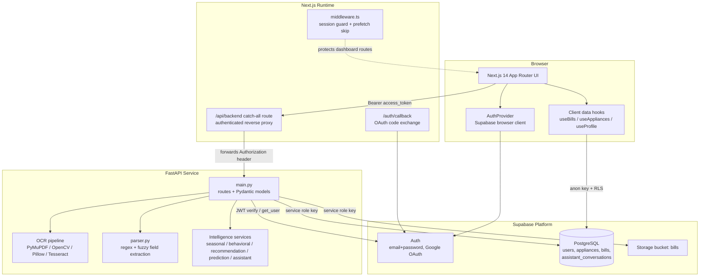

# Two Doors Into the Same Database: The Architecture Story Behind WattWise

### Part one of an engineering series — why one product ended up with two data paths, and what that cost me

---

About 20 days ago I shared WattWise, an AI-powered household energy intelligence platform. Since then I have been writing up the engineering behind it as a series, and this first entry is deliberately narrow. It is only about architecture.

The OCR pipeline gets its own article. So does the backend internals and the request lifecycle. So do the lessons. Here I want to tell one story properly: how a fairly ordinary product ended up with **two separate paths into the same database**, why I chose that on purpose, and the bill that arrived later.

---

## The constraint that shaped everything

WattWise does two very different things with the same four Postgres tables.

The first is ordinary. A user opens the dashboard and reads their own bills, their own appliance list, their own profile. It is a read of rows they own, it happens constantly, and it should be as close to free as I can make it.

The second is not ordinary. When a bill is saved, the server computes a seasonal analysis, an appliance attribution, a set of recommendations and a forecast, then writes all of it onto the row alongside a verification status, a parser version and an OCR confidence score.

Those are **server-authored facts**. If the browser could write them, a user could claim any energy score they wanted. The read path wants minimum privilege and minimum latency. The write path needs credentials the browser must never hold.

I could have forced both through one door. Most tutorials would. But the two workloads want opposite things, and pretending otherwise means one of them gets a compromise it did not need.

---

## The shape that came out of it



Follow the two arrows into the database and the whole design becomes legible.

The left arrow is the browser going straight to Postgres with an anon key. Row-level security does the authorization — every policy is `auth.uid() = user_id`. A frontend developer *cannot* write a query that returns someone else's rows, no matter what they type. The guarantee is enforced by the database, not by discipline.

The right arrow is FastAPI holding a service role key, doing the privileged work.

Everything else on that diagram exists to make those two arrows safe.

---

## Why these three pieces

**Next.js App Router** — I chose it for middleware and route handlers, not for React Server Components. I needed a session guard that runs before any page code, and a server-side route that can hold a backend URL the browser never sees. Most of my pages are `"use client"` and that is deliberate: none of this content is public or cacheable, so server-rendering it would mean re-plumbing auth through cookies for every read and buying almost nothing.

**FastAPI** — the intelligence layer is numeric and the ingestion layer is image processing. The Python ecosystem for both has no equivalent in Node. Pydantic models double as an enforced API contract. That was not a close call.

**Supabase** — the alternative was Postgres plus a hand-rolled JWT layer plus S3. Supabase collapses that into one dependency, and more importantly it treats row-level security as a first-class primitive. For a product where every single row is owned by exactly one user, that is the whole authorization model in four lines per table.

---

## The proxy is the most important thing I built

The browser never talks to FastAPI directly. Everything goes through a catch-all route handler at `/api/backend`.

It is a small file and it does four jobs. It rejects any path that does not begin with `api/` and any segment containing `..`, so traversal into non-API backend routes is closed by construction. It requires a Bearer token before a single byte leaves the Next.js process, so unauthenticated traffic never reaches Python at all. It strips the header set that quietly corrupts a proxied response on the way back. And it keeps the browser on one origin, which takes CORS off the hot path entirely.

That last one is the underrated benefit. A lot of two-service architectures spend their first week fighting CORS. Mine never had to, because from the browser's perspective there is only one server.

---

## The bill that arrived later

Here is the part I would rather not write, which is exactly why it belongs here.

The service role key **bypasses row-level security completely**. Every policy I wrote is invisible to the backend. So on that side of the diagram, authorization stopped being a database guarantee and became application code:

```python
supabase.table("bills").select(...).eq("user_id", user_id)
supabase.table("bills").update(record).eq("id", bill_id).eq("user_id", user_id)
supabase.table("appliances").select(...).eq("user_id", user_id)
supabase.table("assistant_conversations").select(...).eq("user_id", user_id)
```

Every one of those filters is correct today. I checked all of them.

But "correct today" is a property of a snapshot, not of a design. Nothing in the type system, the tests or the framework would catch a new endpoint whose author forgot the filter. It would not crash. It would return a successful response containing another user's electricity bills.

Compare that to the left arrow, where the same mistake is impossible to make. One path makes the error unthinkable. The other makes it a code review away.

That asymmetry is the real cost of the split, and the fix is structural rather than careful: a repository object that takes `user_id` as a mandatory constructor argument, so an unscoped query is not something you can write. It is the top item on my roadmap, and it is a day of work I should have spent before the tenth endpoint rather than after.

---

## The other architectural bet

One more decision belongs in an architecture story: analysis is computed at **write** time, not read time. Saving a bill runs the full intelligence stack and stores the results on the row as JSONB.

That bought a lot. Bill history renders contribution splits with one `select`. The dashboard skips a network round trip entirely when a stored forecast already exists.

It also cost something real. Those snapshots go stale — change your family size in settings and every previously saved bill still carries analysis computed under the old profile, and nothing recomputes it today. I knew the trade when I made it. I did not build the invalidation, which means I do not have a cache, I have a stale cache.

---

## Closing

If I had to compress this into one sentence: the architecture is not two services, it is two trust levels, and everything else follows from taking that seriously.

Next in the series I go inside the FastAPI service — the layering, the contracts and the request lifecycle — and after that, the OCR pipeline.

If you have run a split like this, I would like to know where you drew the line between database-enforced and application-enforced authorization, and whether you regretted it.
