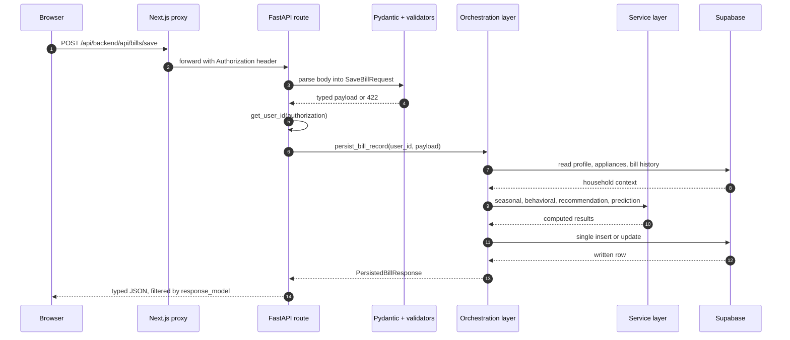

# Why My FastAPI Backend Isn't Just CRUD APIs

### How I designed a backend that validates, analyzes, predicts, and prepares every electricity bill before it reaches the dashboard

---

The last article described WattWise from the outside — two paths into the same database, and where the trust boundary sits. This one goes inside the Python service to answer one question:

**What actually happens after a user uploads an electricity bill?**

The short answer: a lot more than an insert.

---

## The problem

The naive version writes itself. A bill is a row: take a JSON body, write it to Postgres, return the id. Fifteen minutes of work.

That version is wrong for one reason: **the data arriving at the API is neither trustworthy nor finished.** Not trustworthy, because most of it was extracted from a photograph then corrected by a human in a hurry — some fields are confident, some are guesses, some are wrong in ways that look plausible. Not finished, because `318 units, ₹2,340` is a fact without context; it only means something next to the household that produced it and the bills before it.

So this backend has two jobs CRUD does not: decide **how much to trust each field**, and **finish the record** before anyone reads it.

---

## Why CRUD wasn't enough

Saving a bill does not touch the database once. It reads three tables to assemble household context, runs four analysis engines in sequence, then performs a single write containing the bill and everything derived from it.

The endpoint is called `POST /api/bills/save`, which undersells it considerably. Analysis happens at write time so reads stay cheap — a saved bill is a finished artifact, not a raw row awaiting interpretation.

---

## The request journey



---

## The backend layers

Five, and one rule keeps them honest: **each layer knows nothing about the one above it.**

**HTTP** — 15 route functions that do almost nothing: extract the user, call one function, return the result. A route that grows a second paragraph of logic is in the wrong layer.

**Contract** — 12 Pydantic models, the enforced boundary between outside world and code.

**Orchestration** — the only layer that knows both how to reach the database and what order the engines run.

**Services** — 35 modules, most under 100 lines. `budget_risk_analyzer.py` is 32 lines and does one thing.

**Persistence** — a thin call at the bottom.

The invariant I care about most: **no service module imports the database client, knows what HTTP is, or holds state.** Every one is a pure function over dictionaries.

That pays for itself twice. My tests need no mocks, fixtures or database — they build a household dict and a bill dict inline and call the engine. And the same code serves two callers: the analysis endpoints run an engine on a client payload, the save path runs the *identical* engine on server data.

---

## Validation before business logic

This is the part I would defend hardest, because it is where the trust problem gets solved. Validation is not one function — it runs three times, at three boundaries, answering three questions.

**Stage one — Pydantic, at the HTTP boundary.** Is this well-formed JSON with the right shapes? Failure is a 422 and nothing else runs.

Note what `SaveBillRequest` looks like: every field is optional, including the extracted text. That encodes a product requirement — **a bill can be created entirely by hand.** If extraction produced nothing usable, the client posts empty text plus manual values and the save path behaves identically. No second code path for the manual case means no second path to keep working.

**Stage two — type coercion.** Everything a browser sends is a string. This stage coerces by field class: one integer field, seventeen numeric fields, a month field with its own normalizer. Values that fail coercion are *skipped*, not rejected — a malformed optional field should not block an otherwise valid save.

It exists because of a bug. `billing_days` is an `integer` column; numbers parsed from a document are floats. Postgres rejected `31.0` at save time, after the user had done all the correction work. There is now a regression test asserting both value and Python type — asserting the value alone would have let it back in.

**Stage three — domain validation.** Three fields are required. Fourteen must be non-negative. Three may legitimately be negative, because adjustments and credits go both ways on a real bill; marking those non-negative would reject a correct document.

Then the bounds that matter:

```python
if field == "billing_days" and not 1 <= numeric_value <= 60:
    errors[field] = "Billing days should be between 1 and 60."
if field == "units_consumed" and numeric_value > 10000:
    errors[field] = "Units consumed looks unusually high."
```

Those are not type checks. They catch what types cannot: **the right number landing in the wrong field.** A meter reading of 15,820 is a valid non-negative number. It is only obviously wrong once it is sitting in a field that should never exceed 60.

The output of all three stages is not a boolean but a per-field verdict, and the bill is stored as `verified` or `needs_review`. The backend does not refuse ambiguous data — it records the ambiguity and passes that judgment forward.

---

## Authentication

Every route except the health check pulls a user id from a Bearer token, two ways. The fast path decodes the JWT locally with the shared secret — microseconds, no network. If that throws, it falls back to asking the auth provider. Fast in the common case, correct in the uncommon one.

The mistake worth naming: I call that helper *manually* in every route instead of declaring it a FastAPI dependency. It works, and it is fragile — an endpoint that forgets the call is an unauthenticated endpoint, and nothing catches it. With `Depends`, a handler cannot receive a user id without the dependency having run. I have not done that refactor, which is also why my tests cover services well and route handlers not at all.

---

## Error handling

Domain failures raise `HTTPException` with a sentence written for a human, because that string goes straight into the UI. Database errors are translated — the driver's message is useful, a stack trace is not, and neither reaches the browser.

The opinion underneath it: **a failed enhancement is not a failed request.** If the optional extraction step fails during an upload, the endpoint still returns 200 with the stored file reference and a flag saying extraction did not work. The upload genuinely succeeded. A 500 would throw away a file the user already handed me because a convenience feature didn't fire.

---

## Trade-offs

**One large `main.py`.** No `routers/`, no `schemas/`, no cookiecutter layout. With 15 routes and 35 service modules, splitting routes across five files would produce five files under 30 lines, all importing the same two things. Decomposition went where the complexity is. The counterpoint: `main.py` is 1,119 lines and holds orchestration wearing a routing costume.

**Untyped analysis endpoints.** Mutations declare a `response_model`; the four analysis endpoints return service dictionaries directly. I moved fast while those payloads were changing shape, and TypeScript interfaces are now their de facto contract. That is where this backend under-specifies itself.

**Write amplification.** Computing everything at save time makes that endpoint the slowest in the system so every later read is nearly free. I would take that trade again.

---

## Closing thoughts

A backend's real job is not storing what it was given. It is deciding what to believe, finishing what is incomplete, and being explicit about which is which.

Three stages of validation, a `verified` or `needs_review` status, a service layer testable with a dictionary — none of it exotic. It is just the difference between persisting data and taking responsibility for it.

In the next article I'll move one layer deeper and explain why extracting reliable data from an electricity bill turned out to be much harder than writing the backend around it.
