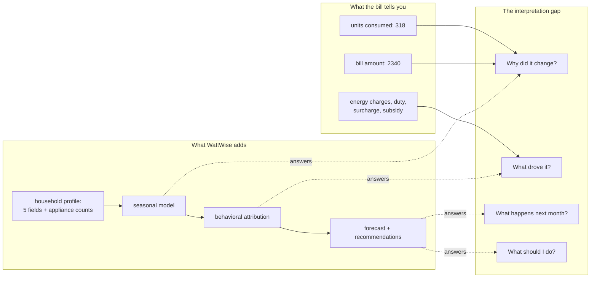
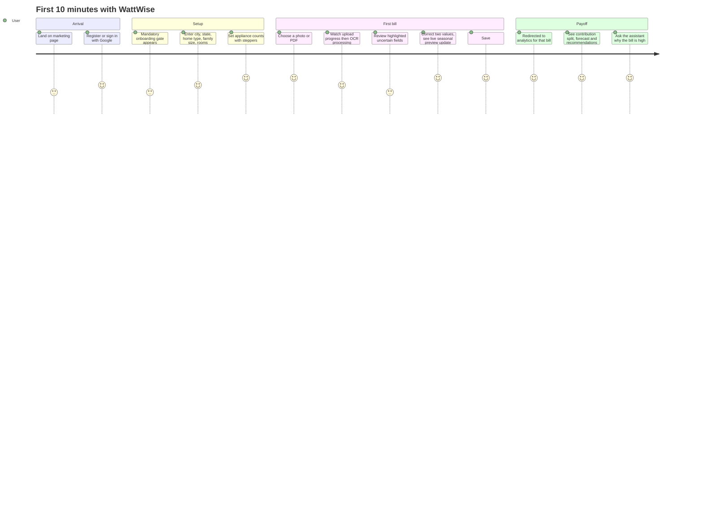
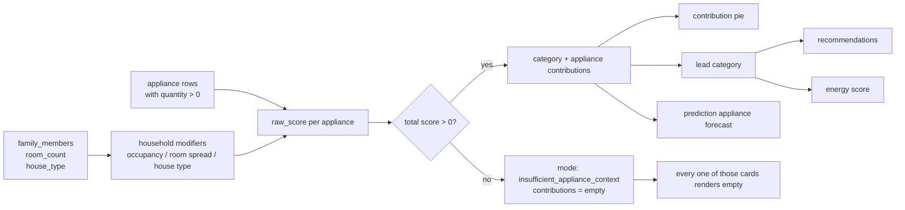
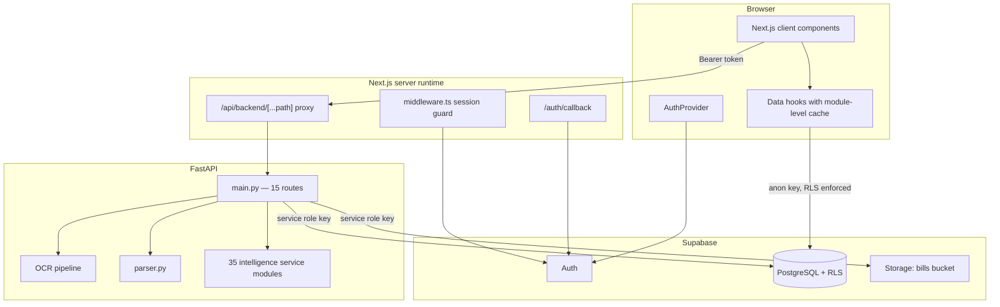
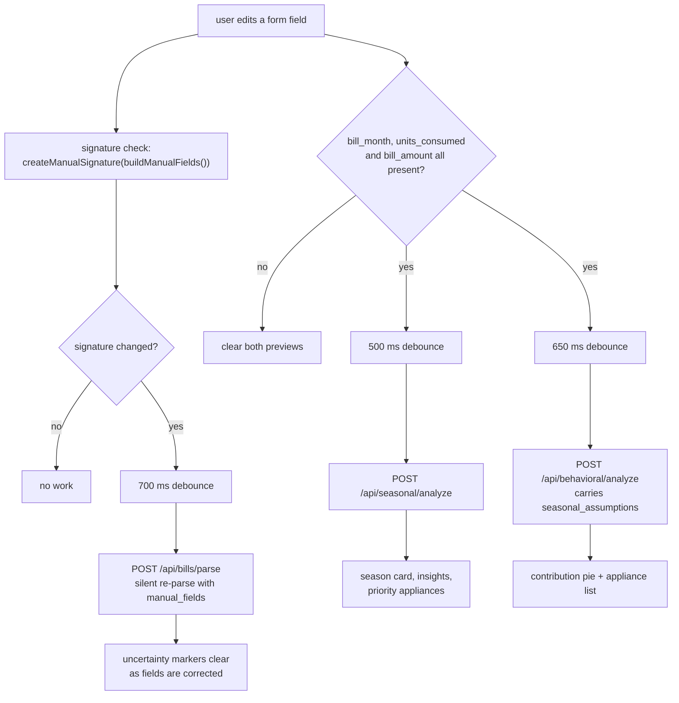
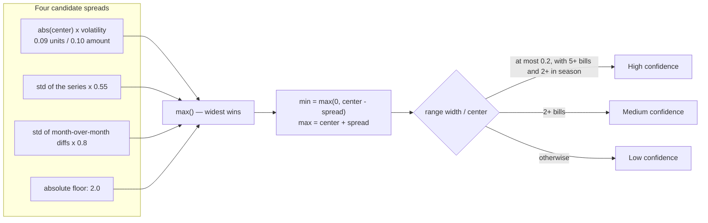
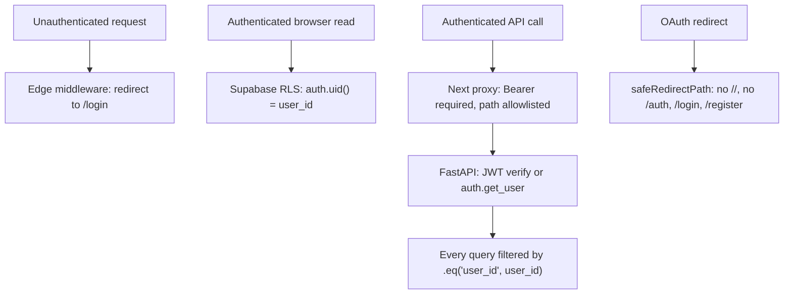

# Building WattWise: Designing an AI-Powered Household Energy Intelligence Platform

> **Series:** Building WattWise · **Part 1 of 4**
> **Estimated reading time:** 18 minutes
> **Companion docs:** [Architecture](./architecture.md) · [Database](./database.md) · [API Reference](./api-reference.md)

---

## Table of Contents

1. [The Problem Nobody Solves for You](#the-problem-nobody-solves-for-you)
2. [Where the Idea Came From](#where-the-idea-came-from)
3. [Goals and Non-Goals](#goals-and-non-goals)
4. [Why This Problem Is Harder Than It Looks](#why-this-problem-is-harder-than-it-looks)
5. [The User Journey](#the-user-journey)
6. [Technology Choices and Why](#technology-choices-and-why)
7. [System Architecture](#system-architecture)
8. [Feature Walkthrough](#feature-walkthrough)
9. [The Engineering Decisions That Shaped Everything](#the-engineering-decisions-that-shaped-everything)
10. [Performance Work](#performance-work)
11. [Security Model](#security-model)
12. [Challenges](#challenges)
13. [What I Would Do Differently](#what-i-would-do-differently)
14. [Roadmap](#roadmap)
15. [Key Takeaways](#key-takeaways)

---

## The Problem Nobody Solves for You

An Indian electricity bill is a strange document. It tells you exactly how much you owe, down to the rupee, and almost nothing about why. There is a units figure, a slab-driven set of charges, a duty line, a subsidy line, a surcharge, and something called "Recorded MD" that most households have never had explained to them. The bill is precise about the outcome and silent about the cause.

The gap that creates is not a data gap. It is an interpretation gap. Households already possess the raw material — a stack of monthly bills — but nothing turns that stack into a sentence like *"your bill went up 22% because cooling load dominated a hot billing cycle across three active rooms, and next month is likely to land between ₹2,400 and ₹2,900."*

The utility cannot produce that sentence, because it does not know how many people live in your home, how many rooms are in daily use, or whether you own one air conditioner or three. A smart meter vendor can produce it, but only if you buy hardware. WattWise takes a third route: it assumes you will never install a sensor, and asks what can be responsibly inferred from a photograph of a bill plus a five-field household profile.

> **The core product bet:** an honest estimate delivered today beats a precise measurement that requires hardware you will never buy.



---

## Where the Idea Came From

The starting observation was mundane: people photograph their bills. They already do it, for reimbursement, for record-keeping, for arguments with landlords. The photograph exists. It just goes nowhere.

That reframed the product from "energy monitoring" to "document intelligence with an energy domain model on top." Once you accept that framing, the engineering problem decomposes cleanly:

| Layer | Question it answers |
|---|---|
| OCR + parsing | What does this document actually say? |
| Household context | Who lives here and what do they run? |
| Seasonal model | What does this time of year usually do to consumption? |
| Behavioral estimation | Which category of appliance most plausibly drove this bill? |
| Prediction | Where is the next bill likely to land? |
| Recommendation | What is the single most useful thing to change? |
| Assistant | Can the user interrogate all of the above in plain language? |

Each layer consumes the one above it. That dependency chain turned out to be the spine of the entire codebase — it is visible in the backend service graph, in the order of network calls in the dashboard hook, and in the sequence of columns on the `bills` table.

---

## Goals and Non-Goals

**Goals**

- Turn a photo or PDF of an electricity bill into structured, corrected, validated data in under a minute.
- Never lose a user's work because OCR failed. Manual entry must always be a complete path, not a fallback stub.
- Produce explanations, not just numbers. Every insight ships with the reasoning that generated it.
- Be honest about uncertainty. Estimates are labeled as estimates, everywhere, in the API payload and in the UI.
- Keep the whole thing deployable by one person on managed infrastructure.

**Explicit non-goals**

- No device-level metering claims. The system never says "your AC used 140 units." It says "cooling is estimated at 38% of this bill's mix."
- No guaranteed savings figures. Every recommendation is phrased as a likelihood.
- No multi-tenant admin surface, billing, or team features. This is a single-household product.

That second non-goal drove a naming convention that runs through the entire backend. Payloads carry an `estimated_analysis_label` field whose value is literally `"Estimated Analysis"` or `"Estimated Forecast"`. Contribution items carry an `estimated_reason` string. The frontend has a dedicated `EstimatedAnalysisBadge` component. Honesty was implemented as a data contract, not as a disclaimer in the footer.

---

## Why This Problem Is Harder Than It Looks

Three things make this domain genuinely difficult.

**1. The input is adversarial.** A phone photo of a thermal-printed bill, taken at an angle, under a ceiling light, is close to a worst case for OCR. Tesseract will read `Bill Amount` as `Blll Amount`, `Units Consumed` as `Unlts Consmed`, and `Billing Days` as `nays`. Any parser built on exact string matching dies immediately.

**2. The ground truth does not exist.** There is no label to train against. Nobody knows what fraction of a given bill was cooling. This rules out supervised machine learning for the attribution problem and forces a transparent, rule-based model — which turns out to be an advantage, because a rule-based model can explain itself.

**3. The user has almost no data.** The first bill a user uploads produces a history of length one. A forecasting system must be useful at n=1, better at n=3, and confident at n=5, and it must communicate which regime it is in. Systems that only work with rich history are useless at the exact moment a user decides whether to keep using them.

---

## The User Journey



The single most important design decision in that flow is the **mandatory onboarding gate**. `MandatoryOnboardingGate` wraps every dashboard route, and when the household profile is incomplete it does something aggressive: it sets `overflow: hidden` on the body, compensates for the scrollbar width, and applies the `inert` attribute to the app shell behind the wizard. The user cannot browse past setup.

That is a deliberately hostile-sounding choice, and it exists because of a hard dependency. Behavioral estimation requires `family_members`, `room_count`, `house_type`, and at least one appliance with a non-zero quantity. Without them, `calculate_estimated_contributions` returns `mode: "insufficient_appliance_context"` and every downstream card renders empty. A user who skips setup does not get a degraded experience; they get a blank one. Blocking is kinder than an empty dashboard.

The escape hatch survives: `isOnboardingGateResolved` returns true if `onboarding_skipped_at` is set, so a determined user can still get through, and the app then shows setup prompts instead of analysis.

The gate exists because of a hard dependency chain — every card on the dashboard traces back to five profile fields and one appliance row:



---

## Technology Choices and Why

### Next.js 14 App Router on the frontend

The deciding factor was middleware and route handlers, not React Server Components. WattWise needs a server-side session guard that runs before any page code, and it needs a server-side proxy that can hold a backend URL that the browser never sees. The App Router gives both in one deployment artifact.

Most page components are `"use client"`. That is not an oversight. The dashboard, analytics, predictions, recommendations, assistant, bills and settings pages are all driven by a live Supabase session held in React context, and they all mutate state in response to user interaction. Server rendering those pages would mean re-plumbing auth through cookies for every data read and would buy very little, because none of this content is public or cacheable.

### FastAPI on the backend

Three reasons, in order of weight:

1. **The Python OCR and imaging ecosystem is unmatched.** PyMuPDF, OpenCV, Pillow and pytesseract have no equivalent stack in Node.
2. **Pydantic models are executable API documentation.** `SaveBillRequest`, `PersistedBillResponse` and `BillListItem` define and enforce the contract in one place, and FastAPI generates OpenAPI from them for free.
3. **The intelligence layer is fundamentally numeric.** NumPy and scikit-learn are one import away.

### Supabase for auth, database and storage

The alternative was Postgres plus a self-rolled JWT layer plus S3. Supabase collapses that into one dependency with row-level security as a first-class primitive, which matters enormously for a product where every row is owned by exactly one user. The RLS policies in `supabase/schema.sql` are four lines each and cover the entire authorization surface for direct browser reads.

### Recharts for visualization

Chosen for composability and because every chart in the app is a variation on four primitives: area, bar, pie and a dual-axis forecast. All four chart components are lazy-loaded, which matters — see [Performance Work](#performance-work).

### The full dependency picture

| Frontend | Version | Backend | Version |
|---|---|---|---|
| next | 14.2.5 | fastapi | 0.111.1 |
| react / react-dom | 18.3.1 | uvicorn[standard] | 0.30.3 |
| typescript | 5.5.4 (strict) | supabase | 2.7.4 |
| tailwindcss | 3.4.10 | pytesseract | 0.3.10 |
| recharts | 2.12.7 | pillow | 10.4.0 |
| @supabase/ssr | 0.5.0 | PyMuPDF | 1.24.9 |
| @supabase/supabase-js | ^2.49.1 | opencv-python | 4.10.0.84 |
| lucide-react | 0.468.0 | rapidfuzz | 3.9.4 |
| class-variance-authority | 0.7.0 | scikit-learn | 1.5.1 |
| tailwind-merge | 2.5.4 | PyJWT | 2.9.0 |

Runtime is pinned to Python 3.11.9 in three places (`.python-version`, `backend/.python-version`, `backend/runtime.txt`) because OCR deployments are fragile and version drift on a host that installs system packages is a real failure mode.

---

## System Architecture



Full diagrams: [overall system architecture](./assets/diagrams/overall-system-architecture.md) · [frontend-backend flow](./assets/diagrams/frontend-backend-flow.md) · [deployment architecture](./assets/diagrams/deployment-architecture.md)

### The proxy is the most consequential piece of infrastructure

`app/api/backend/[...path]/route.ts` is 119 lines and it earns every one of them. It:

- Rejects any path that does not begin with `api/`, and any path segment containing `..` or a backslash. Path traversal into non-API backend routes is closed by construction.
- Requires an `Authorization: Bearer` header for every method except `OPTIONS`, before a byte leaves the Next.js process. Unauthenticated traffic never reaches FastAPI.
- Strips `host` and `content-length` before forwarding, then strips `content-encoding`, `content-length` and `transfer-encoding` on the way back — the classic set of headers that corrupt a proxied response if passed through naively.
- Iterates a list of backend candidates (`BACKEND_API_BASE_URL`, `NEXT_PUBLIC_API_BASE_URL`, then localhost ports 8000 and 8010), treating network errors as "try the next one" and 5xx responses as "remember this and try the next one," falling back to the remembered 5xx if everything fails and a 502 with a diagnostic message if nothing responds at all.
- Tags every successful response with `x-wattwise-backend` so you can tell from the browser network tab which backend served you.

The candidate list is a development-ergonomics feature that survived into production, and it is honest to say so: it exists because running the backend on a different port shouldn't require an env var change. The production cost is that a misconfigured deploy fails over to localhost and produces a confusing 502 rather than a clear "backend URL not set" error.

### Two read paths, deliberately

Bills are readable **two ways**: directly from Supabase via `useBills` (protected by RLS), and through `GET /api/bills` on FastAPI (protected by explicit `.eq("user_id", user_id)` filters). The dashboard and analytics pages use the first; the bills workspace and bill history pages use the second.

This is real duplication and I will not pretend otherwise. It happened because the bills workspace needs the deleted-bills list, which the RLS-protected client query does not conveniently express alongside the active list, and because the FastAPI `BillListItem` model normalizes null JSONB columns into empty arrays so the UI does not have to null-check thirty fields. The cost is two definitions of "what a bill looks like" — a Pydantic model and a TypeScript type — that must be kept in sync by hand. See [Part 4](./part-4-engineering-lessons.md) for how I would collapse this.

---

## Feature Walkthrough

### Bill ingestion and correction

The bills page (`app/(dashboard)/bills/page.tsx`) is the largest single file in the repository at roughly 1,875 lines, and it is the product's center of gravity. It manages upload, OCR result hydration, a two-section form covering 19 fields, live re-parsing, live seasonal and behavioral previews, inline history with expandable rows, edit mode, soft delete, restore and permanent delete confirmations, and deep-link handling from the bill history page.

The behavior worth calling out is the **debounced re-parse loop**. Every edit to the form recomputes a signature (`createManualSignature(buildManualFields())`). If it differs from the last parsed signature, a 700 ms timer fires a silent re-parse against `POST /api/bills/parse` with the manual fields attached. The server merges machine values with human values, rewrites `field_meta` for overridden fields to `source: "manual", confidence: 1.0, requires_review: false`, and re-runs validation. The user sees uncertainty markers disappear as they type.

Two more debounced effects run alongside it, at 500 ms and 650 ms, hitting the seasonal and behavioral analysis endpoints so the user can see a live preview of what their corrections will produce *before* saving. This is the feature that makes correction feel like exploration rather than data entry.

Three independent debounce timers fire off a single keystroke, each guarded by its own precondition:



### Seasonal intelligence

`build_seasonal_intelligence` composes four services. Season detection is calendar-based and regionally specific: months 3–6 are Summer, 7–9 are Rainy, everything else is Winter/Cooler. That mapping is tuned for Telangana and southern India, and it is a hard-coded assumption that will need to become a per-region lookup before this ships anywhere else.

The behavior inference weights each appliance by a season-specific priority (AC scores 1.55 in Summer and 0.45 in Winter; Geyser inverts to 1.5 and 0.55) multiplied by quantity, then emits up to five natural-language behavior signals gated on thresholds — family size ≥ 6 or ≥ 4, room count ≥ 5 or ≥ 3, daily average ≥ 14 / ≥ 10 / ≤ 6, per-room intensity ≥ 120 / ≥ 90, total units ≥ 450 / ≤ 180.

### Behavioral estimation

This is the attribution engine, and it is deliberately a transparent formula rather than a model:

```
raw_score = quantity
          × base_appliance_factor        # AC 3.6, Geyser 2.4, Cooler 2.8, Lights 0.75 …
          × seasonal_category_multiplier # Cooling 1.45 in Summer, 0.72 in Winter …
          × occupancy_factor             # 1.18 / 1.10 / 1.00 / 0.92 by family size
          × room_spread_factor           # 1.16 / 1.08 / 1.00 / 0.94 by room count
          × house_type_factor            # Independent 1.08, Studio 0.92
          × activity_factor              # top-priority +0.15, high daily average +0.12, …
```

Scores are normalized to percentages and the bill's `units_consumed` is distributed across them. Five categories — Cooling, Lighting, Always Active, Entertainment, Utility — each carry a fixed hex color that flows from the backend into the Recharts pie, so the legend on the dashboard is server-defined.

Every constant here is a judgment call. That is precisely why the formula is a chain of named multipliers instead of a fitted model: a reviewer can disagree with `AC = 3.6` and change one number, and the effect on the output is traceable.

### Prediction

`predict_next_value_range` fits `LinearRegression` on `index → value` and predicts at `index = len(values)`. It degrades in two directions: a single data point produces a `single_point_baseline` with a spread of `max(center × volatility, 20 or 3)`, and an unimportable scikit-learn falls back to `numpy.polyfit` with the model name recorded as `polyfit_fallback` in the response metadata.

The uncertainty band is the interesting part:

```python
spread = max(abs(center) * volatility, std_component * 0.55, drift_component * 0.8, 2.0)
```

Four sources of spread, and the widest wins: proportional volatility, the standard deviation of the series, the standard deviation of month-over-month differences, and an absolute floor. A household with erratic bills gets a visibly wider band, which is the correct honest behavior.

Confidence is graded separately from the band: **High** requires ≥ 5 bills, ≥ 2 same-season bills, and a range width ≤ 20% of center. **Medium** requires ≥ 2 bills. Everything else is **Low**, with the reason string surfaced directly in the UI badge.



### Recommendations

Six independent generators produce candidate cards; the engine dedupes on `(category, title)`, sorts by priority rank then category then title, and caps at 12. The deterministic sort matters more than it sounds — without it, dictionary iteration order would reshuffle a user's recommendation list between two otherwise identical requests, which reads as instability.

An energy score sits alongside: base 78, adjusted by units-per-person, units-per-room, daily average, appliance count, category/season interactions and month-over-month change, clamped to `[42, 96]` and graded A / B+ / B / C / D. The clamp is a product decision — nobody gets an F, and nobody gets a perfect score, because both would over-claim precision the model does not have.

### The assistant

The assistant is **not** an LLM, and the documentation should say so plainly. `_classify_intent` runs a keyword cascade over ten intents, and each intent routes to a dedicated explainer that reads a fully assembled context object containing the household profile, the current bill, the history, and the complete seasonal, behavioral, recommendation and prediction outputs.

Answers are assembled by a shared formatter that produces a consistent three-part shape:

```
Short answer: <one sentence>

Why WattWise thinks that:
- <up to 3 reasoning bullets>
Best next moves:
- <up to 3 action bullets>
```

Every conversation is persisted with a `grounding_metadata` object recording the season, lead category, energy score grade and bill count that produced it. The result is an assistant that cannot hallucinate a number, because it has no generative capacity — every figure in every answer is read from a computed context. The cost is brittleness: an unanticipated phrasing falls through to `explain_general`. Full intent routing is in [assistant-workflow](./assets/diagrams/assistant-workflow.md).

---

## The Engineering Decisions That Shaped Everything

### 1. Compute analysis at write time, not read time

When a bill is saved, `persist_bill_record` does far more than insert a row. It loads the household profile, the appliance list and the full non-deleted bill history; runs seasonal intelligence, behavioral estimation, the recommendation engine and the prediction engine; and writes all four results into JSONB columns on the same row, each with its own `*_generated_at` timestamp.

**Why:** a saved bill becomes a self-contained analytical artifact. The bill history list can render contribution splits and recommendation counts with a single `select`. The dashboard checks `currentBill.prediction_results` and skips a network round trip entirely when the snapshot exists.

**The cost:** snapshots go stale. Change your family size in settings and every previously saved bill still carries analysis computed under the old profile. The system does not currently recompute them. This is the single largest correctness debt in the codebase, and it is discussed at length in [Part 4](./part-4-engineering-lessons.md).

### 2. Machine values and human values are stored separately, forever

The `bills` table keeps `parsed_data` (what the parser produced), `corrected_data` (what the user confirmed), `parsed_field_meta` (per-field confidence, source, matched pattern and the raw OCR line), `manual_override_fields` (which fields the human touched), `ocr_raw_text`, `ocr_confidence` and `parser_version`.

Nothing is ever overwritten. When `PARSER_VERSION` moves from `phase4.v2` to something newer, every historical row can be re-parsed from its stored raw text and diffed against its stored corrections. That is the difference between a parser you can improve and a parser you are stuck with.

### 3. The service layer is 35 single-purpose modules

The backend has one `main.py` and thirty-five service modules, most under 100 lines. `budget_risk_analyzer.py` is 32 lines and does exactly one thing. `seasonal_influence_service.py` is a 30-line lookup table with an accessor.

The composition graph is strictly acyclic: `seasonal_engine` → `season_detection` + `seasonal_behavior` + `seasonal_insights` + `seasonal_trends`; `behavioral_estimation_engine` → `estimation_calculation_service` + `household_behavior_utility` + the seasonal modules; `recommendation_engine` → six generators; `prediction_engine` → five forecasting services. Every module is independently testable with plain dictionaries, which is exactly how the eight test files exercise them.

### 4. Explanations are data, not presentation

Every insight the backend produces carries its own reasoning text. Contribution items have `estimated_reason`. Seasonal insights have `title`, `message` and `tone`. Recommendations have `text` plus a `metadata` object containing the numbers that triggered the rule. Prediction responses have a `prediction_reasoning` array.

The frontend renders explanations; it never authors them. That means the assistant, the dashboard and the API all tell the same story, and improving an explanation is a one-file backend change.

---

## Performance Work

The perceived-performance work is concentrated in five places, and each has a measurable rationale.

**Chart bundles are lazy.** All four Recharts components are loaded through `next/dynamic` with `ssr: false` and a skeleton fallback. Recharts pulls in D3 modules and is by a wide margin the heaviest dependency in the app; keeping it out of the initial route bundle is the single biggest win available.

**Middleware skips prefetch requests.** This is the sharpest optimization in the codebase. Next.js prefetches linked routes aggressively, and `supabase.auth.getUser()` performs a network call to the Supabase Auth API. Without a guard, hovering the sidebar would fire six auth round trips. The middleware matcher uses `missing` conditions on the `next-router-prefetch` and `purpose: prefetch` headers so prefetch traffic bypasses the session check entirely:

```ts
{
  source: "/dashboard/:path*",
  missing: [
    { type: "header", key: "next-router-prefetch" },
    { type: "header", key: "purpose", value: "prefetch" }
  ]
}
```

The security reasoning holds: a prefetch renders nothing to the user, and the actual navigation that follows is checked normally.

**Client data is cached at module scope with in-flight deduplication.** `useBills`, `useAppliances` and `useProfile` each hold a module-level cache keyed by user id, a `Set` of listeners, and a shared promise. If the sidebar, the top nav and the page body all call `useBills` on the same render, exactly one Supabase query is issued and all three components receive the result through the listener broadcast. Navigation between dashboard routes serves from cache with no network at all.

**Routes are prefetched from both navigations.** `Sidebar` and `MobileNav` both call `router.prefetch` for every primary nav entry on mount, and again on hover, focus or touch start.

**Route groups have a shared loading skeleton.** `app/(dashboard)/loading.tsx` renders a structurally accurate skeleton — stat row, chart panel, insight list — so the transition is a layout that fills in rather than a spinner that jumps.

The honest gap: none of this is measured. There is no Lighthouse budget in CI, no bundle analyzer, no Web Vitals reporting. These are well-reasoned optimizations, not verified ones, and that distinction matters.

---

## Security Model



**Row-level security is on for all four tables.** Every policy is the same shape: `auth.uid() = user_id`, with `with check` on writes. Direct browser reads are safe by construction.

**The backend runs as service role and therefore bypasses RLS.** This is the security decision that deserves the most scrutiny. FastAPI holds `SUPABASE_SERVICE_ROLE_KEY` and can read any row in the database. The only thing preventing cross-tenant access is that every single query appends `.eq("user_id", user_id)` with the id extracted from a verified token. One omitted filter in one new endpoint would be a data breach.

The mitigation today is discipline and a small surface (15 routes). The mitigation it deserves is a repository layer that takes `user_id` as a mandatory constructor argument and makes an unscoped query impossible to write. That is the top security item on the roadmap.

**Token verification has a fast path and a safe path.** `get_user_id` first attempts a local HS256 decode with `SUPABASE_JWT_SECRET` (with `verify_aud` disabled, since Supabase audience claims vary by flow). On any `PyJWTError`, or if the secret is unset, it falls back to a network call to `supabase.auth.get_user(token)`. Fast in the common case, correct in the uncommon one.

**Open redirect is closed in three places.** `safeRedirectPath` appears in the login page, the register page and the auth callback route, and each rejects values that are null, do not start with `/`, start with `//`, or point at `/auth`, `/login`, `/register` or `/onboarding`.

**Upload validation is allowlist-based.** Extensions are checked against an explicit set, and size against `MAX_UPLOAD_MB`. Files are namespaced by user id in storage (`{user_id}/{uuid4}-{safe_name}`).

**Known gaps, stated plainly:** there is no rate limiting on any endpoint; content is not sniffed, so a `.png` file containing arbitrary bytes reaches Pillow (which will reject it, but the check is implicit); the upload is read fully into memory before its size is validated, so the size limit protects storage rather than the process; and uploaded files are not deleted when a bill is permanently deleted.

---

## Challenges

**OCR quality was the whole project for a while.** The preprocessing chain — EXIF transpose, upscale to 1,200 px minimum, contrast ×1.8, sharpness ×1.4, median filter, adaptive Gaussian threshold with a 31-pixel block, deskew via `minAreaRect`, final global threshold — is thirteen operations, and each was added in response to a specific failure. Part 3 walks through the whole thing.

**Fuzzy matching wanted to match everything.** Introducing `rapidfuzz` fixed the OCR-corruption problem and immediately created a false-positive problem: with a threshold of 78, `partial_ratio` cheerfully matched `"interest on cd"` against a line about `"interest on ed"`. The fix was `_line_is_candidate_for_field`, a token gate that must pass before fuzzy matching is even attempted, plus explicit special-casing for the ED/CD pair. Fuzzy matching needs a hard gate, not just a threshold.

**Postgres rejected `31.0` for an integer column.** `billing_days` is `integer`. Numbers parsed from OCR are floats. The insert failed, and it failed at save time, after the user had done all the correction work. The fix is `coerce_record_types` plus a dedicated regression test (`test_bill_type_coercion.py`) that asserts both the value and the Python type.

**Schema drift between environments.** `useProfile` contains a fallback path that detects PostgREST "schema cache" errors mentioning `onboarding_completed_at` or `onboarding_skipped_at`, retries with a narrower column list, and stores the skip flag in `localStorage` instead. That is 60 lines of defensive code that exists because a deployed database was behind the application. It works, but it is a workaround for a missing migration story, and it should be deleted the day migrations are versioned.

**The hook waterfall.** The original hooks composed naively: `useSeasonalIntelligence` → `useBehavioralEstimation` (waits for seasonal) → `useRecommendations` (waits for both). Each layer re-triggered on every dependency change, producing three sequential round trips and visible cascading spinners. `useIntelligenceBundle` and `useDashboardAnalytics` were introduced to run the same chain inside a single effect with a `cancelled` flag for cleanup. Both the old and new hooks still exist in the codebase — the old ones remain in use on some pages.

---

## What I Would Do Differently

- **Version the schema from commit one.** The `alter table ... add column if not exists` block in `schema.sql` — roughly 45 statements — is a migration history compressed into an idempotent script. It works, but it cannot be rolled back and it cannot tell you what changed when.
- **Put the energy-score formula in one language.** It currently exists twice: in `efficiency_analysis_service.py` and in `lib/analytics/analytics-utility.ts`, with identical constants. Two implementations of a formula will drift; it is a question of when.
- **Build the repository layer before the tenth endpoint, not after.** Manual `user_id` filtering is a discipline that scales poorly.
- **Add CI on day one.** Eight test files exist and nothing runs them automatically. Compiled `__pycache__/*.pyc` artifacts are committed to git because `.gitignore` never got a `__pycache__` entry — a five-second fix that survived because no pipeline ever complained.

---

## Roadmap

| Priority | Item | Why |
|---|---|---|
| P0 | Repository layer with mandatory `user_id` scoping | Removes the class of bug that leaks data |
| P0 | CI running the eight backend test files plus `tsc` and `next lint` | Tests that do not run are documentation |
| P0 | Versioned migrations replacing the idempotent schema script | Enables safe schema evolution |
| P1 | Recompute stored snapshots when the household profile changes | Fixes the staleness debt |
| P1 | Single source of truth for the energy score | Removes duplicate logic |
| P1 | Region-configurable season mapping | Unblocks non-southern-India users |
| P2 | Background OCR queue with job status | Removes the long synchronous upload request |
| P2 | Rate limiting on upload and assistant endpoints | Both are expensive per call |
| P2 | Structured JSON logging with request ids | Currently there is no logging at all |
| P3 | Optional LLM layer on top of the grounded context | The context object is already the perfect prompt payload |

---

## Key Takeaways

1. **Honesty can be a data contract.** `estimated_analysis_label`, `estimated_reason` and `prediction_confidence` are fields, not disclaimers. When uncertainty is part of the schema, the UI cannot forget to show it.
2. **Rule-based systems win when there is no ground truth.** Nobody can label appliance-level attribution from a bill. A transparent multiplier chain that explains itself beats a black box that cannot.
3. **Store provenance, not just results.** Keeping raw OCR text, machine values, human corrections and per-field metadata turns the parser into something you can improve rather than something you are stuck with.
4. **Compute-at-write is a genuine trade, not a free win.** It bought fast reads and self-contained history; it cost snapshot freshness. Both halves of that sentence are true and both belong in the documentation.
5. **The gate that annoys users can be the one that saves the product.** Blocking navigation until household setup is complete is aggressive, and it is the only reason a first-time dashboard has anything on it.

---

**Next:** [Part 2 — Designing a Production-Ready FastAPI Backend →](./part-2-fastapi-backend.md)

**Also in this series:** [Part 3 — The OCR Pipeline](./part-3-ocr-pipeline.md) · [Part 4 — Engineering Lessons](./part-4-engineering-lessons.md)

**Reference docs:** [Architecture](./architecture.md) · [Database](./database.md) · [API Reference](./api-reference.md) · [All diagrams](./assets/diagrams/) · [All flowcharts](./assets/flowcharts/)
