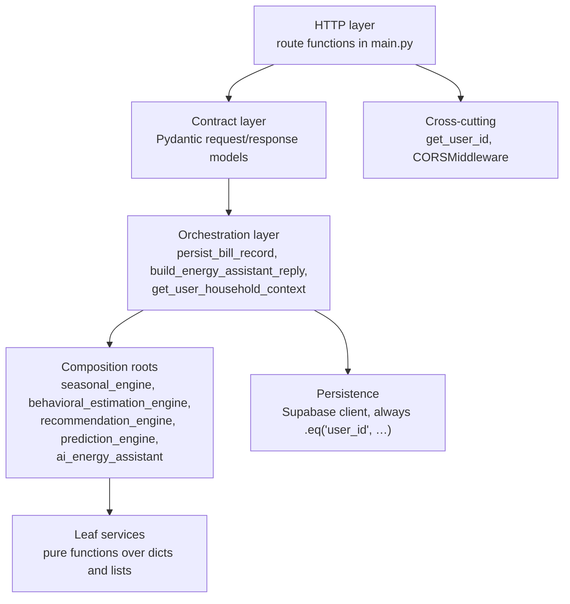
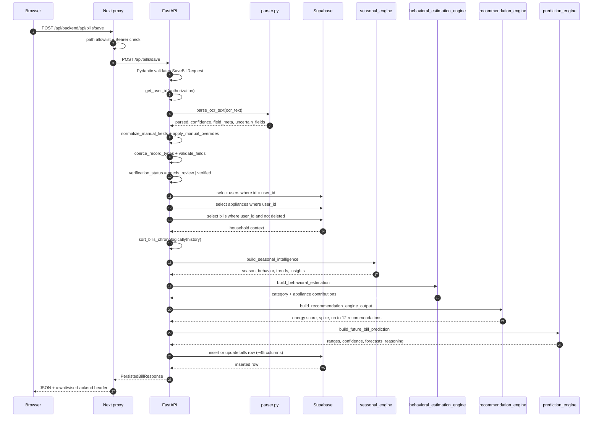

# Designing a Production-Ready FastAPI Backend

> **Series:** Building WattWise · **Part 2 of 4**
> **Estimated reading time:** 17 minutes
> **Prerequisite:** [Part 1 — Building WattWise](./part-1-building-wattwise.md)

---

## Table of Contents

1. [What "Production-Ready" Means Here](#what-production-ready-means-here)
2. [Folder Organization](#folder-organization)
3. [The Layering Model](#the-layering-model)
4. [Routing](#routing)
5. [Validation and the Pydantic Contract](#validation-and-the-pydantic-contract)
6. [Authentication and Authorization](#authentication-and-authorization)
7. [The Service Layer in Depth](#the-service-layer-in-depth)
8. [Request Lifecycle](#request-lifecycle)
9. [Dependency Injection: What I Did and What I Should Have Done](#dependency-injection-what-i-did-and-what-i-should-have-done)
10. [Configuration](#configuration)
11. [Error Handling](#error-handling)
12. [Logging and Observability](#logging-and-observability)
13. [Security Posture](#security-posture)
14. [Testing](#testing)
15. [Scalability](#scalability)
16. [Future Improvements](#future-improvements)
17. [Key Takeaways](#key-takeaways)

---

## What "Production-Ready" Means Here

"Production-ready" is an overloaded phrase, so let me be specific about the bar this backend clears and the bar it does not.

**It clears:** typed request and response contracts, a strictly layered and acyclic service graph, ownership enforcement on every data access, deterministic outputs, graceful degradation when inputs are thin, environment-driven configuration with fail-fast validation, and a test suite that covers the domain logic.

**It does not clear:** no structured logging, no request tracing, no rate limiting, no CI, no health check beyond liveness, no metrics, no background job system. The OCR endpoint does its work synchronously inside the request.

I am stating both halves up front because a case study that only lists strengths is marketing. What follows is the reasoning behind the design, including the parts that need work.

---

## Folder Organization

```txt
backend/
├── main.py                              # 1,119 lines — routes, models, OCR, orchestration
├── requirements.txt                     # pinned dependencies
├── packages.txt                         # apt packages for the host (tesseract, libgl1, …)
├── runtime.txt / .python-version        # Python 3.11.9
├── .env.example                         # documented configuration surface
├── services/
│   ├── __init__.py
│   │
│   │   # ── OCR text → structured fields ──
│   ├── parser.py                        # 329 — field specs, regex + fuzzy matching, overrides
│   ├── regex_extract.py                 #  69 — number, month, meter reading, tariff extraction
│   ├── normalization.py                 #  89 — line, numeric, text and month normalization
│   ├── validation.py                    #  67 — required fields, ranges, sanity bounds
│   ├── fuzzy.py                         #   6 — rapidfuzz partial_ratio wrapper
│   │
│   │   # ── Seasonal intelligence ──
│   ├── seasonal_engine.py               #  45 — composition root
│   ├── season_detection.py              #  55 — month → season
│   ├── seasonal_behavior.py             # 150 — appliance weighting, behavior signals
│   ├── seasonal_trends.py               #  42 — MoM change, same-season averages
│   ├── seasonal_insights.py             # 237 — natural-language insight generation
│   ├── appliance_season_mapping.py      #  70 — aliases, seasonal priorities, phrase library
│   ├── seasonal_influence_service.py    #  30 — category multipliers by season
│   │
│   │   # ── Behavioral estimation ──
│   ├── behavioral_estimation_engine.py  # 146 — composition root
│   ├── estimation_calculation_service.py# 181 — the contribution formula
│   ├── appliance_category_service.py    #  50 — category map, colors, base factors
│   ├── household_behavior_utility.py    #  37 — occupancy, room spread, house type factors
│   │
│   │   # ── Recommendations ──
│   ├── recommendation_engine.py         # 171 — composition root, dedupe, sort, cap
│   ├── seasonal_recommendation_service.py     # 81
│   ├── appliance_optimization_service.py      # 79
│   ├── tariff_intelligence_service.py         # 60
│   ├── efficiency_analysis_service.py         # 132 — energy score + efficiency cards
│   ├── usage_spike_detector.py                # 71
│   │
│   │   # ── Prediction ──
│   ├── prediction_engine.py             # 186 — composition root
│   ├── ml_prediction_service.py         #  56 — LinearRegression + fallbacks
│   ├── trend_analysis_service.py        #  43 — timeline, averages, direction
│   ├── seasonal_forecasting_utility.py  #  45 — next season, spike message
│   ├── anomaly_forecast_service.py      #  34 — risk grading
│   ├── budget_risk_analyzer.py          #  32 — budget goal comparison
│   │
│   │   # ── Assistant ──
│   ├── ai_energy_assistant.py           # 112 — intent classification, response assembly
│   ├── assistant_context_builder.py     #  55 — context object construction
│   ├── energy_insight_generator.py      # 362 — seven explainers
│   ├── prediction_explanation_service.py      # 43
│   ├── recommendation_explanation_service.py  # 27
│   ├── seasonal_explanation_utility.py        # 41
│   │
│   └── bill_chronology.py               #  55 — bill_month-first sorting
└── tests/
    ├── test_parser_regression.py        # fixture-driven OCR regression
    ├── test_bill_type_coercion.py       # integer coercion guard
    ├── test_prediction_engine.py
    ├── test_recommendation_engine.py
    ├── test_ai_energy_assistant.py
    ├── test_behavioral_estimation_engine.py
    ├── test_behavioral_estimation_validation.py
    ├── test_seasonal_behavior_variation.py
    ├── test_seasonal_insights_variation.py
    └── fixtures/telangana/
        ├── README.md
        ├── bill_0{1,2,3}_raw_ocr.txt
        └── bill_0{1,2,3}_expected.json
```

The shape here is worth defending, because it violates a convention. There are no `routers/`, `schemas/`, `dependencies/` or `repositories/` packages — the FastAPI cookiecutter layout. Instead there is one large `main.py` and a wide, flat `services/` directory of small modules.

**The reasoning:** the complexity in this system is not in HTTP handling, it is in domain logic. There are 14 routes and 31 service modules. Splitting 14 routes across five router files would create five files averaging under 30 lines, each importing the same auth helper and the same Supabase client, in exchange for a deeper import graph. The domain modules are where the interesting decomposition lives, and that is where the decomposition went.

**The honest counterpoint:** `main.py` at 1,119 lines is past the point where a newcomer can hold it in their head. It contains route definitions, ten Pydantic models, the entire OCR pipeline (five functions), type coercion helpers, auth extraction, and six orchestration functions that are really services in disguise. The OCR functions in particular (`preprocess_image`, `ocr_text_and_confidence`, `extract_text_from_pdf`, `extract_text_from_image`) have no business being in a routing module and should be `services/ocr_service.py`. Same for `persist_bill_record` and `build_energy_assistant_reply`, which are orchestration, not routing.

---

## The Layering Model



The rule that made this maintainable: **every leaf service is a pure function taking plain dicts and returning plain dicts.** No service imports the Supabase client. No service knows what an HTTP request is. No service holds state.

That constraint has three payoffs:

1. **Testing needs no fixtures, mocks or a database.** `test_recommendation_engine.py` builds a household dict, an appliance list and a bill dict inline and calls the engine directly.
2. **The same code path serves two very different callers.** `POST /api/recommendations/analyze` runs the engine on a client-supplied payload; `persist_bill_record` runs the identical engine on server-loaded data. There is exactly one implementation.
3. **Composition roots are readable.** `build_seasonal_intelligence` is 28 lines and its body is four function calls and a dictionary literal. You can see the whole design in one screen.

The dependency graph is strictly acyclic, with one subtlety: `recommendation_engine` imports `behavioral_estimation_engine` and `seasonal_engine` so it can rebuild those inputs if the caller did not supply them:

```python
seasonal_intelligence = seasonal_intelligence or build_seasonal_intelligence(...)
behavioral_estimation = behavioral_estimation or build_behavioral_estimation(...)
```

This is optional-dependency-with-fallback, and it makes the engine usable both as a composed step and as a standalone entry point. The cost is that a caller who forgets to pass the inputs silently pays for a full recomputation instead of getting an error. Acceptable for four call sites; a problem at forty.

---

## Routing

Fourteen routes, grouped by concern:

| Method | Path | Auth | Response model |
|---|---|---|---|
| `GET` | `/health` | none | — |
| `POST` | `/api/bills/upload` | Bearer | — (raw dict) |
| `POST` | `/api/bills/parse` | Bearer | — (raw dict) |
| `POST` | `/api/bills/save` | Bearer | `PersistedBillResponse` |
| `GET` | `/api/bills` | Bearer | — (list of `BillListItem` dumps) |
| `PUT` | `/api/bills/{bill_id}` | Bearer | `PersistedBillResponse` |
| `DELETE` | `/api/bills/{bill_id}` | Bearer | `BillActionResponse` |
| `POST` | `/api/bills/{bill_id}/restore` | Bearer | `BillActionResponse` |
| `DELETE` | `/api/bills/{bill_id}/permanent` | Bearer | `BillActionResponse` |
| `POST` | `/api/seasonal/analyze` | Bearer | — (raw dict) |
| `POST` | `/api/behavioral/analyze` | Bearer | — (raw dict) |
| `POST` | `/api/recommendations/analyze` | Bearer | — (raw dict) |
| `POST` | `/api/predictions/analyze` | Bearer | — (raw dict) |
| `GET` | `/api/assistant/conversations` | Bearer | — (raw dict) |
| `POST` | `/api/assistant/ask` | Bearer | `AssistantAskResponse` |

Full request and response detail lives in the [API Reference](./api-reference.md).

Three design choices are visible in that table.

**Mutations declare response models; analysis endpoints do not.** Anything that writes to the database returns a typed, filtered model. The analysis endpoints return service dictionaries directly. The reasoning was velocity — these payloads are deeply nested and were still changing shape — and the consequence is that the *TypeScript* types in `lib/hooks/*.ts` are the de facto contract for four endpoints. `SeasonalIntelligence`, `BehavioralEstimation`, `RecommendationAnalysis` and the dashboard's `PredictionAnalysis` type each mirror a Python dict that nothing enforces. This is the clearest place where the backend under-specifies itself.

**Update reuses the create path.** `PUT /api/bills/{bill_id}` does not have its own logic. It reconstructs the request with the id attached and calls the same function:

```python
return persist_bill_record(
  user_id,
  SaveBillRequest(**payload.model_dump(), bill_id=bill_id),
)
```

An update is a full recomputation and a full row rewrite. That is more work than a partial update, and it is worth it: every analysis snapshot on the row is regenerated from current inputs, so an edited bill is never left with a stale mixture of old and new analysis. Idempotent by construction.

**Delete is three separate endpoints.** `DELETE /api/bills/{id}` sets `is_deleted`, `POST /api/bills/{id}/restore` clears it, `DELETE /api/bills/{id}/permanent` actually removes the row — and each has a guard clause in its `WHERE` that makes the wrong transition impossible:

```python
# soft delete only affects rows that are currently active
.eq("id", bill_id).eq("user_id", user_id).eq("is_deleted", False)

# restore only affects rows that are currently trashed
.eq("id", bill_id).eq("user_id", user_id).eq("is_deleted", True)

# permanent delete only affects rows that are already trashed
.eq("id", bill_id).eq("user_id", user_id).eq("is_deleted", True)
```

Double-deleting returns a clean 404 instead of silently succeeding. Permanently deleting an *active* bill is impossible — you must trash it first. The state machine is enforced in the query, not in application logic that could be bypassed.

---

## Validation and the Pydantic Contract

Ten models define the contract. The interesting ones:

```python
class SaveBillRequest(BaseModel):
  ocr_text: str = ""
  manual_fields: dict[str, object] | None = None
  file_url: str | None = None
  file_path: str | None = None
  ocr_confidence: float | None = None
  bill_id: str | None = None
```

Every field is optional, including `ocr_text`. That is not laziness — it encodes the product requirement that **a bill can be created entirely by hand**. If OCR is unavailable, the client posts empty `ocr_text` and a full `manual_fields` dict, and the save path works identically. The parser handles empty text gracefully (`split_lines("")` returns `[]`, no fields match, and validation reports the three required core fields as missing, which the manual overrides then supply).

```python
class BillListItem(BaseModel):
  id: str
  bill_month: str
  units_consumed: float | None = None
  # …
  estimated_contribution_results: list[dict[str, Any]] | None = None
  recommendation_results: list[dict[str, Any]] | None = None
  prediction_results: dict[str, Any] | None = None
```

The list endpoint normalizes before constructing these:

```python
normalized.append({
  **item,
  "estimated_contribution_results": item.get("estimated_contribution_results") or [],
  "behavioral_assumptions": item.get("behavioral_assumptions") or [],
  "recommendation_results": item.get("recommendation_results") or [],
  # …
})
```

Nullable JSONB columns become empty arrays before they cross the wire. The frontend never writes `bill.recommendation_results?.length ?? 0` for these fields, because the API guarantees a list. Normalizing at the boundary rather than at every consumption site is a small decision that removes a category of null-check noise from the entire UI.

### Three-stage validation

Validation is not one function; it happens at three distinct stages with three different jobs.

**Stage 1 — Pydantic, at the HTTP boundary.** Is this well-formed JSON with the right shapes? Failures produce FastAPI's standard 422.

**Stage 2 — `normalize_manual_fields`, at the type boundary.** User input arrives as strings. This function coerces by field class: `INTEGER_FIELDS` (currently just `billing_days`) go through `int(float(value))`; `NUMERIC_FIELDS` (16 of them) go through `float(value)`; `bill_month` goes through `normalize_month_value`; everything else becomes a string. Values that fail coercion are *skipped*, not rejected — a malformed optional field should not block a save.

**Stage 3 — `validate_fields`, at the domain boundary.** This is where business rules live:

| Rule | Fields | Rationale |
|---|---|---|
| Required | `bill_month`, `bill_amount`, `units_consumed` | Below this, no analysis is possible |
| Non-negative | 14 fields including all charges | A negative energy charge is an OCR error |
| May be negative | `adjustment`, `interest_on_cd`, `loss_gain` | These legitimately go both ways on real bills |
| `1 ≤ billing_days ≤ 60` | `billing_days` | Catches a misread meter reading landing in the wrong field |
| `units_consumed ≤ 10000` | `units_consumed` | Domestic connections do not do this |
| `recorded_md ≤ 100` | `recorded_md` | Domestic max demand is single digits |
| Month parseable | `bill_month` | Everything chronological depends on it |

The bounds are the interesting part. They exist to catch a specific failure mode: OCR putting the *right number in the wrong field*. A meter reading of 15,820 landing in `billing_days` is not caught by "is this a number" — it is caught by "is this between 1 and 60."

### Type coercion has its own regression test

```python
def test_manual_billing_days_normalizes_to_integer(self):
  normalized = normalize_manual_fields({"billing_days": "31.0"})
  self.assertEqual(normalized["billing_days"], 31)
  self.assertIsInstance(normalized["billing_days"], int)
```

`billing_days` is an `integer` column in Postgres. A Python float `31.0` is rejected. The failure surfaced at save time — after the user had corrected everything — and the test asserts both value and type so a refactor cannot silently reintroduce it.

---

## Authentication and Authorization

### Extraction

```python
def get_user_id(authorization: Optional[str]) -> str:
  if not authorization or not authorization.startswith("Bearer "):
    raise HTTPException(status_code=401, detail="Missing authorization token.")

  token = authorization.split(" ", 1)[1].strip()
  if SUPABASE_JWT_SECRET:
    try:
      payload = jwt.decode(token, SUPABASE_JWT_SECRET,
                           algorithms=["HS256"], options={"verify_aud": False})
      user_id = payload.get("sub")
      if user_id:
        return user_id
    except jwt.PyJWTError:
      pass

  try:
    response = supabase.auth.get_user(token)
  except Exception:
    raise HTTPException(status_code=401, detail="Invalid token.")
  # … extract id from object-or-dict response shape …
```

Two paths by design. Local HS256 verification is the fast path: no network, microseconds, and it validates the signature and expiry properly. The `verify_aud: False` option is there because Supabase issues different audience claims across flows, and pinning one would break OAuth logins.

The `supabase.auth.get_user(token)` fallback covers the cases the fast path cannot: the JWT secret is not configured, the token is a different type, or the algorithm changed. It costs a network round trip, and it is correct.

The response-shape handling (`getattr(response, "user", None)` followed by `if isinstance(response, dict)`) is defensive code against supabase-py returning different shapes across versions. It is ugly. It is also the kind of ugly that prevents a 500 in production when a dependency changes its return type.

### Authorization: the decision that carries the most risk

The backend authenticates with `SUPABASE_SERVICE_ROLE_KEY`, which **bypasses row-level security entirely**. Every RLS policy in the schema is invisible to it.

The reason is functional: the backend must write columns the browser should never be able to write. `verification_status`, `parser_version`, `ocr_confidence`, and all the analysis snapshot columns are server-computed facts. If the browser could write them through RLS, a user could claim any energy score they liked. Server-authored data needs server credentials.

The consequence is that **authorization is now application code**. Every query in `main.py` carries `.eq("user_id", user_id)`:

```python
supabase.table("bills").update(record).eq("id", payload.bill_id).eq("user_id", user_id)
supabase.table("bills").select(...).eq("user_id", user_id)
supabase.table("bills").delete().eq("id", bill_id).eq("user_id", user_id).eq("is_deleted", True)
supabase.table("assistant_conversations").select(...).eq("user_id", user_id)
supabase.table("appliances").select(...).eq("user_id", user_id)
supabase.table("users").select(...).eq("id", user_id)
```

Today, every one of them is correct. But correctness here rests on the author remembering, on every new query, forever. The structural fix is a repository layer:

```python
class BillRepository:
    def __init__(self, client, user_id: str):
        self._client = client
        self._user_id = user_id          # scope is not optional

    def _scoped(self):
        return self._client.table("bills").eq("user_id", self._user_id)
```

With that, an unscoped query is not a mistake you can make. It is the highest-value refactor available in this codebase and it is on the roadmap for exactly that reason.

### Defense in depth

Before a request reaches `get_user_id`, it has already passed the Next.js proxy, which rejects any non-`OPTIONS` request without a `Bearer` prefix. That is not a substitute for backend auth — a direct call to the FastAPI host skips it entirely — but it means unauthenticated traffic from the browser path is dropped at the edge.

---

## The Service Layer in Depth

### Composition root pattern

Each intelligence domain has exactly one entry point, and its body is a composition:

```python
def build_seasonal_intelligence(household, appliances, current_bill, history=None) -> dict:
  season = detect_season_from_bill_month(current_bill.get("bill_month"))
  behavior = infer_seasonal_behavior(season, household, appliances, current_bill)
  trends = build_seasonal_trends(current_bill, history or [])
  insights = generate_seasonal_insights(season, household, current_bill, behavior, trends)
  return { "season": season, "season_card": {...}, "behavior": behavior,
           "trends": trends, "insights": insights, "seasonal_metadata": {...} }
```

Four calls, one dict. You can read the entire seasonal design in twenty seconds, and each of the four callees is independently testable.

### Defensive numeric access everywhere

A pattern repeats across every service:

```python
units_consumed = float(bill.get("units_consumed") or 0)
billing_days = max(int(bill.get("billing_days") or 30), 1)
family_members = int(household.get("family_members") or 0)
```

`or 0` rather than `, 0` as a default, because the value may be present *and* `None` — which is exactly what a nullable Postgres column produces. `max(..., 1)` on `billing_days` prevents division by zero when computing daily averages, and the `30` default reflects a real product decision: a bill without a stated billing period is assumed to be monthly, because that assumption is far more often right than wrong.

This is unglamorous, and it is the reason the analysis layer does not crash on partially-parsed bills — which is the normal case, not the exception.

### Determinism as a requirement

```python
deduped_recommendations.sort(
  key=lambda item: (PRIORITY_ORDER.get(item["priority"], 3), item["category"], item["title"])
)
```

A three-part sort key with no ties. The same inputs always produce the same ordering. This matters for a subtle UX reason: without it, two identical requests could return the same twelve recommendations in different orders, and a user refreshing the page would see their advice reshuffle for no reason. Reshuffling reads as unreliability.

The same principle drives dedupe-by-`(category, title)` — six generators can independently produce a cooling recommendation, and the user should see one card, not three.

### Graceful degradation is explicit and labeled

```python
if total_score <= 0:
  return {
    "category_contributions": [],
    "appliance_contributions": [],
    "estimation_metadata": {
      "estimated_units_basis": units_consumed,
      "mode": "insufficient_appliance_context",
    },
  }
```

The degraded response has the same *shape* as a successful one, so the UI needs no special case, and it carries a machine-readable `mode` field so the UI *can* special-case it if it wants to. The same pattern appears in `predict_next_value_range` (`model: "insufficient_history"`, `"single_point_baseline"`, `"linear_regression"`, `"polyfit_fallback"`) and in `persist_bill_record`'s fallback objects (`mode: "insufficient_household_context"`).

Degradation is a first-class state with a name, not an error.

---

## Request Lifecycle

The most complex request in the system is `POST /api/bills/save`. Here it is end to end:



**Three database round trips, four in-process analyses, one write.** The three reads are sequential and could be concurrent — a genuine easy win that has not been taken.

Note step 12: `get_user_household_context` accepts an `excluded_bill_id`. When editing an existing bill, that bill is removed from its own history before analysis runs. Without it, month-over-month comparison would compare a bill against itself.

The chronological sort in step 15 is subtler than it looks. Bills are sorted by `bill_month` parsed into a timestamp, **not** by `created_at`, because users upload bills out of order. Someone who joins in June and back-fills March, April and May must get a history in calendar order, not upload order. `get_bill_chronology_timestamp` parses a month name and optional year (defaulting to the current UTC year), falls back to a `MM/YYYY` numeric form, then falls back to `created_at`, then to `0.0`. The identical logic exists in TypeScript in `lib/bill-chronology.ts` for client-side sorting — another cross-language duplication that should be resolved by making the server the only sorter.

---

## Dependency Injection: What I Did and What I Should Have Done

FastAPI's `Depends` system is one of its best features, and this codebase **does not use it**. That is worth examining honestly.

**What the code does:**

```python
@app.post("/api/bills/save", response_model=PersistedBillResponse)
async def save_bill(payload: SaveBillRequest,
                    authorization: Optional[str] = Header(default=None)):
  user_id = get_user_id(authorization)
  return persist_bill_record(user_id, payload)
```

The `Header(default=None)` parameter *is* FastAPI dependency injection — the header is injected. But `get_user_id` is called manually in every handler rather than being declared as a dependency.

**What it should do:**

```python
async def current_user_id(authorization: Optional[str] = Header(default=None)) -> str:
  return get_user_id(authorization)

@app.post("/api/bills/save", response_model=PersistedBillResponse)
async def save_bill(payload: SaveBillRequest, user_id: str = Depends(current_user_id)):
  return persist_bill_record(user_id, payload)
```

The differences are not cosmetic:

| | Manual call | `Depends` |
|---|---|---|
| Auth visible in OpenAPI | No | Yes |
| Testable via `app.dependency_overrides` | No | Yes |
| Impossible to forget | No | Yes — the parameter is required |
| Composable (e.g. `Depends(get_bill_repo)`) | No | Yes |

The third row is the important one. Today, a new route that forgets to call `get_user_id` is an unauthenticated endpoint, and nothing catches it. With `Depends`, the handler cannot receive a `user_id` without the dependency running.

The Supabase client has the same issue — it is a module-level singleton created at import:

```python
supabase = create_client(SUPABASE_URL, SUPABASE_SERVICE_ROLE_KEY)
```

Simple, works, and untestable. There is no seam to inject a fake, which is precisely why the eight test files all test service modules and none test route handlers. The test suite's shape is a direct consequence of this design choice.

Both refactors are small. Neither has been done. That is the accurate state of the code.

---

## Configuration

Everything is environment-driven with documented defaults:

```python
SUPABASE_URL              = os.getenv("SUPABASE_URL")
SUPABASE_SERVICE_ROLE_KEY = os.getenv("SUPABASE_SERVICE_ROLE_KEY")
SUPABASE_JWT_SECRET       = os.getenv("SUPABASE_JWT_SECRET")
SUPABASE_STORAGE_BUCKET   = os.getenv("SUPABASE_STORAGE_BUCKET", "bills")
OCR_LANGUAGE              = os.getenv("OCR_LANGUAGE", "eng")
OCR_PSM                   = os.getenv("OCR_PSM", "6")
OCR_OEM                   = os.getenv("OCR_OEM", "3")
OCR_MIN_WIDTH             = int(os.getenv("OCR_MIN_WIDTH", "1200"))
OCR_CONTRAST              = float(os.getenv("OCR_CONTRAST", "1.8"))
OCR_SHARPNESS             = float(os.getenv("OCR_SHARPNESS", "1.4"))
OCR_THRESHOLD             = int(os.getenv("OCR_THRESHOLD", "160"))
OCR_ADAPTIVE_BLOCK_SIZE   = int(os.getenv("OCR_ADAPTIVE_BLOCK_SIZE", "31"))
OCR_ADAPTIVE_C            = int(os.getenv("OCR_ADAPTIVE_C", "10"))
MAX_UPLOAD_MB             = int(os.getenv("MAX_UPLOAD_MB", "10"))
LOW_CONFIDENCE_THRESHOLD  = float(os.getenv("LOW_CONFIDENCE_THRESHOLD", "0.6"))
```

Two things stand out.

**The fail-fast check:**

```python
if not SUPABASE_URL or not SUPABASE_SERVICE_ROLE_KEY:
  raise RuntimeError("Missing Supabase config. Set SUPABASE_URL and SUPABASE_SERVICE_ROLE_KEY.")
```

The process refuses to start rather than serving requests that will 500 on first database access. The equivalent check exists on the frontend in four files (`middleware.ts`, `lib/supabase/client.ts`, `lib/supabase/server.ts`, `app/auth/callback/route.ts`), each throwing at module load. A misconfigured deploy fails loudly at boot, not quietly at 3 a.m.

**Nine OCR tuning knobs are environment variables.** This is unusual and it is deliberate. OCR quality varies by bill format, print quality and camera. Being able to tune contrast, threshold, adaptive block size and page segmentation mode without a redeploy turns a code change into a config change. `LOW_CONFIDENCE_THRESHOLD` in particular is a product lever: raising it sends more bills to manual review, lowering it trusts the parser more.

**CORS** is configured from a comma-separated `CORS_ORIGINS` with a sensible dev default:

```python
def get_cors_origins() -> list[str]:
  configured = os.getenv("CORS_ORIGINS", ",".join([
    "http://localhost:3000", "http://127.0.0.1:3000",
    "http://localhost:3001", "http://127.0.0.1:3001",
  ]))
  return [origin.strip() for origin in configured.split(",") if origin.strip()]
```

Worth noting: because the browser talks to FastAPI through the Next.js proxy, CORS is off the hot path in production. It matters only if a client calls `NEXT_PUBLIC_API_BASE_URL` directly.

---

## Error Handling

The strategy has three tiers.

**Tier 1 — HTTP semantics.** `HTTPException` with a specific status and a user-facing sentence:

| Status | Trigger | Message |
|---|---|---|
| 400 | Missing filename, empty assistant question | "Missing file name." / "Question is required." |
| 400 | Assistant with no saved bills | "Save at least one bill before using the energy assistant." |
| 400 | Bad upload extension | "Unsupported file format. Use JPG, PNG, or PDF." |
| 401 | Missing/invalid token | "Missing authorization token." / "Invalid token." |
| 404 | Wrong id, wrong state | "Bill not found or already deleted." |
| 413 | Oversized upload | "File exceeds N MB limit." |
| 500 | Database or unexpected failure | PostgREST message or `str(exc)` |

Every message is written for a human. `detail` goes straight into the UI via `readErrorMessage`, so an unhelpful backend string becomes an unhelpful toast.

**Tier 2 — Explicit exception translation.**

```python
try:
  response = query.insert(record).execute()
except APIError as exc:
  raise HTTPException(status_code=500, detail=exc.message or "Failed to persist bill record.")
except Exception as exc:
  raise HTTPException(status_code=500, detail=str(exc))
```

PostgREST's `APIError` carries a useful `.message`; generic exceptions get stringified. Neither leaks a stack trace to the client.

**Tier 3 — Failures that are not errors.** This is the most interesting tier. OCR failure returns **HTTP 200**:

```python
except TesseractNotFoundError:
  return {"success": False, "file_path": file_path, "file_url": public_url,
          "error": "Tesseract is not installed on the OCR server."}
except Exception as exc:
  return {"success": False, "file_path": file_path, "file_url": public_url,
          "error": f"OCR failed: {exc}"}
```

The upload *succeeded*. The file is in storage. The URL is returned. Only the text extraction failed, and the user can complete the bill manually and still save a fully valid record with a working file link. Returning 500 would discard a successful upload because an optional enhancement failed.

The same philosophy shows up in `GET /api/assistant/conversations`, which wraps the summary computation in its own try/except and returns `assistant_summary: null` rather than failing the whole request when a user has no bills yet.

**The gap:** there is no global exception handler. An unhandled exception in a service module produces FastAPI's default 500 with no logging and no correlation id. In production, that is an error you cannot investigate.

---

## Logging and Observability

This section is short because there is almost nothing to describe, and pretending otherwise would be dishonest.

**What exists:** `GET /health` returning `{"status": "ok", "parser_version": PARSER_VERSION}`. Uvicorn's default access log. The `x-wattwise-backend` response header added by the proxy, which is genuinely useful for identifying which backend served a request.

**What does not exist:** structured logging, request ids, correlation between a frontend error and a backend event, timing metrics, OCR success-rate tracking, error aggregation, and any readiness check that verifies the database or Tesseract are actually reachable.

Including `parser_version` in the health payload is a small good idea — it lets you confirm which parser build is live without a deploy log. But `/health` returns `ok` even if Supabase is unreachable and Tesseract is missing, which makes it a liveness probe masquerading as a health check.

The minimum viable fix is well understood: structured JSON logs, a middleware that generates and echoes a request id, timing on the OCR and save paths, and a `/health/ready` that pings the database and runs `pytesseract.get_tesseract_version()`. Roughly a day of work that has not been done.

---

## Security Posture

**Strong:**

- RLS on all four tables for the direct-browser path, with `auth.uid() = user_id` on both `using` and `with check`.
- Real JWT signature verification with a network fallback.
- Ownership filters on every backend query.
- Upload extension allowlist and size cap.
- User-namespaced storage paths (`{user_id}/{uuid4}-{safe_name}`).
- Filename sanitization (spaces replaced) plus a UUID prefix, so collisions and most path tricks are neutralized.
- Errors never leak stack traces.

**Weak:**

- Service-role key bypasses RLS; authorization is application discipline.
- No rate limiting anywhere. `POST /api/bills/upload` runs Tesseract at 300 dpi per PDF page — a trivially abusable CPU sink.
- Files are read fully into memory *before* the size check, so `MAX_UPLOAD_MB` protects storage, not the process.
- No content-type sniffing; extension is trusted (Pillow and PyMuPDF will reject garbage, but the rejection is incidental).
- Storage objects are orphaned on permanent bill delete.
- No audit trail for destructive actions.
- `get_public_url` implies a public bucket; anyone with the URL can read a bill image. Signed URLs would be the correct choice for documents containing names, addresses and account numbers.

That last point deserves emphasis. Electricity bills are personally identifying documents. Public storage URLs for them is the security issue in this codebase I would fix first if the product had real users.

---

## Testing

Eight test files, plain `unittest`, no pytest, no fixtures framework, no mocks.

**The regression suite is the crown jewel:**

```python
def test_telangana_ocr_regression_fixtures(self):
    fixture_files = sorted(FIXTURES_DIR.glob("*_raw_ocr.txt"))
    self.assertGreaterEqual(len(fixture_files), 3)

    for raw_path in fixture_files:
        expected_path = raw_path.with_name(raw_path.name.replace("_raw_ocr.txt", "_expected.json"))
        raw_text = raw_path.read_text(encoding="utf-8")
        expected = json.loads(expected_path.read_text(encoding="utf-8"))
        parsed = parse_ocr_text(raw_text)["parsed"]

        for key, expected_value in expected.items():
            self.assertIn(key, parsed, f"{raw_path.name}: missing field {key}")
            self.assertEqual(parsed[key], expected_value, f"{raw_path.name}: mismatch for {key}")
```

Three anonymized real-bill OCR dumps with expected field maps. Adding a fixture is dropping two files in a directory — no code change. The fixture README documents the policy: anonymize names, addresses and account numbers; keep three to five real bill shapes; include both clean and noisy OCR; update expected output only when parser behavior changes *intentionally*.

That last clause is the discipline that makes a regression suite meaningful. It is written down where the next person will find it.

**Property-style assertions elsewhere.** Because the intelligence engines produce prose, the tests assert invariants rather than exact strings:

```python
self.assertLessEqual(result["expected_next_bill"]["min_amount"],
                     result["expected_next_bill"]["center_amount"])
self.assertLessEqual(result["expected_next_bill"]["center_amount"],
                     result["expected_next_bill"]["max_amount"])
self.assertIn(result["prediction_confidence"]["level"], {"Low", "Medium", "High"})
```

Ordering holds, the enum is respected, the label is stable. `test_seasonal_insights_variation.py` and `test_seasonal_behavior_variation.py` go further and assert that *different inputs produce different outputs* — a guard against the insight generator collapsing into a single generic sentence for every household, which is exactly the failure mode a rules-based text generator drifts toward.

**Gaps:** no route-handler tests (blocked by the module-level Supabase singleton), no frontend tests at all, no coverage measurement, and — most importantly — **no CI**. Nothing runs these tests except a human typing `python -m unittest`.

---

## Scalability

### Current shape

Single-process uvicorn, stateless request handling, all state in Supabase. Horizontal scaling works today because no request depends on in-process state.

### Where it breaks first

| Bottleneck | Detail | Fix |
|---|---|---|
| Synchronous OCR | A 4-page PDF at 300 dpi occupies a worker for seconds | Job queue + polling or webhook |
| Blocking calls in `async def` | `pytesseract`, `cv2` and the Supabase client are all synchronous, called from `async` handlers — they block the event loop | `run_in_threadpool`, or make the handlers `def` and let Starlette manage the thread pool |
| Sequential reads on save | Three Supabase queries, one after another | Concurrent fetch |
| Full history load | `get_user_household_context` fetches every non-deleted bill on every save | Window to the last 24 months |
| Assistant summary | `GET /api/assistant/conversations` recomputes the entire intelligence stack just to render a header | Cache, or read the latest bill's stored snapshots |
| No caching layer | Identical analysis payloads recompute from scratch | Content-hash cache |

The blocking-in-`async` issue is the most consequential and the least visible. Declaring a handler `async def` and then calling synchronous CPU-bound code inside it means the event loop cannot serve other requests during that work. With one worker, one OCR request stalls everything. Starlette would handle this correctly if the handlers were plain `def` — it runs those in a thread pool automatically. This is a one-word fix per handler that has not been made.

### Where it already scales well

The analysis endpoints are stateless pure functions over their payloads. `POST /api/seasonal/analyze`, `/api/behavioral/analyze`, `/api/recommendations/analyze` and `/api/predictions/analyze` touch no database. They are trivially parallel, trivially cacheable, and could be split into a separate service without touching a line of their logic.

The compute-at-write design also scales reads well: rendering bill history with contribution splits and recommendation counts is one indexed `select`, no computation.

---

## Future Improvements

**Structural**
1. Extract OCR into `services/ocr_service.py` and orchestration into `services/bill_service.py`, shrinking `main.py` to routes and models.
2. Adopt `Depends` for `current_user_id` and for repositories.
3. Introduce `BillRepository`, `ApplianceRepository`, `ProfileRepository` and `ConversationRepository`, each scoped to a user id at construction.
4. Split routes into `routers/bills.py`, `routers/intelligence.py`, `routers/assistant.py` — but only *after* the extractions above, otherwise it is rearranging without simplifying.

**Correctness**
5. Response models for the four analysis endpoints, generating an OpenAPI schema the TypeScript types can be derived from.
6. Recompute stored snapshots when the household profile changes.
7. Make the season mapping region-configurable rather than a module constant.

**Operations**
8. Structured logging with request ids and timing.
9. `/health/ready` that verifies Supabase and Tesseract.
10. Rate limiting on upload and assistant endpoints.
11. CI running `python -m unittest discover`, `tsc --noEmit` and `next lint` on every push.
12. Signed storage URLs replacing public ones.

---

## Key Takeaways

1. **Layer by domain complexity, not by framework convention.** Thirty-one small service modules and one large routing file is the correct shape when the complexity is in the domain — but the routing file still needs to stop absorbing responsibilities that are not routing.
2. **Pure functions over dicts are the cheapest testable unit there is.** No mocks, no fixtures, no database, and the same code serves both the API and the internal orchestration path.
3. **Degradation deserves a name in the payload.** `mode: "insufficient_appliance_context"` and `model: "single_point_baseline"` let the client decide how much to trust a response without inferring it from empty arrays.
4. **A failed enhancement is not a failed request.** OCR failure returning 200 with the file URL intact is the difference between "try again" and "you lost your upload."
5. **The design choices you skip show up in the shape of your test suite.** No `Depends`, no injectable client, therefore no route tests. The gap in the tests is a mirror of the gap in the architecture.

---

**Previous:** [← Part 1 — Building WattWise](./part-1-building-wattwise.md)
**Next:** [Part 3 — From Electricity Bill to AI Insights →](./part-3-ocr-pipeline.md)

**Reference docs:** [Architecture](./architecture.md) · [Database](./database.md) · [API Reference](./api-reference.md)
**Diagrams:** [API request flow](./assets/diagrams/api-request-flow.md) · [Authentication](./assets/diagrams/authentication-flow.md) · [Recommendation engine](./assets/diagrams/recommendation-engine.md) · [Prediction engine](./assets/diagrams/prediction-engine.md)
**Flowcharts:** [API lifecycle](./assets/flowcharts/api-lifecycle.md) · [Error handling](./assets/flowcharts/error-handling.md) · [Database save](./assets/flowcharts/database-save.md)
