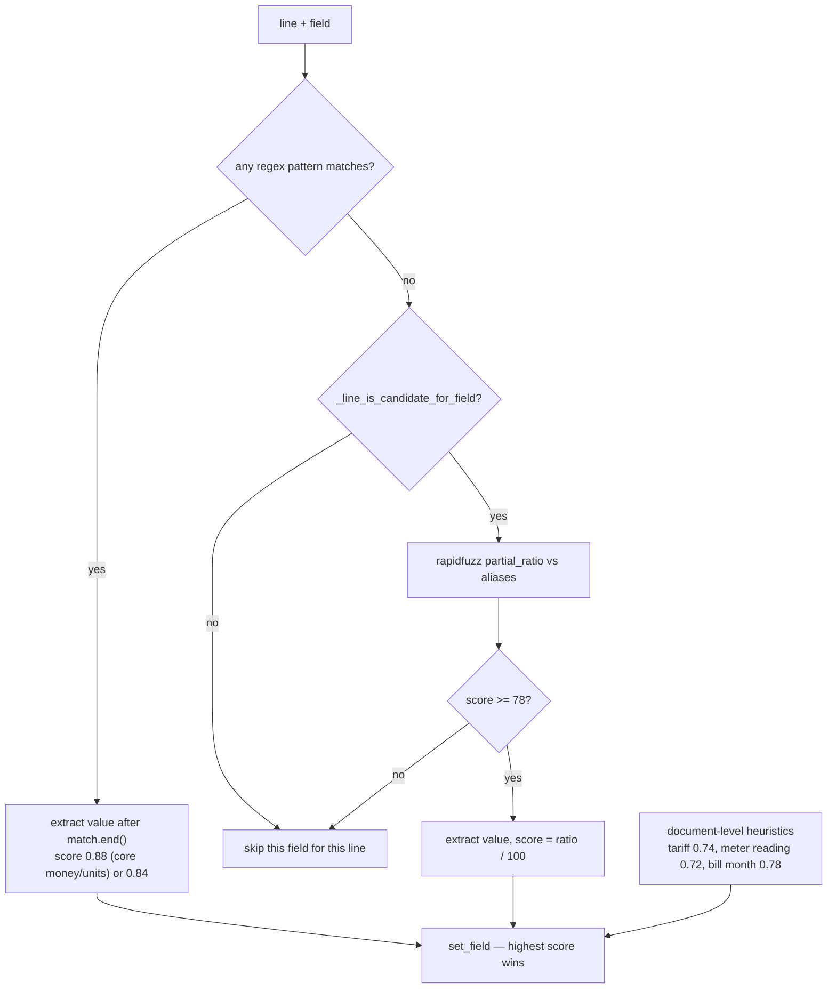

# From Electricity Bill to AI Insights: Building the OCR Pipeline

> **Series:** Building WattWise · **Part 3 of 4**
> **Estimated reading time:** 18 minutes
> **Prerequisite:** [Part 2 — FastAPI Backend](./part-2-fastapi-backend.md)

---

## Table of Contents

1. [The Input Is the Problem](#the-input-is-the-problem)
2. [Pipeline Overview](#pipeline-overview)
3. [Stage 1 — Upload and Storage](#stage-1--upload-and-storage)
4. [Stage 2 — Document Normalization](#stage-2--document-normalization)
5. [Stage 3 — Image Preprocessing](#stage-3--image-preprocessing)
6. [Stage 4 — Tesseract and the Confidence Signal](#stage-4--tesseract-and-the-confidence-signal)
7. [Stage 5 — Text Cleaning and Normalization](#stage-5--text-cleaning-and-normalization)
8. [Stage 6 — Field Extraction](#stage-6--field-extraction)
9. [Stage 7 — Validation](#stage-7--validation)
10. [Stage 8 — Human Correction](#stage-8--human-correction)
11. [Stage 9 — Persistence and Provenance](#stage-9--persistence-and-provenance)
12. [Performance Characteristics](#performance-characteristics)
13. [Failure Modes](#failure-modes)
14. [Regression Testing a Non-Deterministic Input](#regression-testing-a-non-deterministic-input)
15. [Future Improvements](#future-improvements)
16. [Key Takeaways](#key-takeaways)

---

## The Input Is the Problem

Here is what an actual Tesseract pass over a phone photo of a Telangana electricity bill produces:

```
Blll Amount 2340
Unlts Consmed 318
Biling nays 30
Recorded HD 1.9
GIS Subsidy 0
Interest on ED 0
Present Rdg 15820
```

Every one of those lines is wrong, and every one is recoverable. `Blll` is `Bill` with `i`→`l`. `Unlts Consmed` has two independent corruptions. `nays` is `Days` with the `D` lost and `y` misread. `HD` is `MD`. `GIS` is `GJS`. These are not random — they are the systematic confusions of a specific OCR engine on a specific class of document: thermal or dot-matrix print, tight leading, ruled table cells, photographed at an angle under a ceiling light.

A parser built on `if "Bill Amount" in line` returns nothing for this document. The entire design of the WattWise extraction layer follows from accepting that the input is *reliably unreliable* — corrupted in patterned ways, at unpredictable positions.

The second constraint is equally important: **the pipeline must never be the reason a user cannot save a bill.** OCR is an accelerator. When it fails completely, the manual path must be indistinguishable in capability from the automated one.

---

## Pipeline Overview

```mermaid
flowchart LR
  A["Upload<br/>JPG/PNG/PDF"] --> B["Storage<br/>bills bucket"]
  B --> C["Normalize<br/>PDF pages → images"]
  C --> D["Preprocess<br/>13 operations"]
  D --> E["Tesseract<br/>text + confidence"]
  E --> F["Clean<br/>line/number/month normalization"]
  F --> G["Extract<br/>regex → fuzzy → heuristic"]
  G --> H["Validate<br/>required, ranges, sanity"]
  H --> I["Human review<br/>debounced re-parse"]
  I --> J["Persist<br/>machine + human + provenance"]
```



Nine stages. Stages 1–5 are mechanical; stage 6 is where the domain knowledge lives; stages 7–9 are where trust is negotiated with the user.

Detailed diagrams: [OCR pipeline](./assets/diagrams/ocr-pipeline.md) · [Bill processing](./assets/diagrams/bill-processing.md)
Flowcharts: [Upload](./assets/flowcharts/upload-bill.md) · [Extraction](./assets/flowcharts/ocr-extraction.md) · [Manual review](./assets/flowcharts/manual-review.md)

---

## Stage 1 — Upload and Storage

```python
@app.post("/api/bills/upload")
async def upload_bill(file: UploadFile = File(...),
                      authorization: Optional[str] = Header(default=None)):
  user_id = get_user_id(authorization)

  if not file.filename:
    raise HTTPException(status_code=400, detail="Missing file name.")

  extension = os.path.splitext(file.filename.lower())[1]
  if extension not in ALLOWED_EXTENSIONS:          # {.jpg, .jpeg, .png, .pdf}
    raise HTTPException(status_code=400,
                        detail="Unsupported file format. Use JPG, PNG, or PDF.")

  file_bytes = await file.read()
  size_mb = len(file_bytes) / (1024 * 1024)
  if size_mb > MAX_UPLOAD_MB:
    raise HTTPException(status_code=413, detail=f"File exceeds {MAX_UPLOAD_MB} MB limit.")

  safe_name = file.filename.replace(" ", "_")
  file_path = f"{user_id}/{uuid.uuid4()}-{safe_name}"
```

**Store before you process.** The file lands in Supabase Storage *before* OCR runs. This ordering is the single decision that makes the whole pipeline forgiving: if Tesseract crashes, is not installed, or produces garbage, the user still has a stored, linkable document and a working manual path. Processing first and storing on success would mean a failed OCR discards the upload.

**The path scheme carries three properties.** `{user_id}/{uuid4}-{safe_name}` namespaces by owner (so a storage-level policy can be written against the prefix), guarantees uniqueness (two people uploading `bill.pdf` never collide, and neither do two uploads from the same person), and preserves the original filename for recognizability.

**Two acknowledged weaknesses.** `await file.read()` loads the entire file into memory *before* the size check, so `MAX_UPLOAD_MB` protects storage rather than the process — a 500 MB upload is fully buffered before rejection. And extension is trusted without content sniffing; a `.png` containing arbitrary bytes reaches Pillow, which rejects it, but that rejection is incidental rather than designed. Both are on the fix list.

---

## Stage 2 — Document Normalization

PDFs and images take different routes to the same place: a PIL `Image`.

```python
def extract_text_from_pdf(file_bytes: bytes) -> tuple[str, float]:
  pages_text, confidences = [], []
  with fitz.open(stream=file_bytes, filetype="pdf") as doc:
    for index, page in enumerate(doc, start=1):
      pix = page.get_pixmap(dpi=300, alpha=False)
      image = Image.frombytes("RGB", [pix.width, pix.height], pix.samples)
      text, confidence = ocr_text_and_confidence(image)
      confidences.append(confidence)
      pages_text.append(f"--- Page {index} ---\n{text.strip()}")
  avg_conf = round(sum(confidences) / len(confidences), 2) if confidences else 0.0
  return "\n\n".join(pages_text).strip(), avg_conf
```

**Why rasterize instead of extracting the text layer?** PyMuPDF can pull embedded text directly, and that would be faster and perfectly accurate — for PDFs that have a text layer. Utility PDFs frequently do not: many are scans wrapped in a PDF container, and many that do have text have it in a positional soup that loses the line structure the parser depends on. Rasterizing every page treats all PDFs identically and lets one code path handle both cases.

The honest cost: for a digitally-generated bill with clean embedded text, this throws away perfect data and re-derives it imperfectly. The correct evolution is to try the text layer first, run a quality heuristic on it, and fall back to rasterization only when needed. It is on the roadmap and it is not implemented.

**Why 300 dpi?** Tesseract's accuracy is strongly resolution-dependent, and 300 dpi is the widely-cited floor for reliable results on body text. Below it, character shapes degrade past recovery; above it, cost rises with little accuracy gain. `alpha=False` skips the alpha channel — there is no transparency in a bill and the conversion would be wasted work.

**Page markers matter.** Each page is prefixed with `--- Page N ---`. The parser is line-oriented and does not care, but the raw text is stored in `ocr_raw_text` and shown to the user, and a multi-page bill without page boundaries is unreadable.

**Confidence is averaged across pages**, which is a simplification. A crisp page 1 and an unreadable page 2 average to "medium," when the truth is bimodal. Per-page confidence would be more useful, and the schema does not currently store it.

---

## Stage 3 — Image Preprocessing

Thirteen operations. Each one was added in response to an observed failure, and the ordering is not arbitrary.

```python
def preprocess_image(image: Image.Image) -> Image.Image:
  image = ImageOps.exif_transpose(image)                    # 1
  if image.mode not in ("RGB", "L"):
    image = image.convert("RGB")                            # 2

  if image.width and image.width < OCR_MIN_WIDTH:           # 3
    scale = OCR_MIN_WIDTH / image.width
    image = image.resize((int(image.width * scale), int(image.height * scale)),
                         Image.LANCZOS)

  gray_pil = image.convert("L")                             # 4
  gray_pil = ImageEnhance.Contrast(gray_pil).enhance(OCR_CONTRAST)      # 5  (1.8)
  gray_pil = ImageEnhance.Sharpness(gray_pil).enhance(OCR_SHARPNESS)    # 6  (1.4)
  gray_pil = gray_pil.filter(ImageFilter.MedianFilter(size=3))          # 7

  gray = np.array(gray_pil)                                 # 8
  gray = cv2.medianBlur(gray, 3)                            # 9

  block_size = OCR_ADAPTIVE_BLOCK_SIZE                      # 10 (31, forced odd, min 3)
  if block_size % 2 == 0: block_size += 1
  if block_size < 3:      block_size = 3

  thresh = cv2.adaptiveThreshold(gray, 255, cv2.ADAPTIVE_THRESH_GAUSSIAN_C,
                                 cv2.THRESH_BINARY, block_size, OCR_ADAPTIVE_C)

  coords = np.column_stack(np.where(thresh < 255))          # 11 deskew
  if coords.size > 0:
    angle = cv2.minAreaRect(coords)[-1]
    angle = -(90 + angle) if angle < -45 else -angle
    (h, w) = thresh.shape
    matrix = cv2.getRotationMatrix2D((w // 2, h // 2), angle, 1.0)
    thresh = cv2.warpAffine(thresh, matrix, (w, h),         # 12
                            flags=cv2.INTER_CUBIC, borderMode=cv2.BORDER_REPLICATE)

  if OCR_THRESHOLD > 0:                                     # 13
    _, thresh = cv2.threshold(thresh, OCR_THRESHOLD, 255, cv2.THRESH_BINARY)

  return Image.fromarray(thresh)
```

### Why each step exists

**1. EXIF transpose.** Phone cameras store orientation as metadata rather than rotating pixels. Tesseract reads pixels. A portrait photo taken with the phone rotated arrives sideways and OCR returns nothing usable. This one line fixes the single most common total failure.

**3. Upscale to 1,200 px minimum.** Compressed phone uploads and screenshots arrive small. Tesseract needs roughly 20+ pixels of x-height for reliable recognition. LANCZOS is chosen over bilinear or bicubic because it preserves edge sharpness on text — the artifacts it introduces are less damaging to character recognition than the blur the alternatives produce.

**5–6. Contrast ×1.8, Sharpness ×1.4.** Applied *before* thresholding, deliberately. The goal is to widen the gap between ink and paper so the subsequent adaptive threshold has an easier decision at every pixel. Applying enhancement after binarization would do nothing — there are only two values left.

**7 + 9. Median filter, twice.** Pillow's `MedianFilter(3)` then OpenCV's `medianBlur(3)`. This looks redundant. It is empirically not: the two implementations handle borders and the intermediate array differently, and applying both suppressed speckle noise from thermal print and JPEG artifacts more effectively than either alone. This is the least principled step in the chain and the one most likely to be removed if it were benchmarked properly.

**10. Adaptive Gaussian threshold, block 31, C 10.** This is the most important operation in the pipeline. A photograph of a bill is almost never evenly lit — there is a bright patch under the lamp and a shadow at the fold. A single global threshold either blows out the bright region or loses the shadowed one. Adaptive thresholding computes a local threshold per pixel from a Gaussian-weighted 31×31 neighborhood, so both regions binarize correctly.

Block size 31 is a tuned value: large enough to span a full character plus surrounding paper (so a character interior is not treated as background), small enough to track lighting gradients across the page. The defensive odd/minimum enforcement exists because OpenCV throws on even or too-small block sizes, and this value is environment-configurable — an operator tuning `OCR_ADAPTIVE_BLOCK_SIZE=30` would otherwise crash the endpoint.

**11–12. Deskew.** `np.where(thresh < 255)` collects every dark pixel; `cv2.minAreaRect` fits the minimum-area rotated rectangle around them and returns its angle. The `if angle < -45` correction handles OpenCV's convention of reporting angles in `[-90, 0)`. The rotation uses `INTER_CUBIC` for smooth interpolation and `BORDER_REPLICATE` so newly exposed corners repeat the edge pixel instead of filling black — black corners would be interpreted as ink by the following threshold.

Deskew runs *after* binarization because the dark-pixel mask is what defines the text block. Running it on a grayscale image would let background gradients influence the angle estimate.

**13. Final global threshold at 160.** After `warpAffine`'s cubic interpolation, the image is no longer strictly binary — interpolation produces intermediate gray values along every edge. This step re-binarizes. Skipping it leaves anti-aliased character edges that measurably degrade Tesseract's output.

### The trade-off nobody mentions

Aggressive preprocessing is not universally beneficial. This chain is tuned for **photographed, low-quality documents**. Applied to a clean 300 dpi PDF rasterization, the contrast boost and double median filter can erode thin strokes and *reduce* accuracy relative to feeding the original.

The right design is a quality classifier that routes clean inputs down a light path and degraded inputs down this one. The current design applies the same thirteen operations to everything, because the common case in this product is a phone photo and optimizing for it was worth the cost on the rare clean input.

---

## Stage 4 — Tesseract and the Confidence Signal

```python
def ocr_text_and_confidence(image: Image.Image) -> tuple[str, float]:
  processed = preprocess_image(image)
  config = f"--oem {OCR_OEM} --psm {OCR_PSM} -c preserve_interword_spaces=1"
  text = pytesseract.image_to_string(processed, lang=OCR_LANGUAGE, config=config)
  data = pytesseract.image_to_data(processed, lang=OCR_LANGUAGE, config=config,
                                   output_type=Output.DICT)
  confidences = [int(conf) for conf in data.get("conf", []) if conf not in ("-1", "", None)]
  avg_conf = round(sum(confidences) / (len(confidences) * 100), 2) if confidences else 0.0
  return text, avg_conf
```

**`--psm 6` — assume a single uniform block of text.** The default (`--psm 3`, full automatic page segmentation) tries to detect columns and regions, and on a ruled bill table it frequently decides the ruling lines are column separators, fragmenting `Bill Amount    2340` into two disconnected blocks in unpredictable reading order. Mode 6 treats the page as one block and preserves left-to-right, top-to-bottom line order — which is exactly what a line-oriented parser needs.

**`--oem 3` — default LSTM engine.** The neural engine substantially outperforms the legacy one on degraded print.

**`preserve_interword_spaces=1`** keeps the whitespace between a label and its value. Without it, `Bill Amount    2340` can collapse to `Bill Amount 2340` or worse, and the label/value boundary blurs.

**Two Tesseract passes.** `image_to_string` for the text, `image_to_data` for per-word confidence. This roughly doubles OCR cost, and the confidence signal is worth it, because it drives a product behavior that nothing else can provide.

**The confidence formula.** Tesseract emits `-1` for non-text regions; those are filtered. The remainder are averaged and divided by 100 to land in `[0, 1]`. Then:

```python
if payload.ocr_confidence is not None and payload.ocr_confidence < LOW_CONFIDENCE_THRESHOLD:
    uncertain_fields.update(parsed_result["parsed"].keys())
```

When document-level confidence drops below 0.6, **every extracted field is flagged for review**, regardless of its individual match score. This is the pipeline admitting it does not trust itself. A field that matched a regex cleanly still gets flagged, because a document that Tesseract read poorly overall may have produced a confidently-wrong number.

That is the behavior that separates a pipeline you can ship from a demo. The alternative — trusting per-field scores on a document the engine barely read — produces silent data corruption, which is far worse than asking the user to glance at six values.

---

## Stage 5 — Text Cleaning and Normalization

Four normalizers, each doing one job.

```python
def normalize_line(value: str) -> str:
  value = value.lower().strip()
  value = value.replace("|", " ")                       # table rules read as pipes
  value = re.sub(r"[?,:;]", " ", value)                 # punctuation noise
  value = re.sub(r"[^a-z0-9\s\.\-/&]", " ", value)      # everything unexpected
  value = re.sub(r"\s+", " ", value)                    # collapse whitespace
  return value
```

The `|` replacement is pure OCR domain knowledge: vertical table rules are consistently read as pipe characters, and they arrive glued to adjacent words. Replacing them with spaces recovers word boundaries. Note that this normalized form is used for *matching only* — the original raw line is preserved and stored in `field_meta.raw_line`, so the user can always see the source text.

```python
def normalize_numeric_token(value: str) -> float | None:
  cleaned = value.strip().replace(",", "").replace("?", "")
  cleaned = re.sub(r"(?<=\d)\s+(?=\d)", "", cleaned)    # "2 340" → "2340"
  cleaned = re.sub(r"[^\d\.\-]", "", cleaned)
  if cleaned in {"", "-", ".", "-."}:
    return None
  try:
    return float(cleaned)
  except ValueError:
    return None
```

Three OCR-specific behaviors: `?` is stripped because Tesseract emits it for unrecognized glyphs including the rupee sign; the lookahead/lookbehind regex rejoins digits that OCR split with spurious whitespace (`2 340` is one number, not two); and the guard against `""`, `"-"`, `"."`, `"-."` catches strings that survive stripping but are not numbers.

```python
def normalize_month_value(value: str) -> str | None:
  candidate = normalize_text_token(value).replace(".", " ")
  candidate = re.sub(r"\s+", " ", candidate)
  formats = ["%b %Y", "%B %Y", "%m %Y", "%m/%Y", "%m-%Y",
             "%d/%m/%Y", "%d-%m-%Y", "%d.%m.%Y"]
  for fmt in formats:
    try:
      return datetime.strptime(candidate, fmt).strftime("%b %Y")
    except ValueError:
      continue
  # fall back to a regex for a month name plus optional 4-digit year
```

Eight strict formats attempted first, then a permissive regex fallback that accepts `Mar`, `March`, `Sept`, with or without a year. **Every path outputs `"%b %Y"` — `"Mar 2026"`.** One canonical format for the whole system.

That canonicalization is load-bearing. `bill_month` is the sort key for chronology, the season detection input, the duplicate-detection key, and the label on every chart axis. Four subsystems depend on it having exactly one shape. The alternative — storing a proper `date` column — would be better still, and is discussed in [Part 4](./part-4-engineering-lessons.md).

---

## Stage 6 — Field Extraction

This is the heart of the pipeline: 19 fields, three strategies, one scoring model.

### The field specification

```python
FIELD_SPECS: dict[str, dict[str, Any]] = {
  "bill_amount": {
    "aliases": ["bill amount", "blll amount", "bill amt",
                "total amount", "amount payable"],
    "patterns": [r"\bbill\s+amount\b", r"\bblll\s+amount\b",
                 r"\bamount\s+payable\b", r"\bcurrent\s+charges\b"],
    "type": "number",
    "required": True,
  },
  "units_consumed": {
    "aliases": ["units consumed", "unlts consmed", "unlts", "consumption"],
    "patterns": [r"\bunits?\s+consumed\b", r"\bunlts\b", r"\bconsumption\b"],
    "type": "number",
    "required": True,
  },
  "billing_days": {
    "aliases": ["billing days", "biling days", "billing day", "nays"],
    "patterns": [r"\bbilling\s+days\b", r"\bbiling\s+days\b", r"\bnays\b"],
    "type": "number",
  },
  # … 16 more
}
```

Look at what is in the alias lists: `"blll amount"`, `"unlts consmed"`, `"biling days"`, `"nays"`, `"recorded hd"`, `"gis subsidy"`. **The corrupted forms are first-class configuration.** They were not guessed — they were collected from real OCR output on real bills and promoted into the spec.

This is the single highest-leverage design decision in the extraction layer. Instead of trying to *correct* OCR errors with a spell-checker or an edit-distance pass over the whole document, the system *expects specific errors* and matches them directly. It is more accurate because it is targeted, and it is cheaper because there is no correction pass at all.

### Three strategies in priority order



**Strategy 1 — Regex.** Precise, fast, high confidence. Crucially, extraction searches only *after* the label match:

```python
def _extract_number_from_line(field: str, line: str, match_end: int | None = None) -> float | None:
  search_region = line[match_end:] if match_end is not None else line
  numbers = extract_numbers(search_region)
  if numbers:
    return numbers[0]
  numbers = extract_numbers(line)          # fallback: whole line
  if not numbers:
    return None
  return numbers[-1]                       # last number, not first
```

On `Bill No 4471 Bill Amount 2340`, searching the whole line and taking the first number returns the bill number. Searching after `Bill Amount` returns 2340. The whole-line fallback takes the *last* number, because in a `label … value` layout the value is on the right.

**Strategy 2 — Fuzzy, behind a hard gate.** `rapidfuzz.fuzz.partial_ratio` with a threshold of 78 catches corruptions the alias list did not anticipate. On its own, it is dangerous — `partial_ratio` on short strings matches almost anything. So a token gate must pass first:

```python
def _line_is_candidate_for_field(field: str, normalized_line: str) -> bool:
  token_rules = {
    "bill_amount":    ["amount", "amnt", "amt", "charges"],
    "units_consumed": ["unlt", "unit", "consum"],
    "billing_days":   ["billing", "biling", "day", "nays"],
    # …
  }
  required_tokens = token_rules.get(field)
  if not required_tokens:
    return True
  if field == "interest_on_ed":
    return "interest" in normalized_line and " ed" in f" {normalized_line}"
  if field == "interest_on_cd":
    return "interest" in normalized_line and " cd" in f" {normalized_line}"
  return any(token in normalized_line for token in required_tokens)
```

The `interest_on_ed` / `interest_on_cd` special case is the concrete bug this gate was built for. Those two labels differ by **one character**, and `partial_ratio("interest on ed", "interest on cd")` scores well above 78. Fuzzy matching alone would systematically confuse Electricity Duty interest with Consumption Deposit interest. The gate requires the discriminating token — as a whole word, using the leading-space trick `" ed" in f" {line}"` so `"ed"` inside `"reduced"` does not qualify.

**Strategy 3 — Heuristics without labels.** Some fields can be recognized by content:

```python
def extract_meter_reading(line: str) -> float | None:
  lower_line = line.lower()
  if "meter" in lower_line and "no" in lower_line:
    return None                                   # this is the meter *number*
  if not any(k in lower_line for k in
             ["present", "rdg", "reading", "meter reading", "current reading"]):
    return None
  numbers = extract_numbers(line)
  return numbers[-1] if numbers else None
```

The negative guard comes first and it is the important half. `Meter No: 4471028` and `Meter Reading: 15820` both contain "meter" and a long number. Without the exclusion, the meter serial number is stored as a meter reading — a wrong value that looks entirely plausible and would never be questioned.

### Scoring and conflict resolution

```python
def set_field(field, value, score, source, raw_line, matched_on):
    normalized_value = _normalize_field_value(field, value, spec["type"])
    if normalized_value is None:
        return
    if field not in parsed or score > confidence.get(field, 0):
        parsed[field] = normalized_value
        confidence[field] = score
        field_meta[field] = {
          "value": normalized_value, "confidence": score, "source": source,
          "matched_on": matched_on, "raw_line": raw_line,
          "requires_review": score < 0.75,
        }
```

**Highest score wins.** Every line is tested against every field, so a document may produce several candidates for `bill_amount`. A regex hit at 0.88 beats a fuzzy hit at 0.81. Order of appearance in the document does not matter.

The score ladder is deliberate:

| Source | Score | Meaning |
|---|---|---|
| Regex on core fields (`bill_amount`, `units_consumed`, `net_bill_amount`) | 0.88 | Explicit pattern on a field we cannot get wrong |
| Regex on other numeric fields | 0.84 | Explicit pattern, less critical |
| Regex on text / meter reading | 0.82 | Pattern matched, value type is looser |
| Fuzzy | ratio / 100 (0.78–1.00) | Approximate label match |
| Document-level bill month | 0.78 | Found somewhere in the document, not on a labeled line |
| Tariff heuristic | 0.74 | Content-based guess → **below the 0.75 review line** |
| Meter reading heuristic | 0.72 | Content-based guess → **below the 0.75 review line** |

The 0.75 threshold in `requires_review` is calibrated against that ladder: **every heuristic match is flagged for human review by default.** A guess based on content rather than a label is never silently trusted.

And `field_meta` stores the entire audit trail — the value, the score, whether it came from regex, fuzzy, heuristic, document scan or manual entry, which specific pattern matched, and the original raw line. The UI shows this. A user who doubts a number can see the exact text it came from.

---

## Stage 7 — Validation

Validation catches what extraction cannot: values that are well-formed but wrong.

```python
if field == "billing_days" and not 1 <= numeric_value <= 60:
    errors[field] = "Billing days should be between 1 and 60."
if field == "units_consumed" and numeric_value > 10000:
    errors[field] = "Units consumed looks unusually high."
if field == "recorded_md" and numeric_value > 100:
    errors[field] = "Recorded MD looks unusually high."
```

These bounds exist for one specific failure mode: **the right number extracted into the wrong field.** A meter reading of 15,820 landing in `billing_days` passes every type check — it is a valid non-negative number — and is caught only by a domain bound. Domestic max demand is a single-digit kVA figure; 100 is generous. A domestic connection consuming 10,000 units in a month does not exist.

The sign rules encode real billing knowledge:

```python
NON_NEGATIVE_FIELDS = {"units_consumed", "billing_days", "energy_charges",
                       "fixed_charges", "electricity_duty", "bill_amount", ...}
OPTIONALLY_NEGATIVE_FIELDS = {"adjustment", "interest_on_cd", "loss_gain"}
```

`adjustment` and `loss_gain` are genuinely negative on real bills — they represent credits. Marking them non-negative would produce a validation error on a perfectly-read correct bill, which is worse than not validating them at all.

Validation errors are merged into `uncertain_fields`, so a field can be flagged either because the parser was unsure *or* because the value is implausible. Both mean the same thing to the user: look at this.

---

## Stage 8 — Human Correction

The correction UI is not an afterthought bolted onto the pipeline. It is a co-equal input path.

### The debounced re-parse loop

```typescript
useEffect(() => {
  if (!ocrText.trim() || !session?.access_token || parsing || saving) return;

  const currentSignature = createManualSignature(buildManualFields());
  if (currentSignature === lastParsedManualSignature) return;

  const timer = window.setTimeout(() => {
    setAutoReviewing(true);
    void parseOcrText(true, true);        // manualOverride, silent
  }, 700);

  return () => window.clearTimeout(timer);
}, [buildManualFields, formState, lastParsedManualSignature, ocrText,
    parseOcrText, parsing, saving, session?.access_token]);
```

The signature comparison is what makes this practical. Without it, every render that produces an equivalent form state would re-fire the request. With it, the effect is a no-op unless the *semantic content* of the manual fields changed. Combined with the 700 ms debounce, a user typing a four-digit amount produces one request, not four.

The `silent` flag suppresses error banners, because a mid-typing re-parse that fails should not interrupt the user with a red box.

### The merge

```python
def apply_manual_overrides(parsed, manual) -> tuple[dict, list[str]]:
  corrected = dict(parsed)
  overridden_fields = []
  for key, value in manual.items():
    if value is None or value == "":
      continue
    corrected[key] = value
    overridden_fields.append(key)
  return corrected, overridden_fields
```

Human values win, unconditionally. Empty values are skipped rather than treated as deletions — clearing a field does not erase a parsed value, which is the behavior users expect from a form pre-filled by a machine.

Then the metadata is rewritten:

```python
for field in manual_override_fields:
    field_meta[field] = {
      "value": corrected.get(field), "confidence": 1.0, "source": "manual",
      "matched_on": "manual-override", "raw_line": None, "requires_review": False,
    }
```

`confidence: 1.0`, `requires_review: False`. A human-confirmed value is certain by definition, and the review flag clears immediately — which is what produces the satisfying feedback loop of watching warnings disappear as you correct fields.

### Live analysis preview

Two additional debounced effects (500 ms and 650 ms) call the seasonal and behavioral analysis endpoints with the *current, uncommitted* form values. The user sees the season card, the behavior signals and the contribution pie update as they correct numbers — before saving anything.

This changes the emotional character of the task. Correcting OCR output is tedious data entry. Watching an analysis sharpen as you fix values is exploration. Same keystrokes, entirely different experience.

### The duplicate guard

```typescript
const duplicateMonthBill = useMemo(() => {
  const normalizedMonth = normalizeBillMonth(formState.billMonth);
  if (!normalizedMonth) return null;
  return history.find(
    (bill) => bill.id !== editingBillId &&
              normalizeBillMonth(bill.bill_month) === normalizedMonth,
  ) ?? null;
}, [editingBillId, formState.billMonth, history]);
```

Two bills for the same month would corrupt every downstream calculation: month-over-month change, seasonal averages, and the regression input series all assume one bill per period. The guard excludes the bill currently being edited (so editing March does not flag itself) and the error message routes the user to the right action — *edit the existing record* — rather than just refusing.

---

## Stage 9 — Persistence and Provenance

The `bills` table stores eight distinct pieces of provenance per row:

| Column | Contents |
|---|---|
| `ocr_raw_text` | Complete unmodified Tesseract output |
| `ocr_confidence` | Document-level confidence `[0, 1]` |
| `parsed_data` | What the machine extracted, untouched |
| `corrected_data` | What the human confirmed |
| `parsed_field_meta` | Per-field score, source, matched pattern, raw line |
| `manual_override_fields` | `text[]` of fields the human edited |
| `verification_status` | `needs_review` or `verified` |
| `parser_version` | e.g. `phase4.v2` |

**Nothing is destructive.** `parsed_data` is never overwritten by corrections. That single property enables several things that are otherwise impossible:

- **Re-parse history.** When the parser improves, every historical bill can be re-run from its stored `ocr_raw_text` and diffed against its stored `corrected_data`.
- **Measure accuracy for free.** `manual_override_fields` across all rows is a live dataset of exactly which fields the parser gets wrong most often. That is a prioritized backlog written by users.
- **Version-aware migration.** `parser_version` identifies which rows were produced by which parser build, so a fix can be applied selectively.
- **Auditability.** A user asking "where did this number come from?" gets a real answer from `field_meta.raw_line`.

This is more storage than a minimal design needs. It is the difference between a parser you can improve with evidence and one you improve by guessing.

---

## Performance Characteristics

| Stage | Cost driver | Notes |
|---|---|---|
| Upload | Network + file size | Capped at `MAX_UPLOAD_MB` (10 default) |
| Storage write | One Supabase call | Happens before OCR |
| PDF rasterization | Pages × 300 dpi | Linear in page count; the dominant PDF cost |
| Preprocessing | Image dimensions | 13 ops, several on the full pixel array |
| Tesseract | **Two passes** over the processed image | The dominant image cost |
| Parsing | Lines × 19 fields | Pure CPU, negligible |
| Validation | Field count | Negligible |

**Where the time actually goes:** Tesseract, twice, per page. Everything downstream of it is noise by comparison.

**The structural problem:** all of this runs synchronously inside the HTTP request, in an `async def` handler that calls blocking library code. A four-page PDF holds the request open for seconds *and* blocks the event loop for other requests, because `pytesseract` and `cv2` are synchronous and do not yield.

Two fixes, in increasing order of effort:

1. **Change `async def upload_bill` to `def upload_bill`.** Starlette runs synchronous handlers in a thread pool automatically. One word, and the event loop stops blocking. This is the highest value-per-character change available in the codebase.
2. **Move OCR to a job queue.** Upload returns immediately with a job id; the client polls or receives a webhook. This is the correct long-term design and it is significantly more work.

**What is already fast:** every analysis endpoint. `POST /api/seasonal/analyze` and its siblings are pure functions over the request payload with zero database access — pure CPU on small dictionaries.

---

## Failure Modes

| Failure | Detection | Behavior |
|---|---|---|
| Tesseract not installed | `TesseractNotFoundError` | HTTP 200, `success: false`, file URL returned, manual entry available |
| OCR raises | Generic `except` | HTTP 200, `success: false`, error message surfaced |
| Blank / illegible output | `avg_conf` near 0 | All fields flagged; user fills manually |
| Low confidence (< 0.6) | Threshold check | Every parsed field flagged for review |
| Field genuinely absent | Field missing from `parsed` | Required fields produce a validation error; optional fields stay empty |
| Wrong value, right type | Range validation | Bounded fields caught; unbounded ones rely on the user |
| Wrong field association | — | **Not caught.** ED/CD is specifically guarded; other pairs are not |
| Duplicate month | Client-side normalized comparison | Save blocked with guidance to edit the existing bill |
| Rotated image | EXIF transpose + deskew | Corrected automatically |
| Uneven lighting | Adaptive threshold | Corrected automatically |
| Multi-page PDF | Page loop | All pages OCR'd, confidence averaged (loses per-page detail) |
| Handwritten annotations | — | **Not handled.** LSTM is trained on print; handwriting produces noise |
| Non-English bill | `OCR_LANGUAGE` env var | Configurable, but field specs are English-only |

The two entries marked **not caught** are the honest weak points. Field mis-association beyond the ED/CD pair — for example a bill where "Fixed Charges" and "Energy Charges" appear on the same visual row — would produce a confidently wrong extraction that only a user would notice. And a bill in Telugu or Hindi would need both a Tesseract language pack and an entirely new field specification; the `OCR_LANGUAGE` variable makes the first half configurable and the second half is not built.

---

## Regression Testing a Non-Deterministic Input

You cannot unit-test Tesseract — its output depends on the image, the version and the platform. You *can* unit-test everything downstream of it, by freezing the OCR output.

```txt
backend/tests/fixtures/telangana/
├── README.md
├── bill_01_raw_ocr.txt      ← frozen Tesseract output, anonymized
├── bill_01_expected.json    ← the fields that must parse correctly
├── bill_02_raw_ocr.txt
├── bill_02_expected.json
├── bill_03_raw_ocr.txt
└── bill_03_expected.json
```

```json
{
  "bill_month": "Mar 2026",
  "billing_days": 30.0,
  "units_consumed": 318.0,
  "bill_amount": 2340.0,
  "net_bill_amount": 2340.0,
  "meter_reading": 15820.0,
  "recorded_md": 1.9,
  "energy_charges": 1820.0,
  "loss_gain": 5.0,
  "tariff_details": "Tariff: Domestic LT-I"
}
```

The test globs the directory, so **adding a regression case is dropping two files** — no code change, no registration. The fixture README states the policy explicitly:

> - keep 3-5 real bill shapes
> - include both clean and noisy OCR
> - update expected output only when parser behavior changes intentionally

That last line is the one that keeps a regression suite honest over time. The failure mode of every golden-file test suite is someone updating the expectations to make a red build green. Writing the rule down where the next contributor will find it is cheap and it works.

The other seven test files cover the intelligence layer with property assertions — ordering invariants, enum membership, and variation checks that ensure different households produce genuinely different output.

**The gap:** none of this runs automatically. There is no CI pipeline in the repository. A test suite nobody runs is documentation with extra steps.

---

## Future Improvements

**Accuracy**
1. **Try the PDF text layer first.** Extract embedded text, score its quality, rasterize only on failure. Faster and perfect for digitally-generated bills.
2. **Layout-aware extraction.** `image_to_data` already returns bounding boxes and they are currently discarded. Spatial reasoning — "the value is the token immediately right of the label, on the same baseline" — would fix the field-association failures that no amount of regex tuning can.
3. **Multi-pass with different PSM modes.** Run `--psm 6`, `--psm 4` and `--psm 11`, then reconcile by taking the highest-confidence extraction per field.
4. **Per-page confidence storage.** Replace the page average with an array, so a single bad page can be identified rather than diluted.

**Robustness**
5. **Content-type sniffing** in addition to the extension allowlist.
6. **Streaming size enforcement** so oversized uploads are rejected before full buffering.
7. **Field-association guards** generalized beyond the ED/CD special case.

**Performance**
8. **Make the handler synchronous** so Starlette threads it. One word.
9. **Job queue** for OCR with status polling.
10. **Result cache keyed by file content hash**, so re-uploading the same document is free.

**Learning from the data**
11. **Mine `manual_override_fields`.** Every correction is a labeled parser error. Aggregating them produces a ranked list of what to fix next, generated by users rather than guessed.
12. **Auto-promote corrections into aliases.** If many users correct the same field on lines containing a recurring corrupted token, that token is an alias candidate.
13. **Track accuracy by `parser_version`** to prove that parser changes actually improve things.

That eleventh item is the one I would build next. The system already collects the data — it just does not look at it yet.

---

## Key Takeaways

1. **Design for the corruption you actually observe.** Putting `"blll amount"` and `"unlts consmed"` in the alias list is unglamorous and it outperforms any general-purpose correction pass, because it is targeted at real, recurring failures rather than hypothetical ones.
2. **Fuzzy matching needs a hard gate, not just a threshold.** `interest_on_ed` versus `interest_on_cd` differ by one character and score far above any usable fuzzy threshold. A required-token gate is what makes fuzzy matching safe.
3. **Store the file before you process it.** Every downstream failure becomes recoverable, and the manual path becomes a complete alternative rather than a consolation prize.
4. **A document-level confidence signal buys a product behavior you cannot get any other way.** Below 0.6, flag everything — the parser admitting it does not trust itself is more valuable than the parser being confidently wrong.
5. **Provenance is the difference between a parser you can improve and one you are stuck with.** Raw text, machine values, human values, per-field metadata and a version stamp cost storage and repay it as a labeled dataset of exactly what to fix.
6. **Make the correction UI a first-class path.** Debounced re-parsing plus live analysis previews turns data entry into exploration, and it is what makes an imperfect OCR pipeline acceptable to real users.

---

**Previous:** [← Part 2 — FastAPI Backend](./part-2-fastapi-backend.md)
**Next:** [Part 4 — Five Engineering Lessons →](./part-4-engineering-lessons.md)

**Reference docs:** [Architecture](./architecture.md) · [Database](./database.md) · [API Reference](./api-reference.md)
**Diagrams:** [OCR pipeline](./assets/diagrams/ocr-pipeline.md) · [Bill processing](./assets/diagrams/bill-processing.md)
**Flowcharts:** [Upload bill](./assets/flowcharts/upload-bill.md) · [OCR extraction](./assets/flowcharts/ocr-extraction.md) · [Manual review](./assets/flowcharts/manual-review.md) · [Database save](./assets/flowcharts/database-save.md)
